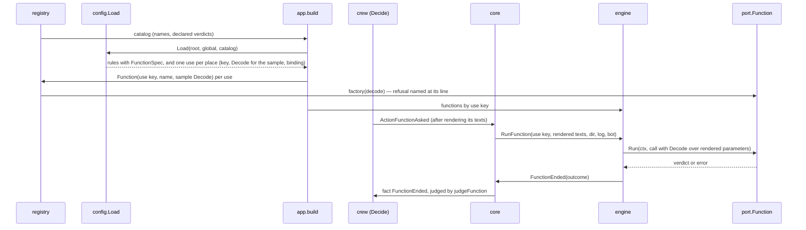

# Crew functions as rule actions and route steps - Plan

## Goal Capsule

- **Objective:** when crew gains a built-in function, the boss can call it from a rule by name, as an action in the sequence or as a step in a route, with parameters crew checks when it loads the config, and crew's code needs no change beyond the function itself and its line in `registry/default.go`.
- **Means:** the full plan's Implementation Units U3 (function port, registry and fake) and U20 (functions as actions and route steps), built here as U1 to U8, with the decisions below (KTD-F1 to KTD-F12) where the full plan left something open or the code after #294 differs from what it assumed.
- **Product authority:** the full plan, `docs/plans/2026-10-07-0724-feat-rule-sequences-and-routes-plan.md`, and issue #256. The full plan's Product Contract wins on behaviour and its KTDs win on mechanism, read through `docs/solutions/design-patterns/rule-sequences-read-their-full-plan-narrowly.md`. This plan narrows them to functions and settles what they left open.
- **Stop conditions:** stop and report when a settled Key Decision or KTD proves unworkable, when a unit cannot keep every gate green without changing a requirement, or when the work would need an acceptance scenario only the tester may write.
- **Execution profile:** one branch and one pull request whose body contains `Closes #256`. Units land in U-ID order, and each keeps `go test -race ./...` green.

---

## Product Contract

Product Contract preservation: narrowed, no scope change. This part builds the full plan's U3 and U20. Its R-IDs, AE-IDs and Key Decisions are the full plan's, cited as written there.

### Summary

Adds crew functions: Go code inside crew that a rule calls by name, as an action or a route step. A top-level definition can name a function and preset its parameters, and the place of use replaces them key by key. crew checks every use's parameters when it loads the config, fills text parameters from the issue just before each call, and judges the verdict the function returns against the verdicts it declares. crew registers no function; only tests use one.

### Problem Frame

See the full plan's Problem Frame. In short, #294 made a rule a sequence of sessions and shell scripts with routes by verdict, but every judgment outside a session is still a shell script. A check crew could own, such as #52's open pull request check, has nowhere to live in crew's code. The boss wants that place in crew before the first function is written.

### Requirements

Requirements this part builds whole: R26, R27, R28, R29, R30, R31.

Requirements this part completes, whose other parts #254 built:

- R2, R7. A function action runs in its turn in the sequence and ends with a verdict like any action.
- R3, R5. An action can be a crew function, defined at the top of the config by name or called by its function's name.
- R14. A step can be a function.
- R16. A function step that returns anything but `passed` is a failed step, and the route goes on.
- R25. A function needs no worktree, so a rule whose actions are all functions creates none.
- R49. A function action's status line shows crew's reason, with the function's error scrubbed and stripped, as a shell action's shows its last line.
- R22, R54. A function after a session resumes like a shell action after a session: at the latest session before it, unless its preset says `resume: self`.
- R32. A defined action and a function may not share a name.
- R52, R53. A route's function steps run at time-up and are skipped once crew stops; a running function action ends stopped.

### Key Decisions

- **The function mechanism ships without any function.** Governs R26 to R31. (session-settled: user-directed — chosen over leaving the function kind for when a real function exists: the boss wants the mechanism in place now.)

The full plan's Key Decisions apply as written.

### Acceptance Examples

This part covers the full plan's AE9, cited by ID in the test scenarios.

### Scope Boundaries

- The full plan's Scope Boundaries hold, among them: no real crew function (the Jev judge stays a shell script), no calls to external services as functions.
- Considered and not built: parameters that are lists or mappings. R29 names text, numbers and booleans, and no function exists to need more. A function that needs a list would add it; the grammar can grow without breaking a written config.
- Considered and not built: recovering from a function's panic. A function is crew's own code, a panic stops crew where everyone sees it, and the function's own tests are the place to prevent it.
- Considered and not built: a load check that an action's `on:` maps only verdicts its function declares. The full plan already declines load checks beyond R32; an extra `on:` entry is harmless.
- Considered and not built: a separate time limit for functions. They share the shell actions' 10 minutes (`shellTimeout`), the same limit the full plan gives every action that is not a session.

#### Deferred to Follow-Up Work

- The journal reader maps a step kind it does not know to a move (`internal/adapter/jsonl/decode.go`, `named(stepKinds(), s.Kind)`). This part adds a kind this binary knows, so nothing it writes is misread; refusing unknown kinds is separate hardening.
- The first real function, such as #52's built-in check, in `internal/function/<name>`.
- How a function reaches GitHub. #52's check must list pull requests as the bot, but this part's call carries only the bot's `port.Identity` (environment for a child process), and KTD7's import rule (`crew`, `port`, the standard library) keeps `proc` out of `internal/function`. The first function that needs the tracker decides between carrying the tracker in the call, so it finds capabilities such as `port.PullRequestFinder` by type assertion, and letting functions start processes through `proc`.

---

## Planning Contract

### Key Technical Decisions

The full plan's KTD2, KTD4, KTD6, KTD7, KTD9, KTD12, KTD13 and KTD14 govern functions. KTD22 does not: a function's call carries no session prompt or last message; the format switch's KTD-S1 named this part as the one that adds the function variants, and KTD-S15 lets it extend journal version 3 additively.

**Ports and registration**

- KTD-F1. **A function declares its verdicts where it registers.** `port.FunctionDefinition` pairs the verdicts a function can return with its `port.FunctionFactory(decode)`. `registry.New` takes a third map of definitions, empty in `registry/default.go`. Declaring at registration lets crew know a function's verdicts before it builds any use, so the config can carry them into the domain (KTD-F4). Governs R30, R31; refines KTD7.
- KTD-F2. **The port hands a function one call.** `port.Function.Run(ctx, call)` returns a verdict or an error. The call carries a `port.Decode` over the rendered parameters, the issue's ref, id and URL, the run's worktree directory and branch or none, a writer into the run's log, and the identity of the bot the function acts as (KTD13). A function runs in crew's process, so it reads the issue from the call, not from `CREW_*` variables. Governs R26, R29, R30.
- KTD-F3. **The config learns the registered functions at load.** `config.Load` takes a catalog of function names and their declared verdicts, which `app.build` takes from the registry. The config needs the names to tell a function from a defined action, to list them when a name is neither, and to refuse a defined action named like a function with its file and line (R32). Tests pass an empty catalog or a fake one. The config package keeps importing nothing from the registry or the ports.

**The domain**

- KTD-F4. **`FunctionSpec` and `FunctionStep` join the sealed families.** `crew.FunctionSpec` holds the function's name, the use it was built for (KTD-F7), its text parameters as templates over the issue, its declared verdicts and `ResumeSelf`. `FunctionStep` holds the step's name and its `FunctionSpec`. `gochecksumtype` then points at every switch to extend (the research list is in Sources). `StepKind` gains `StepFunction`, and `StepPlan` a `Function` name beside `Shell`. Governs R3, R14; completes KTD-S1.
- KTD-F5. **A function's verdict is judged like a shell action's, with its declaration as the gate.** `judgeFunction` in `internal/crew/verdict.go`: a stop is `failed` (`CauseStopped`); an error, a timeout or a parameter that does not render is `failed` with a new `CauseFunction`; a returned verdict counts when it is `passed` or `failed`, or when the function declared it and the action's `on:` names it or it is `waiting`; anything else is `failed` with `CauseVerdict`, in crew's words. `judgeFunctionStep` gives `StepStopped` once a stop reached the run, `StepRan` for `passed` and `StepFailed` otherwise (R16). Governs R7, R30; refines KTD4.
- KTD-F6. **A function has its own events, facts and state, mirroring a shell action's.** `ActionFunctionAsked` (with the bot), `ActionFunctionStopAsked`, `ActionFunctionEnded` (with a `FunctionOutcome`: the returned verdict or none, and crew's one-line reason), the state `InFunction`, and the facts `FunctionEnded` and `StepFunctionEnded`. A route's function step reuses `StepAsked` and gets `StepFunctionStopAsked`. Reusing the shell events would write `action_shell_*` lines for something that runs no script and would make each shell switch test a kind. `restartPoint` treats a function action as it treats a shell action (R22, R54): `judgedItself` holds when the function returned a verdict and was not stopped. A function needs no worktree and never makes the run create one (R25); it gets the run's when one exists (KTD6).

**Configuration**

- KTD-F7. **Every place of use is one function use, keyed by its config path.** A use is a rule item or a route step whose name resolves to a function, directly or through a top-level preset. Its key is its key path, such as `rules.development.actions[2]` or `rules.development.routes.failed[0]`, unique across the config and readable in errors. The config returns each use with its function's name, its merged parameters, a `Decode` over them with text rendered for the sample issue, a way to build a `Decode` over the same parameters with given text, copying the nodes it fills so concurrent calls never share them, and a way to turn a parameter's name and a reason, or any other build error, into a config error. Governs R26, R27, R28.
- KTD-F8. **The grammar extends KTD14, and parameters are flat.**
  - A top-level `actions.<name>` that is a mapping with `name` is a function preset: `name` is the function, `resume: self` is allowed, and every other key is a preset parameter. A mapping with both `script` and `name` is refused as a shape error.
  - A rule item or route step that is a string, or a mapping's one key, may name a defined action or a registered function. A defined action wins the lookup; R32 makes them disjoint anyway.
  - A shell action's reference still takes no parameters. A function's reference takes a mapping of parameters or nothing.
  - A parameter's value is text, a number or a boolean. A list or a mapping is refused at load, naming the key path and line.
  - Because `name`, `resume` and `script` are preset keys, a preset cannot set a parameter of those names. The README says so.
- KTD-F9. **Parameters merge key by key, and each keeps where it was written.** The merged parameters are a list of entries: the preset's, each replaced by the use's entry of the same key, then the use's new keys. Each entry keeps its own key path and line, and `origin.fileOf` names each one's file, so an unknown parameter from a preset in the global file and one from a rule in `.crew/config.yaml` each name their own file (R28, AE9).
- KTD-F10. **A text parameter is a template over the issue, parsed once at load.** Every string scalar among the parameters is parsed as a `text/template` with `.Issue` (`Ref`, `Key`, `Title`, `URL`), the data a prompt sees, and rendered for the sample issue at load; a template that does not parse or render is an error at that key. Numbers and booleans keep their YAML tags and pass as literals. The template shares `promptIssue` and `sampleIssue` with `Prompt`, as the comment template does (KTD-S1). Governs R29.
- KTD-F11. **A function's refusal at build names its parameter's line.** A factory returns `port.RefusedParameter{Parameter, Reason}` when it refuses a value. `app.build` unwraps it with `errors.As` and hands the parameter's name and the reason to the use's error naming, which returns a key error at that parameter's entry, so the config never sees a port type (KTD-F3). Any other factory error is reported at the use's own key path and line. Decode errors already carry the key path and line (`bind`). Governs R28.

**Running**

- KTD-F12. **The core renders, the engine calls.** Before each call, the core renders the use's text parameters for the issue into the command; the decider renders them first, so a template that fails for this issue fails the action (`CauseFunction`) or the step (`StepFailed`) without a call. The engine looks the use up by its key, writes a marker line naming the function into the run's log, builds the `Decode` from the use's binding and the rendered text, and runs the function under `shellTimeout` with the stop as for scripts. The outcome's reason is crew's words; for an action that returned an error it adds the error, scrubbed and stripped as a script's last line is (R49), and a route step's reason has crew's words only. Governs R29, R49, R52, R53.

### High-Level Technical Design

How a function use travels from the config to a call:



The grammar this part adds, as directional sketch:

```yaml
actions:
  open-pr:               # a preset: name is the function, the rest its parameters
    name: pull-request   # hypothetical; crew registers no function
    state: open
    resume: self
rules:
  development:
    actions:
      - agent: developer
        prompt: "..."
      - open-pr:          # the preset, with one parameter replaced
          title: "Fixes {{.Issue.Ref}}"
        on:
          failed: no-pr
      - pull-request      # the function by its own name, no parameters
    routes:
      passed:
        - pull-request:   # a function step
            state: merged
        - move: "crew:development:done"
```

### Assumptions

- A string item or a mapping's one key may name a registered function directly, without a preset (R26 "calls a function by name"). The full plan's KTD14 wrote the string form for defined actions only.
- A function action's status line shows crew's reason, with the function's error when it returned one, scrubbed and stripped, as a shell action's shows its last printed line (R49). A function is crew's code, but its error can quote what it read.
- A function gets no worktree of its own. When it is the only kind of action in a rule, it runs with no directory, and the README says so.
- Time-up lets a running function action finish, as it does a script (the narrow reading of R52 in the learning note).

### Deferred to Implementation

- Exact Go names of the new events, facts, commands, inputs, the outcome type and the template type, within KTD-F4 to KTD-F6.
- Whether `fact_action.go`, `event.go` and `apply.go` split a function file off to stay under 500 lines.
- How the schema walker in `internal/config/export_test.go` and the example test treat a preset's free keys and a function reference's parameters, given that the example config cannot name a registered function; the example describes functions in comments when it cannot load one.
- The wording of the new `--plain` lines and status lines ("called the function", "function step `X`").

### Sequencing

U1 adds the port and registry with no user. U2 to U4 add the domain and the journal lines with no config able to produce them. U5 makes the config parse functions against a catalog, U6 runs them in the core and engine, and U7 wires the registry through the app, which is when a test config can run a fake function end to end. U8 documents it.

---

## Implementation Units

### U1. Function port, registry and fake

- **Goal:** functions have a port, a definition with declared verdicts, a place in the registry and a scripted fake, with no function registered (full plan U3).
- **Requirements:** R26, R30, R31; KTD7, KTD-F1, KTD-F2, KTD-F11.
- **Dependencies:** none.
- **Files:** `internal/port/port.go` (or a new `internal/port/function.go`), `internal/port/factory.go`, `internal/port/port_test.go`, `internal/registry/registry.go`, `internal/registry/default.go`, `internal/registry/registry_test.go`, `internal/registry/default_test.go`, `internal/fake/function.go`, `internal/fake/fake_test.go`, `internal/app/app_test.go`, `internal/app/app_agents_test.go` (the new `registry.New` argument), `.golangci.yml`.
- **Approach:**
  1. Add `Function`, its call, `FunctionFactory(decode)`, `FunctionDefinition` and `RefusedParameter` to the ports.
  2. `registry.New` takes the function definitions; add `Functions()` (the catalog of names and declared verdicts) and `Function(key, name, section)`, which looks up through `lookup` and wraps a factory error as the harness lookup does, keeping `RefusedParameter` reachable through `errors.As`.
  3. `fake.Function` is scripted with the verdict or error each call returns, records each call's decoded parameters, directory and issue, and blocks until its context ends when scripted to; `fake.FunctionDefinition` builds a definition from it and a settings struct.
  4. Add the `depguard` rule for `internal/function/**`, modelled on `captain`: only `crew`, `port` and the standard library.
- **Patterns to follow:** `HarnessFactory` in `internal/port/factory.go`; `registry.Harness` and `lookup`; `fake.HarnessFactory` and the scripted `fake.Shell`.
- **Test scenarios:**
  - The registry builds a fake function by name and hands it the section's decoded parameters.
  - The registry refuses an unknown function name with an error naming the key path and listing the registered functions, or "none".
  - `registry.Default` registers no function, and its catalog is empty.
  - A fake function scripted to return `blocked` returns it and records its call's parameters.
  - A factory's `RefusedParameter` stays reachable through the registry's wrapped error.
- **Verification:** golangci-lint passes with the new `depguard` rule; nothing outside tests builds a function.

### U2. Domain: the function kind, its step and its verdict

- **Goal:** the domain can describe a function action and a function step and judge what a function returned.
- **Requirements:** R3, R7, R14, R16, R29, R30; KTD2, KTD4, KTD-F4, KTD-F5, KTD-F10.
- **Dependencies:** none.
- **Files:** `internal/crew/actionkind.go`, `internal/crew/route.go`, `internal/crew/routing.go`, `internal/crew/verdict.go`, `internal/crew/status.go` (`CauseFunction`), a new `internal/crew/parameter.go` for the text template, `internal/crew/verdict_test.go`, `internal/crew/routing_test.go`, `internal/crew/parameter_test.go`.
- **Approach:**
  1. Add `FunctionName`, `FunctionUse`, `FunctionSpec`, `FunctionStep`, `FunctionOutcome` and the text-parameter template with `Parse` (rendered for `sampleIssue`) and `Render(issue)`.
  2. Add `StepFunction` and `StepPlan.Function`; extend `planOf`.
  3. Add `judgeFunction` and `judgeFunctionStep` (KTD-F5) and `CauseFunction`.
  4. Satisfy every exhaustive switch the new variants open, leaving behaviour for U3.
- **Patterns to follow:** `ShellSpec`, `judgeShell`, `judgeStep` and `On.names`; `ParseCommentTemplate` and `Prompt` for a template that shares `promptIssue`.
- **Test scenarios:**
  - A function that returned a verdict it declared and its `on:` names gives that verdict.
  - A function that returned `passed` or `failed` gives it, declared or not.
  - A function that returned a verdict it did not declare gives `failed` with `CauseVerdict`, in crew's words naming the verdict.
  - A declared verdict that the action's `on:` does not name gives `failed` with `CauseVerdict`.
  - A function that returned no verdict gives `failed` with `CauseFunction`; once a stop reached the run, `failed` with `CauseStopped`, whatever it returned.
  - A function step that returned `passed` is `StepRan`, `blocked` is `StepFailed`, and one ended by a stop is `StepStopped`.
  - A text parameter `Fixes {{.Issue.Ref}}` renders for an issue; `{{.Issue.Number}}` fails to parse at load with the key named.
- **Verification:** `go test -race ./internal/crew` passes; `gochecksumtype` reports no switch missing the new variants.

### U3. Aggregate: a function action and a function step in a run

- **Goal:** a rule run starts, stops, ends and resumes a function action, and runs a function step in its route.
- **Requirements:** R2, R16, R22, R25, R52, R53, R54; KTD3, KTD5, KTD12, KTD13, KTD-F5, KTD-F6, KTD-F12.
- **Dependencies:** U2.
- **Files:** `internal/crew/{event,apply,decide,fact,fact_action,fact_route,action,history,report,rule}.go`, `internal/crew/decide_test.go`, `internal/crew/sequence_test.go`, `internal/crew/stop_test.go`, `internal/crew/history_test.go`, `internal/crew/report_test.go`.
- **Approach:**
  1. `decider.start` renders a function's text parameters for the issue and fails the action with `CauseFunction` when one does not render; otherwise it emits `ActionFunctionAsked` with the run's bot.
  2. `FunctionEnded.decide` records `ActionFunctionEnded` and finishes the action with `judgeFunction`. A stop while `InFunction` asks it to stop (`ActionFunctionStopAsked`), as `InShell` does.
  3. `unasked` skips a function step once a stop reached the run, and fails one whose text does not render. `StepFunctionEnded.decide` records `judgeFunctionStep`. `awaitsStep` tells a running step (shell or function) from a tracker step by kind.
  4. `restartPoint` and `judgedItself` treat a function action as a shell action (KTD-F6); `rule.go`'s worktree need ignores functions.
  5. `ActionRun` keeps the function's outcome, and the status shows its reason on the action's line as it shows a script's (`actionStatuses`, `actionState`).
- **Patterns to follow:** the shell action's path through `start`, `ShellEnded.decide` and `StopReached`; the decision tables in `internal/crew/sequence_test.go` and `fixtures_test.go`.
- **Test scenarios:**
  - A function action after a session runs when the session went `next`, and its declared `blocked`, mapped to a route, ends the run through that route.
  - A rule whose only action is a function asks for no workspace, and its function is asked with no directory.
  - A function action whose text parameter does not render for the issue ends `failed` without being asked.
  - A stop while a function action runs asks it to stop; its end is `failed` with `CauseStopped` and the run ends through `failed`.
  - Time-up while a function action runs lets it finish and keeps the route its verdict chose.
  - In a route, a function step returning `blocked` is recorded as failed and the next step is asked; once a stop reached the run, a function step is skipped.
  - A resume after a function action after a session that returned `blocked` restarts at the session; with `resume: self`, at the function.
  - A resume after a function action that never started, or that crew stopped, restarts at the function.
  - The status of a run whose function action failed shows crew's reason on that action's line.
- **Verification:** `go test -race ./internal/crew` passes.

### U4. Journal: the function lines

- **Goal:** the run journal records and reads back every function event, so history resumes a run that ended at a function.
- **Requirements:** R22; KTD18, KTD-S15, KTD-F6.
- **Dependencies:** U3.
- **Files:** `internal/adapter/jsonl/{line,encode,decode}.go`, `internal/adapter/jsonl/jsonl_test.go` (or the package's round-trip test file).
- **Approach:**
  1. Add the line types for a function action's ask, stop and end, the returned verdict as an optional field, the step kind `function` with its name, and the cause `function`.
  2. Keep version 3; a line without the new fields decodes as before.
- **Patterns to follow:** `typeShellAsked`, `typeShellEnded`, `shellEnded`, `stepKinds` and the cause names in `line.go`.
- **Test scenarios:**
  - Each new event round-trips through encode and decode, with and without a returned verdict.
  - A `RouteChosen` whose route has a function step round-trips with the step's kind and name.
  - An `ActionEnded` failed by `CauseFunction` round-trips.
- **Verification:** `go test -race ./internal/adapter/jsonl` passes; no existing line changes shape.

### U5. Config: presets, uses and their checks

- **Goal:** the config parses function presets and uses, merges their parameters, refuses what R28 and R32 name, and returns every use ready to build (full plan U20 steps 1 and 2).
- **Requirements:** R5, R26, R27, R28, R29, R32; KTD14, KTD15, KTD-F3, KTD-F7 to KTD-F11; AE9.
- **Dependencies:** U2.
- **Files:** `internal/config/actions.go`, `internal/config/sequence.go`, `internal/config/routes.go`, `internal/config/rules.go`, `internal/config/graph.go` (`ends`), `internal/config/config.go`, a new `internal/config/functions.go`, `internal/config/{actions,sequence,routes}_test.go`, a new `internal/config/functions_test.go`, the `config.Load` callers in tests, `internal/config/export_test.go`, `internal/config/schema_test.go`, `schema/config.schema.json`, `.crew/config.example.yaml`, `internal/config/testdata/`.
- **Approach:**
  1. `config.Load` takes the catalog (KTD-F3) and `ruleEnv` carries it.
  2. Top-level `actions` parses a mapping with `name` as a preset: the function must be in the catalog, its parameters are the other keys besides `resume`, and the action's name may not be a function's (R32).
  3. A rule item and a route step resolve a name to a defined action or a function; a function's value is its parameters, merged with its preset's (KTD-F9), each value checked as a scalar and each string parsed as a template (KTD-F10).
  4. Each use becomes a `crew.FunctionSpec` keyed by its path, and `Config.Functions` lists the uses with their sample `Decode`, their binding and their error naming (KTD-F7, KTD-F11), named by file through `origin`.
  5. The schema takes the preset form and a reference's parameters, and the example config shows them in comments.
- **Patterns to follow:** `parseShell`, `parseReference`, `noParameters`, `env.shell` and its error listing names; `parseAgent` with `split` and `bind`; `origin.decode` in `Load`.
- **Test scenarios:**
  - A function item with parameters loads as a function action with them, its declared verdicts and its use key.
  - A use's parameters replace its preset's key by key, and keys only one side writes are kept.
  - Covers AE9. A function use with a parameter the fake does not take fails startup naming the file, the parameter's key path and line; a preset's unknown parameter names the preset's file and line.
  - A parameter whose value is a list fails with its key path and line.
  - A text parameter that names `.Issue.Number` fails at load with its key path and line.
  - A defined action named like a registered function is refused at load, naming the file and line.
  - A preset naming no registered function is refused, listing the registered functions or "none".
  - A shell reference with parameters is still refused; a string naming a function loads with no parameters.
  - A route step naming a function loads as a `FunctionStep`, and a route ending with a function step is refused, since it must end with `move` or `close`.
  - The schema and the config take the same keys.
- **Verification:** `go test -race ./internal/config` passes; a config with no function loads exactly as before.

### U6. Core and engine: running a function

- **Goal:** the core turns a run's function events into commands and the engine calls the function and posts its outcome (full plan U20 step 3).
- **Requirements:** R29, R49, R52, R53; KTD9, KTD12, KTD13, KTD-F2, KTD-F12.
- **Dependencies:** U1, U3.
- **Files:** `internal/core/{command,input,runs,steps,update,view,bots,claims}.go`, `internal/core/function_test.go` (new), `internal/engine/{engine,exec}.go`, a new `internal/engine/function.go`, `internal/engine/function_test.go`, `internal/ui/lines/{lines,route}.go`, `internal/adapter/github/status_render.go`, their tests.
- **Approach:**
  1. Add `RunFunction`, `StopFunction`, `RunStepFunction`, `StopStepFunction` and the inputs `FunctionEnded` and `StepFunctionEnded`; each carries the use key, the rendered texts, the run's directory, log, branch and bot.
  2. The core maps the new events and inputs as it maps the shell ones, and `windsDown` counts a pending function step like a shell step.
  3. `engine.Config` takes the built functions by use key. The engine runs each call in its own goroutine under `shellTimeout`, registers its cancel for the stop commands, writes the marker line into the run's log, and posts the outcome worded per KTD-F12. An unknown use key ends the call as not started.
  4. The views and the status comment name a function action and a function step.
- **Patterns to follow:** `runShell`, `runStepShell`, `stopScript`, `runScript` and `scriptLog` in `internal/engine/shell.go`; `runShell` and `askStep` in the core.
- **Test scenarios:**
  - A rule whose function action returns `passed` ends through its `passed` route, and the fake recorded the issue's ref in a templated parameter.
  - A function returning an error fails its action, and the status line carries crew's reason and the error stripped of control characters.
  - A function step returning `blocked` shows as a failed step in crew's words, and the final move still lands.
  - A stop while a function runs cancels its context, and the run ends through `failed` with the action stopped.
  - A function that outlives `shellTimeout` (under `synctest`) ends `failed` with a time-out reason.
  - The function acts as the latest session's bot: its call carries that bot's identity.
  - The run's log holds the marker line and what the function wrote.
  - Two concurrent calls of one use for different issues each decode their own rendered text (under `-race`).
- **Verification:** `go test -race ./internal/core ./internal/engine ./internal/ui/... ./internal/adapter/github` passes.

### U7. App wiring: one build per use

- **Goal:** crew builds every function use at startup through the registry, refuses bad parameters before polling, and hands the engine the built functions (full plan U20 step 2).
- **Requirements:** R28, R31; KTD-F3, KTD-F7, KTD-F11; AE9.
- **Dependencies:** U5, U6.
- **Files:** `internal/app/app.go`, `internal/app/app_test.go`, a new `internal/app/app_functions_test.go`.
- **Approach:**
  1. `build` passes the registry's catalog to `config.Load`, then calls `Registry.Function` once per use with its sample `Decode`, joining every error. It unwraps a `port.RefusedParameter` and names it through the use (KTD-F11), and names any other error at the use's path.
  2. The engine config gets the built functions with their bindings.
- **Patterns to follow:** the harness loop in `build`.
- **Test scenarios:**
  - A registered fake function is built once per use, with that use's merged parameters.
  - Covers AE9. A use with an unknown parameter stops crew at startup with exit code 2, naming the file, key path and line.
  - A factory refusing a parameter's value stops crew naming that parameter's line.
  - A config naming no function starts as before with the default registry.
  - End to end with fakes: a rule with a session then a function action, and a function step in its `passed` route, moves the issue and the function saw the rendered parameters.
- **Verification:** `go test -race ./internal/app` passes; `registry/default.go` still registers no function.

### U8. Docs

- **Goal:** the README, `CONCEPTS.md` and `AGENTS.md` describe functions as they work.
- **Requirements:** R26 to R31; the repository's "keep it true" rule.
- **Dependencies:** U7.
- **Files:** `README.md`, `CONCEPTS.md`, `AGENTS.md`.
- **Approach:**
  1. The README's Rules section names functions as a third kind of action and a step, with the preset grammar, key-by-key replacement, text templates, declared verdicts, the load checks, no worktree of their own, and that crew ships no function yet.
  2. `CONCEPTS.md` adds a Function entry and names functions where its Action, Verdict, Route, Resume and Bot entries now name only shell actions.
  3. `AGENTS.md` adds the function port and registry to the architecture, `fake.Function` to the fakes, and the `internal/function` layering line.
- **Test expectation:** none -- documentation only; the schema and example tests in U5 cover what the docs describe.
- **Verification:** nothing in the docs promises a function crew does not register.

---

## Verification Contract

| Gate | Command | Applies to |
|---|---|---|
| Format | `gofmt -l cmd internal tools acceptance` prints nothing | every unit |
| Vet | `go vet ./...` | every unit |
| Lint and layering | `go run github.com/golangci/golangci-lint/v2/cmd/golangci-lint@v2.14.0 run` | every unit; U1 adds the function `depguard` rule |
| Tests | `go test -race ./...` | every unit |
| Coverage floors | `go test -race -covermode=atomic -coverpkg=./... -coverprofile=coverage.out ./...`, then `go run github.com/vladopajic/go-test-coverage/v2@v2.19.0 --config=.testcoverage.yml` (total ≥ 90%) and `git diff -U0 origin/main...HEAD \| go run ./tools/diffcover -profile coverage.out` (changed lines ≥ 90%) | before the pull request |
| Vulnerabilities | `go run golang.org/x/vuln/cmd/govulncheck@v1.8.0 ./...` | before the pull request |
| Acceptance smoke | `go -C acceptance run ./cmd/acceptance -count=1 -run Smoke` | before the pull request; this part changes no `gh` or `claude` call |
| Codacy limits | functions ≤ 50 NLOC and complexity ≤ 15, files ≤ 500 lines | every new or grown file, especially `internal/crew`, `internal/core` and `internal/config` |

---

## Definition of Done

- Every unit's Verification holds and every gate above passes.
- `registry.Default` registers no function, and a config with no function loads and runs as before.
- A fake function runs end to end as an action and as a route step in the app's tests, with its parameters checked at load (AE9) and its text filled from the issue.
- The README, `CONCEPTS.md`, `AGENTS.md`, `schema/config.schema.json` and `.crew/config.example.yaml` describe functions, and none promises a function crew lacks.
- Code from abandoned approaches is removed from the diff.
- The pull request's body contains `Closes #256` and states the assumptions above.

---

## Sources / Research

- Full plan: `docs/plans/2026-10-07-0724-feat-rule-sequences-and-routes-plan.md` (R26 to R32, KTD4, KTD7, KTD14, U3, U20); format switch: `docs/plans/2026-10-07-1020-feat-rule-sequences-format-switch-plan.md` (KTD-S1, KTD-S7, KTD-S15, KTD-S16).
- `docs/solutions/design-patterns/rule-sequences-read-their-full-plan-narrowly.md`: the narrow readings of R22 and R52 this plan keeps for functions.
- `docs/solutions/tooling-decisions/codacy-lizard-and-golangci-lint-limits.md`: 50 NLOC, complexity 15, 500-line files; Lizard misreads Go after a type switch.
- `docs/solutions/runtime-errors/nul-in-gh-argument-freezes-status-comment.md`: why a function's error is stripped before it reaches the status.
- Switches the new variants open (from the research pass): `internal/crew/decide.go` (`start`, `unasked`), `routing.go` (`planOf`), `fact.go` (`StopReached`), `fact_route.go` (`awaitsStep`), `action.go` (`running`), `report.go` (`actionStatuses`, `actionState`), `history.go` (`restartPoint`, `judgedItself`), `internal/config/graph.go` (`ends`), `internal/core/runs.go`, `steps.go`, `update.go` (`windsDown`), `view.go`, `bots.go`, `claims.go`, `internal/engine/exec.go`, `engine.go` (`ran`), `internal/adapter/jsonl/{encode,decode,line}.go`, `internal/adapter/github/status_render.go`, `internal/ui/lines/{lines,route}.go`.
- Config entry points: `parseShell` and `reservedNames` (`internal/config/actions.go`), `parseItem`, `parseReference`, `noParameters`, `ruleEnv.shell` (`sequence.go`), `parseStep` (`routes.go`), `bind` and `decodeFields` (`decode.go`), `origin.fileOf` and `origin.decode` (`files.go`).
