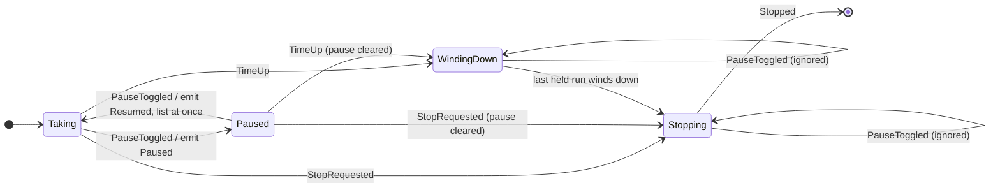
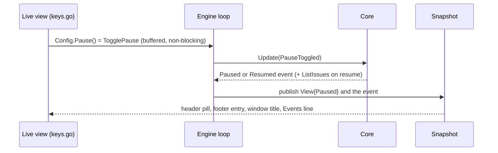

# Pause and resume taking new work from the live view - Plan

## Goal Capsule

- **Objective:** whoever runs crew in the live view can stop or update crew without losing work in progress: they stop crew taking new issues, let what already runs reach its end, then quit or carry on.
- **Means:** Ctrl+P sends a toggle through the engine to the core, which keeps a pause flag that only gates taking issues from a listing (KTD1, KTD5). The live view reads the pause from the snapshot (KTD6).
- **Product authority:** issue #282 and the Product Contract below, copied from the issue body. The Product Contract wins on behaviour; the KTDs win on mechanism. The `:` command line #282 also floats is not active scope.
- **Stop conditions:** stop and report when a requirement cannot hold without changing a held run's decisions in `internal/crew` (Key Decision "Pause stops only the taking of new issues"), or when the acceptance suite's tester refuses the changed snapshots.
- **Execution profile:** one branch, one pull request that closes #282. Units land in U-ID order. The developer never edits `acceptance/scenarios/`; U5 hands that to the tester.

---

## Product Contract

Product Contract preservation: Product Contract unchanged. Its deferred questions are answered in the Planning Contract (KTD3, KTD6).

### Summary

Ctrl+P in the live view pauses crew: it takes no new issue until Ctrl+P is pressed again, while every issue it already holds goes on to its end label. The header says crew is paused and how many issues still run, so its user knows when `q` loses nothing.

### Problem Frame

The person running crew stops it to quit for the day or to update crew to a new build. Stopping today stops every running session: each action whose session crew stopped fails, its issue moves to the rule's failure label and has to be moved back by hand, and the session's work is lost. To avoid that, they have to wait for a moment when nothing runs and press `q` before the next poll takes another issue, which on a busy repository may never come. The run time limit's wind-down lets running work end, but it is set before crew starts, cannot be undone, and exits crew.

### Key Decisions

- **Pause stops only the taking of new issues; held issues run to their end label.** (session-settled: user-directed — chosen over halting a held issue between its actions until resume: half-done issues would sit on their running labels and a stop while paused would have to decide their fate.) Governs R2.
- **One toggle key, Ctrl+P.** (session-settled: user-directed — chosen over separate Ctrl+P and Ctrl+R keys, and over Ctrl+S and Ctrl+Q, which read as quitting and can be swallowed as terminal flow control.) Governs R1, R4.
- **A plain key, not a `:` command line.** (session-settled: user-directed — chosen over building a vim-like `:` command line with pause, resume and quit as its first commands: a key gives the pause without the command line's input, parsing and errors.) Governs R1.
- **A paused crew with nothing running stays open and says so.** (session-settled: user-directed — chosen over exiting on its own once the last held issue ends: a pause must be able to wait and then resume.) Governs R5, R6.
- **The board keeps refreshing while paused.** (session-settled: user-approved — chosen over freezing the listings as the run time limit's wind-down does: the user watches the board while waiting to resume.) Governs R3.
- **A pause lasts only for the running crew.** (session-settled: user-approved — chosen over carrying it across restarts or into `--plain`: the pause exists to stop or update crew from the live view.) Governs R11.

### Requirements

**Pausing and resuming**

- R1. In the live view, Ctrl+P while crew runs pauses it: from then on crew takes no new issue until it is resumed.
- R2. While paused, each issue crew already holds goes on as it would unpaused: its sessions, checks, later actions and ending moves run until it lands on its end label.
- R3. While paused, crew keeps polling: the board shows new and moved issues, owed tracker writes keep retrying, and no listed issue is taken.
- R4. Ctrl+P on a paused crew resumes it, and crew takes issues as usual from the next listing on.
- R5. A paused crew with no held issue keeps running, paused, until it is resumed or stopped.

**Showing it**

- R6. While paused, the header shows that crew is paused and how many held issues still run, and says so plainly once none does.
- R7. Events gets a line when crew pauses and another when it resumes.
- R8. The footer key help and the `?` help list Ctrl+P.

**With stopping and the run time limit**

- R9. `q` and Ctrl+C stop a paused crew exactly as they stop a running one, running sessions included.
- R10. During a wind-down or a stop, Ctrl+P does nothing, and the header shows the wind-down or the stop rather than the pause; a run time limit reached while paused winds crew down as usual.
- R11. A restarted crew starts unpaused, and `--plain` has no pause.

**Documentation**

- R12. The README's live view paragraph describes Ctrl+P, and its "Stopping crew" section describes stopping without losing work: pause, wait for the header to say nothing runs, then stop.

### Acceptance Examples

- AE1. Pausing with work in flight
  - **Covers R1, R2, R3, R6.**
  - **Given:** the live view with two held issues running and a third issue on a rule's ready label.
  - **When:** Ctrl+P is pressed, and several polls pass.
  - **Then:** the header shows crew paused with 2 running; both held issues reach their end labels; the third issue stays on its ready label and on the board; once both ended, the header says crew is paused with nothing running.
- AE2. Resuming
  - **Covers R4, R7.**
  - **Given:** AE1 after both held issues ended.
  - **When:** Ctrl+P is pressed.
  - **Then:** Events shows that crew resumed, the header no longer shows the pause, and crew takes the third issue from the next listing.
- AE3. Stopping without losing work
  - **Covers R5, R9.**
  - **Given:** a paused crew with nothing running.
  - **When:** crew is stopped with `q`.
  - **Then:** crew exits 0 and no issue moved.
- AE4. Stopping before the work ended
  - **Covers R9.**
  - **Given:** a paused crew with one session running.
  - **When:** crew is stopped with `q`.
  - **Then:** crew stops the session, as unpaused, and its issue moves to the rule's failure label.
- AE5. A new issue while paused
  - **Covers R3.**
  - **Given:** a paused crew.
  - **When:** someone puts a rule's ready label on an issue on GitHub.
  - **Then:** the issue shows on the board after the next poll, and crew does not take it.
- AE6. The run time limit while paused
  - **Covers R10.**
  - **Given:** a paused crew with one session running.
  - **When:** the run time limit is reached, then Ctrl+P is pressed.
  - **Then:** the header shows the wind-down, Ctrl+P changes nothing, and crew exits once the held issue ends.

### Scope Boundaries

- A vim-like `:` command line in the live view (`:q`, `:quit`, `:pause` and later commands), the other half of #282, is left for its own idea issue.
- Pausing from `--plain`, through a signal, or from the command line.
- A pause that survives a restart, or crew starting paused.
- Pausing one rule or one queue instead of all of crew.
- A "stop when done" that exits on its own once the held issues end.
- Halting a held issue between its actions until resume.
- Considered and not built: a pause flag in the TUI model that shows the pause before the engine confirms it. The snapshot arrives within one engine step, and a local flag could show a pause the core refused during a wind-down. Evidence that a press visibly lags would change this.

### Dependencies / Assumptions

- #266 (pull request #278) makes `q` and Ctrl+C ask for a second press before stopping. R9 and AE3 hold with or without it: a paused crew stops however a running one does.
- Today a rule's actions all start when crew takes the issue. Rule sequences (#254) start later actions after earlier ones end; R2 covers those later actions too.

### Outstanding Questions

**Deferred to Planning**

- Whether resuming lists at once or waits for the next poll. Answered by KTD3.
- The header's exact wording for paused with running issues and paused with none. Answered by KTD6.

### Sources / Research

- `internal/ui/tui/keys.go`: the live view's keys; `q` and Ctrl+C stop, and Ctrl+P is unbound.
- `internal/app/app.go`: the live view reaches the engine through the `Stop` and `Force` callbacks it is given.
- `internal/core/scheduler.go`: `tick` stops listing once the run time is up, and `listed` takes nothing then; `timeUp` emits `WindingDown`.
- `internal/core/update.go`: `windDown` stops crew once every held issue's actions ended, which a pause must not do (R5).
- `internal/ui/tui/header.go`: the header shows `? help`, `STOPPING` or `WINDING DOWN`.
- `README.md`, "Stopping crew": the stop, the forced exit and the wind-down as documented today.

---

## Planning Contract

### Key Technical Decisions

- KTD1. **The pause is core state that gates only the take.** `core.Model` gets a `paused` flag. While it is set, `listed` still marks gone entries, fills a board filled from the listings, reports skipped and other-kind issues, and emits `PollDone` with `Taken: 0`. It only skips `takeWaiting`. While paused, `tick` lists even when every slot is busy, with no `PollSkipped`. The skip exists only because a full listing could take nothing, and a paused listing takes nothing anyway, while a board filled from the listings changes only through `listed`. `freed`, the retries of owed calls, statuses and pull-request reports, the written board's read and every held run's facts are untouched. So held runs decide exactly as unpaused (R2), the board refreshes even with every slot busy (R3), and `Stopped` stays false while nothing is held, because only a stop or a wind-down sets `stopping` (R5). It implements the Key Decisions that govern R2, R3 and R5.
- KTD2. **One input toggles; a wind-down or a stop ends the pause.** A new scheduler input, `PauseToggled`, flips the flag and does nothing once `stopping` or `timeUp` is set (R10). `stop` and `timeUp` clear `paused` without an event, so the view never reports a pause the wind-down or the stop has replaced, and a run time limit reached while paused winds down as usual (R9, R10). A toggle, rather than separate pause and resume inputs, makes each press one ordered step, so two quick presses never collapse into one (Key Decision "One toggle key, Ctrl+P").
- KTD3. **Resuming lists at once.** When the toggle resumes, the core asks for a listing at once if none is outstanding and a slot is free, as `freed` does. The default poll interval is 300 seconds, so waiting for the next tick could leave a resumed crew idle for five minutes. A listing already in flight at the resume takes when it arrives, because `listed` reads the flag then (R4, AE2).
- KTD4. **Two published events, never journaled.** `core.Paused` and `core.Resumed`, each with its time, join `WindingDown` and `Stopped` as published events that are not run events. The journal records only run events, so a restart starts unpaused by construction (R11). `lines.Text` words them `paused: taking no new issues until resumed; held issues run to their end` and `resumed: taking new issues again` (R7). `--plain` never sees them, because nothing there sends the toggle.
- KTD5. **The engine takes the toggle on a buffered channel.** `Engine.TogglePause` makes a non-blocking send on a small buffered channel. `Run`'s loop steps the core with `core.PauseToggled` for each value it receives, beside its `stop` and `timeUp` cases. `TogglePause` never blocks the live view's update loop. Before its first `core.Tick{}`, `Run` drains the channel without blocking and steps one `PauseToggled` per value. A press made before `Run` therefore always applies before the first listing, rather than racing that listing's result in the loop's `select`. A press after `Run` returns is dropped. `tui.Config` gets a `Pause func()` beside `Stop` and `Force`, and `internal/app` passes `Engine.TogglePause`. Only the live view gets it (R11).
- KTD6. **The live view shows only what the snapshot says.** `core.View` gets `Paused`. Ctrl+P calls `Config.Pause` unless the view is stopping (`m.stopping || m.snap.Stopping`) or winding down (`m.snap.TimeUp`). It keeps no pause state of its own (Scope Boundaries). Ctrl+P works on the board, in the popup and with the help open. The header's right item is chosen in this order: `STOPPING`, `WINDING DOWN`, then while paused a warning pill reading `PAUSED · 2 running`, or `PAUSED · nothing running` once no issue is held, counting the snapshot's held issues, else `? help` (R6, R10). The window title reads `crew · paused` in the same slot. The board footer adds `ctrl+p pause`, or `ctrl+p resume` while paused, after `q q stop`. It leaves the entry out during a wind-down. The `?` help lists `ctrl+p` as "pause or resume taking issues". The popup footer stays as it is (R8).

### Assumptions

- Ctrl+P reaches crew as a key press. In raw mode it is byte 0x10, which neither terminal flow control nor the line discipline takes, so Bubble Tea reports `ctrl+p`. A terminal emulator that binds Ctrl+P to its own action will swallow it. That cost was accepted with the key (Key Decision "One toggle key, Ctrl+P").
- "How many held issues still run" counts every issue the core holds (`View.Issues`), routing and owed ones included. Each of them is work a stop would still cut short.
- The changed footer breaks every screen snapshot under `acceptance/scenarios/screen/testdata/` and the TUI goldens in `internal/ui/tui/testdata/`. Only the tester rewrites the acceptance snapshots (AGENTS.md, "Acceptance"), so U5 runs the tester. The goldens are the developer's and are rewritten with `-update`.

### High-Level Technical Design

The core's pause state:

In Paused, every listing reads the board and takes nothing; held runs move exactly as in Taking.

The toggle's path from the key to the screen:

---

## Implementation Units

### U1. Pause the take in the core

- **Goal:** the core takes no issue while paused, lets held runs go on, resumes with a listing, and gives way to a wind-down or a stop.
- **Requirements:** R1–R5, R7, R9–R11; KTD1–KTD4.
- **Dependencies:** none.
- **Files:** `internal/core/input.go`, `internal/core/model.go`, `internal/core/update.go`, `internal/core/scheduler.go`, `internal/core/event.go`, `internal/core/view.go`, `internal/core/pause_test.go` (new), `internal/ui/lines/lines.go`, `internal/ui/lines/lines_test.go`, `internal/ui/tui/detail.go`.
- **Approach:**
  1. Add `PauseToggled` beside `StopRequested` and `TimeUp` in `input.go`, with its `Stamped`, `arrival` and `schedulerInput` methods, and dispatch it in `schedulerInput`.
  2. Add `paused` to `Model`, a `togglePause` step in `scheduler.go` per KTD2 and KTD3, the gate in `listed` and the paused listing in `tick` per KTD1, and clear `paused` in `stop` and `timeUp`.
  3. Add `Paused` and `Resumed` to `event.go` with their `Time` and `event` methods, `Paused` to `View`, the two lines in `lines.Text` (KTD4), and the two events to `coreEventIssue`'s about-no-issue case in `detail.go`.
- **Patterns to follow:** `timeUp` and `WindingDown` for an input that changes the scheduler and announces itself; `freed` for listing at once; the table tests in `internal/core/timeup_test.go` and `internal/core/stop_test.go`, through the driver in `internal/core/driver_test.go`.
- **Test scenarios:**
  - Covers AE1. Two held issues and a third on a ready label: after `PauseToggled`, a `Paused` event; the next tick lists, and `IssuesListed` with the third issue emits `PollDone` with `Taken: 0` and no take or move command; `View.Paused` is true.
  - Covers AE1. While paused, a held run's session ends and its route's moves are commanded as unpaused; a sequence's later action starts as unpaused.
  - Covers AE5. While paused with a default board filled from the listings, a listing with a new ready issue puts it on the board and takes it not.
  - Covers AE5. Paused with every slot busy: a tick emits `ListIssues` and no `PollSkipped`, and the listing's new ready issue lands on the board without being taken. Unpaused with every slot busy, a tick still emits `PollSkipped`.
  - R3. While paused, an owed call is retried at the next tick.
  - Covers AE2. A second `PauseToggled` emits `Resumed` and a `ListIssues` command; the listing's result takes the third issue; `View.Paused` is false.
  - KTD3. Resume while a listing is outstanding emits no second `ListIssues`, and the outstanding listing takes when it arrives. Resume with every slot busy emits no `ListIssues`.
  - Covers AE3. Paused with nothing held, many ticks: `Stopped()` stays false; then `StopRequested`: `Stopped` is emitted and no move was commanded.
  - Covers AE4. Paused with one running session, `StopRequested`: the run gets the stop as unpaused, and `View.Paused` is false.
  - Covers AE6. Paused with one running session, `TimeUp`: `WindingDown`, `View.Paused` false; a later `PauseToggled` emits nothing and changes nothing; the core stops once the run's route winds down.
  - R10. `PauseToggled` after `StopRequested` emits nothing.
  - `lines.Text` gives the two KTD4 lines for `Paused` and `Resumed`.
- **Verification:** `go test -race ./internal/core ./internal/ui/lines` passes, and the changed lines are covered.

### U2. Carry the toggle through the engine

- **Goal:** a toggle from any goroutine reaches the core as one ordered step and never blocks its caller.
- **Requirements:** R1, R4; KTD5.
- **Dependencies:** U1.
- **Files:** `internal/engine/engine.go`, `internal/engine/engine_test.go` or a new `internal/engine/pause_test.go`.
- **Approach:**
  1. Add a buffered `pause` channel to `Engine`, made in `New`, and `TogglePause`, a non-blocking send, documented beside `Stop`.
  2. Before the first `core.Tick{}`, drain the channel without blocking and step `core.PauseToggled{}` once per value (KTD5). In `Run`'s loop, step it on each receive.
- **Patterns to follow:** `Stop` and its `stop` channel; the `synctest` engine tests with the fake tracker and harness.
- **Test scenarios:**
  - Under `synctest`, with a fake tracker holding a ready issue and a long session running on another: `TogglePause`, then a poll interval passes. The ready issue is not taken, and a subscriber sees a snapshot with `Paused` set and a `Paused` event.
  - A second `TogglePause`: the subscriber sees `Resumed`, and the ready issue is taken without waiting for the next poll interval.
  - `TogglePause` called before `Run` pauses the first listing's take. Called after `Run` returned, it returns at once.
  - Paused with nothing held: `Run` does not return until `Stop`, then returns nil.
- **Verification:** `go test -race ./internal/engine` passes under `synctest` with no leaked goroutine.

### U3. Pause from the live view and show it

- **Goal:** Ctrl+P pauses and resumes from the live view, and the header, footer, help and window title say where crew is.
- **Requirements:** R1, R4, R6, R8, R10, R11; KTD5, KTD6.
- **Dependencies:** U1, U2.
- **Files:** `internal/ui/tui/model.go`, `internal/ui/tui/keys.go`, `internal/ui/tui/header.go`, `internal/ui/tui/outside.go`, `internal/app/app.go`, `internal/ui/tui/model_test.go`, `internal/ui/tui/header_test.go`, `internal/ui/tui/outside_test.go`, `internal/ui/tui/popup_keys_test.go`, `internal/ui/tui/testdata/*.golden`.
- **Approach:**
  1. Add `Pause func()` to `tui.Config` and pass `r.eng.TogglePause` from `runner.renderer`.
  2. Add a `pause` binding (`ctrl+p`) to `keyMap`. Match it in `Model.key` right after the stop keys, ignored per KTD6.
  3. Extend the header's right-item switch, `windowTitle`, `keyHelp`'s board footer and `helpOverlay`'s first group per KTD6.
  4. Rewrite the goldens with `go test ./internal/ui/tui -update`, then review the diff: only the footer line may change.
- **Patterns to follow:** the stop branch of `Model.key` and the harness's `h.stops` counter in `model_test.go`; the `STOPPING` and `WINDING DOWN` pills in `header.go`.
- **Test scenarios:**
  - Covers AE1. Ctrl+P calls `Pause` once and does not call `Stop`. A snapshot with `Paused` and two held issues shows `PAUSED · 2 running` in the header and `crew · paused` as the window title.
  - Covers AE1. A snapshot with `Paused` and no held issue shows `PAUSED · nothing running`.
  - Covers AE2. A snapshot without `Paused` shows `? help` again.
  - Covers AE6. With a snapshot that has `TimeUp`, Ctrl+P does not call `Pause` and the header shows `WINDING DOWN`, even with `Paused` set.
  - R10. After a confirmed stop, or with a snapshot that has `Stopping`, Ctrl+P does not call `Pause`.
  - With the popup open and with the help open, Ctrl+P calls `Pause` once.
  - Ctrl+P while the stop is armed calls `Pause` and leaves the armed notice in place.
  - The board footer reads `q q stop · ctrl+p pause · tab focus · …`, then `ctrl+p resume` while paused, and has no `ctrl+p` entry while winding down.
  - The help overlay lists `ctrl+p` with "pause or resume taking issues".
- **Verification:** `go test -race ./internal/ui/tui ./internal/app` passes, and the golden diff touches only footer lines.

### U4. Document the pause in the README

- **Goal:** the README tells a reader how to pause, how to resume, and how to stop crew without losing work.
- **Requirements:** R12.
- **Dependencies:** U3.
- **Files:** `README.md`.
- **Approach:**
  1. In the live view paragraph, add that Ctrl+P pauses crew: it takes no new issue while each held one runs to its end. The header shows `PAUSED` with how many issues still run, and Ctrl+P again resumes and lists at once.
  2. In "Stopping crew", add a paragraph on stopping without losing work: press Ctrl+P, wait for the header to read `PAUSED · nothing running`, then stop. A pause lasts only for the running crew, `--plain` has none, and a wind-down or a stop ends it.
- **Test scenarios:** Test expectation: none -- documentation only; U5's tester reads it as the contract.
- **Verification:** the README's wording matches the header, footer and Events text of U1 and U3 word for word.

### U5. Hand the pause to the tester

- **Goal:** the acceptance suite's screen snapshots carry the new footer, and scenarios cover the pause from the README's promises.
- **Requirements:** R1–R12 at the binary's level; AE1–AE6 where a pseudo-terminal reaches them.
- **Dependencies:** U1–U4 committed.
- **Files:** `acceptance/scenarios/screen/` and its `testdata/` snapshots, written only by the tester.
- **Approach:** run the repository's `cw-tester` skill with the area `screen` and `#282` in a fresh subagent that has not read crew's code. It decides which snapshots to accept and which scenarios to add, and commits them. A `snapshots refused` outcome is a stop condition. Failing scenarios it reports are fixed in crew's code, never in its scenarios.
- **Test scenarios:** owned by the tester. Expected to include a pause that leaves a ready issue untaken, a resume that takes it, and a stop while paused with nothing running that exits 0.
- **Verification:** `go -C acceptance run ./cmd/acceptance -count=1` passes, with the tester's report recorded in the pull request.

---

## Verification Contract

| Gate | Command | Applies to |
| --- | --- | --- |
| Format | `gofmt -l cmd internal tools acceptance` prints nothing | U1–U3 |
| Vet | `go vet ./...` | U1–U3 |
| Lint | `go run github.com/golangci/golangci-lint/v2/cmd/golangci-lint@v2.14.0 run` | U1–U3 |
| Tests | `go test -race ./...` | U1–U3 |
| Coverage | `go test -race -covermode=atomic -coverpkg=./... -coverprofile=coverage.out ./...`, then `go run github.com/vladopajic/go-test-coverage/v2@v2.19.0 --config=.testcoverage.yml` and `git diff -U0 origin/main...HEAD \| go run ./tools/diffcover -profile coverage.out` | U1–U3 |
| Acceptance | `go -C acceptance run ./cmd/acceptance -count=1`, plus `go -C acceptance vet ./...` and golangci-lint there | U5 |

## Definition of Done

- R1–R12 hold, each proven by a U1–U3 test, the U4 README text or a U5 scenario.
- Every gate in the Verification Contract passes; the changed lines are at least 90% covered.
- The golden diffs change only the footer line, and the acceptance snapshots were rewritten by the tester.
- The README's live view paragraph and "Stopping crew" section match the header, footer, `?` help and Events lines.
- No code from abandoned approaches is left in the diff.
