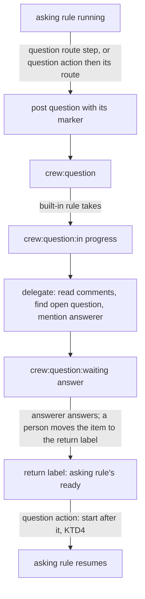
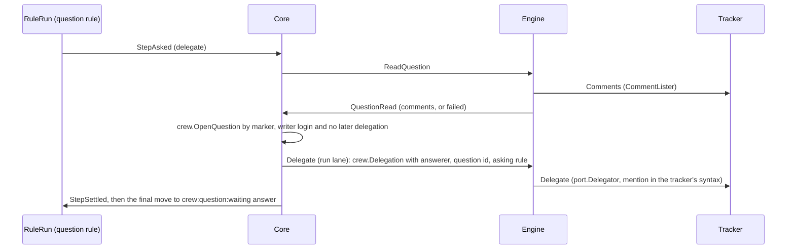

# A rule asks a question and crew delegates it to the configured answerer - Plan

## Goal Capsule

- **Objective:** a rule can ask a question on an item without knowing who will answer it, and the person or App the config names is mentioned on the item and asked to answer. The whole exchange shows on the item, through the tracker only.
- **Means:** a `question` step, written as a route step or as an action, and a built-in rule that takes `crew:question` and mentions the answerer from a new `questions:` section (KTD1, KTD3, KTD6, KTD7).
- **Product authority:** issue #310, part 1 of 2 of #308. Its Product Contract wins on behaviour; the KTDs below win on mechanism. The return of an answered item (R7 to R11, `crew:answered`) is the other part of #308 and is not built here.
- **Stop conditions:** stop and report when a settled Key Decision proves unworkable, when a unit cannot keep `go test -race ./...` green without changing a requirement, or when the work would need edits to `acceptance/scenarios/`, which only the tester makes.
- **Execution profile:** one branch and one pull request whose body contains `Closes #310`. Units land in U-ID order, and every unit keeps every gate green.

---

## Product Contract

Product Contract preservation: unchanged. R1 to R6, R12 to R14, AE1, AE6, AE7 and F1 are issue #310's, carried below as written there; R7 to R11 and AE2 to AE5 belong to the other part of #308. KTD1 reads R1's "as the rule's bot" as crew's tracker writer; Open Questions asks the boss to confirm that reading.

### Summary

A rule asks with a question step: it posts the question on the item with crew's marker and the question's parameters, its id, the rule that asked and a return label checked at config load, and moves the item to `crew:question`. A built-in rule takes the items in `crew:question`, reads the open question, mentions the answerer the config names, and leaves the item waiting in a label no rule takes. All of it runs through the tracker port.

### Problem Frame

Today a rule reacts only to labels. A run that needs an answer can pause through a `waiting` route (#255), but nothing tells anyone that a question waits, and the session that asked must know whom to trust. #307 wants crew to drive a skill's flow step by step, with steps asking for help the way a remote, asynchronous team does in a thread. Without a generic way to ask, every intermediate step needs a label of its own and every pause needs a person who happens to notice it.

### Key Decisions

- **Questions travel through the tracker, as labels and comments.** (session-settled: user-directed — chosen over a local chat held as a second tracker: for a remote, asynchronous team the tracker is enough.) Governs R1, R12.
- **The protocol is a tracker concern, and GitHub is only the provider in use today.** (session-settled: user-directed — chosen over a GitHub-specific protocol: GitHub is used now by circumstance.) Governs R12, R13.
- **Two labels and two built-in rules, not a watcher over every comment.** (session-settled: user-directed — chosen over a repository-wide comment feed where `@bot name` commands trigger rules: crew needs to know which items to read.) Governs R4, R13.
- **The rule that asks does not choose who answers.** (session-settled: user-directed — chosen over the asking rule naming its answerer: the question is generic and `crew:question`'s built-in rule delegates it.) Governs R2, R4.
- **Who answers is fixed in the config for now.** (session-settled: user-directed — chosen over a rule for choosing the answerer now: that choice, by fixed rules or an oracle, comes later.) Governs R5.
- **The return label always comes from the question, never from the answer.** (session-settled: user-directed — chosen over the answer naming where to go: stated by the boss.) Governs R3.
- **The return label is checked when crew loads the config.** The question step names it in the config, so #220's decision that destinations are fixed in the config holds. Governs R3.

### Actors

- A2. A rule that asks: it posts a question and, once the item returns to its ready label, resumes.
- A3. crew's built-in rule for `crew:question`: it delegates each question.
- A4. The answerer: the person or App the config names.

### Requirements

**Asking**

- R1. A rule asks with a question step, as an action or a route step. The step posts the question on the item as the rule's bot, with crew's marker and the question's parameters, then moves the item to `crew:question`.
- R2. A question's parameters are its id, the rule that asked and the return label. A question names no answerer.
- R3. The return label is the ready label of a rule in the config. crew refuses a config whose question step names any other label, and the error names the file, key path and line.

**Delegating**

- R4. A built-in rule takes the items in `crew:question`, reads the item's open question and delegates it by mentioning the answerer on the item.
- R5. The answerer is the one person or App the config names for every question.
- R6. After delegating, the item waits in a label no rule takes until someone moves it on.

**Tracker**

- R12. The protocol uses only what the tracker port provides: labels, comments and their authors. Another tracker provider supports it by implementing those, with no change to crew's rules or core.
- R13. crew reads comments only on the items its built-in rules take.
- R14. An item has at most one open question, since it carries one crew state label at a time.

### Key Flows

- F1. A question and its delegation
  - **Trigger:** a rule's action ends with a verdict whose route holds a question step, or the rule reaches a question action.
  - **Actors:** A2, A3, A4
  - **Steps:** the question step posts the question and moves the item to `crew:question`. At the next poll, the built-in rule takes the item, reads its open question, mentions the answerer and moves the item to `crew:question:waiting answer` (KTD7). The answerer answers on the item. Until the other part of #308 ships, a person moves the item to the question's return label by hand, and the rule that asked takes it and resumes.
  - **Outcome:** the item's thread shows the question and the delegation, and the answerer was notified.
  - **Covered by:** R1, R4, R6

### Acceptance Examples

- AE1. **Covers R1, R2, R4, R5.** Given the deps rule posts "Does #277 block #281?" with the return label `crew:deps:ready`, when crew polls, the item moves to `crew:question`, and the built-in rule mentions the configured answerer on it. The question names no answerer.
- AE6. **Covers R3.** Given a question step whose return label is no rule's ready label, when crew loads the config, it refuses it and names the file, key path and line.
- AE7. **Covers R12.** Given the in-memory tracker in place of GitHub, when a rule asks, the same flow runs with no change to the rules.

### Scope Boundaries

- The return of an answered item (R7 to R11): `crew:answered`'s built-in rule, which checks the answer and returns the item to the question's return label, is the other part of #308.
- Choosing the answerer per question, by fixed rules or by an oracle such as the judge of #203.
- Bots that answer a question and move the item on.
- A question someone writes on an item by hand: only a question step posts a question.
- More than one open question on an item.
- Moving the intermediate steps of the refinement or the brainstorm onto questions: the rules for #307's skills.
- This repository's own `.crew/config.yaml` keeps its rules as they are: whether its rules ask questions, and in which queue the built-in rule runs, is the boss's call.
- Considered and not built: `@bot name [inputs]` commands typed in comments, a local chat as a second tracker, and webhooks. The issue records why.
- Considered and not built: a failed route for the built-in rule when the item holds no question. The delegation still mentions the answerer and says crew found none (KTD8), so a person who put the label by hand is told at once. Evidence of labels moved by hand and left unnoticed would change the call.
- Considered and not built: checking that the answerer can comment on the repository. GitHub mentions anyone; a wrong login shows on the item at the first delegation.
- Questions asked from rules that take pull requests: refused at load for now (KTD6), since the built-in rule takes issues.

#### Deferred to Follow-Up Work

- A default board column for `crew:question:waiting answer`, so an item waiting for its answerer stays on screen.
- The other part of #308 (#311) counts an answer only from someone #255 trusts (its R10). It should check at startup that `questions.answerer` is a code owner or on the answering list, since this part accepts any login and nothing here reads an answer.
- #311's R11 hands the answer to the rule that resumes. A run after a question action starts at the next action (KTD4), which asked nothing, so #311 needs a way to tie the question's id to that run; #255's answers are tied to the session that asked.
- The tester writes the scenarios for F1, AE1 and AE6 against the built binary.

---

## Planning Contract

### Key Technical Decisions

**The question step**

- KTD1. **A question is a step kind of crew's own, not a function.** A route writes it as `- question: {id: <id>, text: <template>, return: <label>}`. A function cannot be used: `port.FunctionCall` carries no tracker, and its parameters are checked by its factory, which cannot see the rules R3 checks the return label against. The step posts through the outbox's run lane like a comment step, so it is retried, owed and dropped like one.
  - `id` follows the verdicts' name grammar (`checkName` in `internal/crew/verdict.go`). `text` is a comment template over `CommentData`, parsed and sample-rendered at load like a comment step's. A text that does not render for the run fails the step as a comment step does.
  - The body is the rendered text, then the question's marker on its own line (KTD5). The GitHub adapter adds crew's own marker to every comment it posts (#255), so the question carries both.
  - It posts as crew's tracker writer, `tracker.bot` or you, as every comment step does. Issue #310 says "as the rule's bot": a rule has no bot of its own, and `port.Commenter` writes only as the tracker's writer. See Assumptions.
- KTD2. **A question step ends its route.** The config refuses any step after it and appends the move to `crew:question` itself, so the route still ends with one move (#254's R15) and the core's final-step logic is unchanged. A route that writes a move or close of its own after the question is refused, as is a written `move: crew:question` anywhere, so only a question puts an item there.
- KTD3. **A question action ends at once and leads to a route crew declares for it.** In a rule's actions it is written `- question: {id, text, return}`, with an optional `name:` beside it, `question` by default. It accepts no `on:`.
  - When the run reaches it, the action ends at once, without I/O, with the new verdict `asked` (`crew.Asked`). Its `On` sends `asked` to a route of the same name as the action, which the config adds to the rule's routes: the question step, then the move to `crew:question`.
  - The config refuses a declared route of that name. Two question actions in one rule need distinct names, as two sessions on one agent do today.
  - A stop or time-up before it ends it through `failed`, as any action's start does.
- KTD4. **A resume after a question action starts after it.** `startAfter` in `internal/crew/history.go` decides it, before its branch for a run without a worktree, when the last run's cursor is a question action that ended with `asked`:
  - When the question was the rule's last action, the next run gets `StartPassedRoute`, in the worktree when one can be reopened.
  - When an action follows it and the worktree can be reopened, the next run gets `StartAt` that action.
  - When an action follows it and no worktree can be reopened (none was opened, or it is gone or retired), the next run starts fresh and asks again. This is the one case that asks the same question twice, and the README says so.
  - The journal keeps its existing start kinds. A route-step question resumes as today: at the action whose verdict chose the route.
- KTD5. **The question's marker is part of crew's marker protocol in `internal/crew/marker.go`.** It is `<!-- crew:question id=<id> rule=<rule> return=<label> -->`, its values query-escaped as `SessionMarker`'s are. Because it starts with `<!-- crew:`, a question is never an answer to a session's question (#255's R43).

**Configuration and the built-in rule**

- KTD6. **A top-level `questions:` section turns the protocol on.** It holds `answerer`, required, and `queue`, optional, `default` by default.
  - `answerer` is one login: a user, or an App as `<slug>[bot]`. `github-actions[bot]` is refused in any case, as in `answering_apps`.
  - `queue` names a declared queue or `default`, as a rule's `queue` does. A queue with no slots is allowed, as for any rule.
  - Without the section, crew adds no built-in rule and refuses every question step, naming its key path and line and saying that `questions.answerer` is missing. A config without questions behaves as today.
  - A question step or action in a rule that takes pull requests is refused at its key path and line: the built-in rule takes issues, so such a pull request would stay in `crew:question` for good. See Open Questions.
- KTD7. **The built-in rule is a rule without actions that the config adds.** It is named `question`, takes `crew:question`, runs in `crew:question:in progress`, and its `passed` route is the delegation step (KTD8), then a move to `crew:question:waiting answer`, which no rule takes (R6). It does not notify.
  - The config refuses a user rule named `question`, and any user rule whose ready or running label, or whose written move, is one of the three labels, compared ignoring case after `spellOnce`.
  - Because it is a `crew.Rule`, the scheduler, the outbox, the status comment and the label creation at Prepare treat it as any other rule. The config puts it before every user rule in `Config.Rules`: at equal priority the scheduler takes later rules first (`waiting` in `internal/core/scheduler.go`), so user rules of equal priority take first. It also shows first in the live view's rule order.
- KTD8. **The delegation step reads the comments, finds the open question and hands the tracker a delegation to post.** It is a step kind of its own (`crew.DelegateStep`) that only the built-in rule holds; the config's grammar has no word for it.
  - The core sends `ReadQuestion`, the engine lists the comments through `port.CommentLister` within the lookup timeout and posts `QuestionRead`. The engine shares one listing helper with `readAnswers`.
  - `crew.OpenQuestion` picks the latest comment that holds a question marker and crew's own marker and whose author is crew's writer, `tracker.bot`'s login or your `gh` login, compared ignoring case, and returns it only when no delegation comment by crew's writer comes after it. A forged marker by anyone else is ignored, and a question delegated before, such as an earlier rule's after a question post the tracker refused, is not delegated again. This is the read R13 allows.
  - The core builds a `crew.Delegation`: the answerer, the question's id and asking rule when one was found, and whether it was found, not found or the read failed. It never carries the question's text. The outbox delivers it in the run lane through a new call kind beside `CallReport`, so it is retried, owed and dropped like a report.
  - Every delegation mentions the answerer, also when the read failed or found no question, and then says so, so the step never strands an item silently. Each carries the delegation marker `<!-- crew:delegated id=<id> -->` (an empty id when none was found), defined beside the question marker (KTD5).
- KTD9. **The tracker formats the delegation in its own markup.** An optional `port.Delegator` posts a `crew.Delegation`, as `ReportFailure` posts a `crew.FailureReport`, with its errors classified as `Move`'s; the mention syntax is the adapter's. The GitHub adapter writes a user answerer as `@login` and an App answerer `<slug>[bot]` as `@<slug>` in a code span, so GitHub notifies no user who happens to own the login `<slug>`, while an App that reads comment text still finds its trigger. `fake.Routing` implements it too (AE7).
- KTD10. **A question needs a tracker that can carry the protocol.** `app.build` refuses, with exit code 2 and naming the key path, a question step without a `port.Commenter`, and a `questions:` section without a `port.Delegator` and a `port.CommentLister`, or without a way to know crew's writer login: a `port.LoginFinder`, or a `tracker.bot` that acts. This follows `routeSteps` and `waitingSessions` in `internal/app/checks.go`. `port.Commenter`'s doc gains the duty the GitHub adapter already meets: the tracker writes `crew.PostedMarker` on every comment it posts, so a new provider knows R12's whole contract.
- KTD11. **The core gets the answerer and crew's writer logins as one option.** The engine builds it in `prepare`, once the tracker found its login, from `questions.answerer`, `tracker.bot`'s login when that bot acts, and the `gh` login. The core uses it in `crew.OpenQuestion` and in the `crew.Delegation` it builds.
- KTD12. **The run journal stays at version 3.** A route's step plans gain the kinds `question` and `delegate` in `internal/adapter/jsonl/line.go`. `asked` is a verdict like any other. A journal written before this change holds neither, so nothing old changes meaning.

Jev is not used: finding the question is a marker and a login, exact rules, not a judgment on free text.

### High-Level Technical Design

How an item moves through the asking rule and the built-in rule (F1):



How the delegation step runs between the core and the engine (KTD8):



What the config turns a question into (KTD2, KTD3, KTD7), as directional guidance:

```yaml
questions:
  answerer: octocat
rules:
  deps:
    labels: {ready: "crew:deps:ready", running: "crew:deps:in progress"}
    actions:
      - agent: developer
        prompt: ...
        on: {unsure: ask}
      - question: {id: blocks, text: "Does {{.Issue.Ref}} block #281?", return: "crew:deps:ready"}
        name: confirm
    routes:
      passed: "crew:deps:done"
      failed: "crew:deps:failed"
      ask:
        - question: {id: unsure, text: "...", return: "crew:deps:ready"}
      # crew adds: confirm: [question blocks, move crew:question]
      # and appends move crew:question to ask
```

### Assumptions

- "As the rule's bot" (R1) reads as crew's tracker writer, `tracker.bot`, the identity every route comment already uses. Posting as the latest session's bot would need a commenter per identity, which `port.Commenter` does not have. The pull request body states this reading.
- GitHub notifies no App on a mention. An App answerer reacts only to the comment text its own webhook or workflow receives, and some, such as the Claude Code GitHub Action, skip comments written by bots unless told otherwise; the delegation is posted as `tracker.bot`, an App. The README says that an App answerer must be set up to act on comments crew's bot writes.
- The built-in rule's labels are fixed: `crew:question`, `crew:question:in progress` and `crew:question:waiting answer`. The issue names `crew:question` and leaves the waiting label to planning. They follow this repository's `crew:<rule>:<state>` shape only because the rule is named `question`; any repository gets the same three labels.
- The built-in rule runs in the default queue unless `questions.queue` names another. In a config whose default queue has no slots, such as this repository's, the item waits in `crew:question` until the boss gives the rule a queue; the README says so.
- Until the other part of #308 ships, nothing returns an answered item: a person moves it to the return label, as #255's waiting route asks today.

### Open Questions

Neither blocks implementation: the plan builds the reading stated, and the pull request body asks the boss to confirm each.

- R1 says the question is posted "as the rule's bot". The plan posts it as crew's tracker writer (KTD1). Posting as the asking run's session bot would need a commenter per identity. Which identity asked matters to #311, where an App that asked a question cannot answer it.
- R1 says "a rule" asks, and rules may take pull requests. The plan refuses questions in pull-request rules (KTD6) rather than adding a second built-in rule or a second set of labels for pull requests.

### Deferred to Implementation

- The exact wording of the GitHub adapter's delegation comment in its three cases: found, not found, read failed.
- The exact Go names of the command, the input, the step kinds and the option of KTD11.
- Whether the implicit route of a question action is built in `internal/config/sequence.go` or `internal/config/routes.go`, and where `checkRoutes` learns of it.
- How `startAfter` reads the question case without disturbing the other start kinds; KTD4 fixes the behaviour and keeps the journal's start kinds.

### Sequencing

U1 builds the domain alone. U2 parses it from the config and adds the built-in rule. U3 runs it in the core and the engine. U4 wires the app's checks and the journal and renderers, and proves the whole flow on the in-memory tracker. U5 documents it. Every unit keeps every gate green.

---

## Implementation Units

### U1. Domain: the question, its marker, its steps and the question action

- **Goal:** `internal/crew` can describe a question, post it as a step, end a question action at once with `asked`, resume after it, and find an item's open question in its comments.
- **Requirements:** R1, R2, R14; KTD1, KTD3, KTD4, KTD5, KTD8.
- **Dependencies:** none.
- **Files:**
  - Domain: `internal/crew/marker.go` (the question and delegation markers), a new `internal/crew/ask.go` (the `Question` type, `QuestionStep`, `DelegateStep`, `QuestionSpec`, `Delegation`, `OpenQuestion`), `internal/crew/route.go`, `internal/crew/routing.go` (`StepQuestion`, `StepDelegate` plans), `internal/crew/actionkind.go`, `internal/crew/verdict.go` (`Asked`), `internal/crew/decide.go` (`start` for `QuestionSpec`), `internal/crew/history.go` (`startAfter`), `internal/crew/rule.go` (`needsWorkspace`), `internal/crew/fact.go` and `internal/crew/fact_route.go` (the new kinds are tracker steps).
  - Tests: `internal/crew/marker_test.go`, a new `internal/crew/ask_test.go`, `internal/crew/decide_test.go`, `internal/crew/history_test.go`, `internal/crew/fixtures_test.go`.
- **Approach:**
  1. Add the question type: id, text template, return label; and its body for a run: the rendered text, then its marker with the run's rule (KTD1, KTD5).
  2. Add `QuestionStep` and `DelegateStep` as tracker steps, beside `CommentStep`, and their plans.
  3. Add `QuestionSpec` and `Asked`; `start` ends a question action at once with `Asked`, through its `On`, once no stop or time-up holds it (KTD3).
  4. `startAfter` starts after a question action that ended with `Asked`, per KTD4.
  5. Write `OpenQuestion(comments, writers)` and the `Delegation` value per KTD8.
- **Execution note:** write `OpenQuestion` and the restart rule test-first, as tables.
- **Patterns to follow:** `CommentStep` and `CommentTemplate` in `internal/crew/route.go` and `template.go`; `SessionMarker` and its `url.QueryEscape` values in `internal/crew/marker.go`; `Answers` in `internal/crew/answer.go` for a pure pick over comments; the decision tables in `internal/crew/decide_test.go`.
- **Test scenarios:**
  - The question marker of id `blocks`, rule `deps` and return `crew:deps:ready` round-trips through the parser, also when the rule and label hold spaces and `-->`.
  - A question's body for issue #42 holds the rendered text, then its marker on the last line.
  - A run reaching a question action emits the action's end with `asked` and chooses the route named after the action, without asking for a session, a script or a function.
  - A run stopped before its question action ends it through `failed`.
  - Covers R14. With two question comments by crew's writer, `OpenQuestion` returns the later one.
  - A question followed by a delegation comment by crew's writer is not open; with no later question, `OpenQuestion` returns none.
  - An earlier question delegated, then a later question whose post the tracker refused, leaves no open question: the earlier one is not delegated again.
  - A comment with a question marker but no crew marker, or by a login other than the writers, is not a question; a writer login in another letter case is.
  - A comment by the writer with crew's marker but no question marker is not a question.
  - No comments, or none that qualify, gives no question.
  - A last run whose cursor is a question action that ended with `asked`, followed by a session: the next run starts at the session.
  - The same, with the question action last: the next run runs only the `passed` route, with or without a worktree to reopen.
  - A rule whose only action is a question action: the next run runs only the `passed` route.
  - A question action followed by a session, whose worktree is gone: the next run starts fresh at the first action.
  - A last run without a worktree, its question action followed by a function action: the next run starts fresh.
  - A last run ended by a session whose verdict chose a route holding a question step: the next run starts at that session, as today.
  - A rule whose only action is a question action needs no workspace.
- **Verification:** `go test -race ./internal/crew` passes, and no existing decision or history row changes.

### U2. Config: `questions:`, the question step and action, and the built-in rule

- **Goal:** crew loads question steps and actions, checks their return labels, and adds the built-in rule when `questions:` is written.
- **Requirements:** R1, R2, R3, R5, R6; KTD2, KTD3, KTD6, KTD7.
- **Dependencies:** U1.
- **Files:**
  - Config: a new `internal/config/questions.go` (the section, the built-in rule, the return-label check), `internal/config/routes.go` (the `question` step word, its last-step rule and appended move), `internal/config/sequence.go` (the `question` item), `internal/config/rules.go` (the implicit route, `spellOnce` over return labels), `internal/config/graph.go` (reserved name and labels, `ends`), `internal/config/actions.go` (`question` in `reservedNames`), `internal/config/config.go` (the top-level key, `Config.Questions`).
  - Schema and fixtures: `schema/config.schema.json`, `.crew/config.example.yaml`, `internal/config/testdata/translation/.crew/config.yaml`.
  - Tests: a new `internal/config/questions_test.go`, `internal/config/routes_test.go`, `internal/config/sequence_test.go`, `internal/config/config_test.go` (the `rejectCase` table), `internal/config/schema_test.go`, `internal/config/config_example_test.go`.
- **Approach:**
  1. Parse `questions:` per KTD6 and keep it on `Config`.
  2. Parse the `question` route step and action per KTD2 and KTD3, with its template parsed and sample-rendered at load.
  3. After `spellOnce`, check every question's return label against the user rules' ready labels (R3), each error with its file, key path and line.
  4. Append the built-in rule per KTD7 once the user rules passed `checkGraph`, and refuse the reserved name and labels.
- **Patterns to follow:** `effectStep` and `checkSteps` in `internal/config/routes.go` and `graph.go`; `answeringApps` in `internal/config/answering.go`; `ruleQueue` in `internal/config/queue.go`; the `rejectCase` tables.
- **Test scenarios:**
  - A route `ask: [{question: {id: unsure, text: "Is it?", return: "crew:deps:ready"}}]` loads as a question step, then a move to `crew:question`.
  - A question action with `name: confirm` loads as an action whose `on` sends `asked` to a route `confirm`, which the rule's routes hold.
  - A question action without `name` is named `question`; two in one rule without names are refused at the later one.
  - Covers AE6. `return: "crew:nowhere"` is refused naming the file, `rules.deps.routes.ask[0].question.return` and its line; the same for a question action's `return`.
  - A return label written `Crew:Deps:Ready` matches the rule's `crew:deps:ready`.
  - A return label equal to `crew:question` is refused.
  - A step after a question step, and a written `move: crew:question`, are refused at their lines.
  - A question action with `on:` is refused; a declared route named like a question action is refused.
  - `id: "two words"` and a `text` naming `{{.Reason}}` are refused at their lines.
  - A question step without `questions:` is refused, saying `questions.answerer` is missing.
  - With `questions: {answerer: octocat}`, the rules start with the built-in rule `question`, before every user rule: ready `crew:question`, running `crew:question:in progress`, no actions, a `passed` route of the delegation step and a move to `crew:question:waiting answer`, notify off.
  - `answerer: github-actions[bot]` in any case is refused; a missing `answerer` is refused; `answerer: claude[bot]` loads.
  - `questions.queue: clerk` names a declared queue; an unknown queue is refused as a rule's is.
  - A question step or question action in a rule with `takes: pull_requests` is refused at its key path and line.
  - A user rule named `question`, or taking `crew:question:waiting answer`, is refused when `questions:` is written, and loads when it is not.
  - The schema, the decoder's key tree and the example match both ways, and the example sets `questions:` and a question step.
- **Verification:** `go test -race ./internal/config` passes; a config without `questions:` or question steps loads exactly as before.

### U3. Core and engine: posting the question and delegating it

- **Goal:** a question step posts its question through the run lane, and the delegation step reads the comments and mentions the answerer.
- **Requirements:** R1, R4, R5, R13; KTD1, KTD8, KTD9, KTD11.
- **Dependencies:** U1.
- **Files:**
  - Core: `internal/core/steps.go` (`askStep` for both kinds), `internal/core/outbox.go` (the delegation call kind), `internal/core/command.go` (`ReadQuestion`, the delegate command), `internal/core/input.go` (`QuestionRead`), a new `internal/core/question.go` (the read, the delegation value, the option), `internal/core/update.go` (dispatch), `internal/core/model.go` (the option).
  - Engine: `internal/engine/answers.go` (the shared listing helper and `readQuestion`), `internal/engine/exec.go` (dispatch, and the delegate call through `port.Delegator`), `internal/engine/engine.go` (the option at `prepare`, `Config.Answerer`).
  - Tests: a new `internal/core/question_test.go`, `internal/core/steps_test.go`, `internal/core/route_test.go`, `internal/engine/answers_test.go`, `internal/engine/engine_test.go`.
- **Approach:**
  1. `askStep` renders a `QuestionStep`'s body for the run and delivers it as a comment in the run lane, as it does a `CommentStep` (KTD1).
  2. For a `DelegateStep`, the core sends `ReadQuestion` and holds the step; `QuestionRead` builds the `crew.Delegation` per KTD8 and the outbox delivers it in the run lane (KTD9). A read for a run or step the core no longer waits on changes nothing.
  3. The engine reads the comments within `lookupTimeout` through the helper `readAnswers` already uses, and posts `QuestionRead` with the comments or the failure.
  4. The engine hands the core the answerer and writer logins in `prepare` (KTD11).
- **Patterns to follow:** `sessionAsked` and `answersRead` in `internal/core/answers.go`; `readAnswers` in `internal/engine/answers.go`; `askStep` and `stepEnded` in `internal/core/steps.go`; `WithBots` in `internal/core/bots.go` for an option.
- **Test scenarios:**
  - Covers AE1. A run of `deps` choosing route `ask` sends one `Comment` whose body holds the rendered question and its marker naming the rule `deps` and the return label `crew:deps:ready`, then the move from `crew:deps:in progress` to `crew:question`.
  - Covers AE1. The built-in rule's run sends `ReadQuestion`; given a question comment by crew's writer, it delivers one delegation for the answerer `octocat`, naming `blocks` and `deps` and holding none of the question's text; then the move to `crew:question:waiting answer`.
  - A read that failed: the delegation says the read failed; the route still ends with its move.
  - No question found: the delegation says none was found and carries no question id.
  - A delegation the tracker refuses is given up, and the route's move still runs; a transient failure is owed and retried like a report.
  - A `QuestionRead` for a run the core does not hold, or whose step already settled, changes nothing.
  - A question step whose comment the tracker refuses is given up, and the route's move still runs.
  - A stop while crew reads: the step settles, and the route still ends with its move, as other tracker steps do after a stop.
  - The engine's read posts the comments it listed, or a failed read with a scrubbed reason when the listing fails or times out.
  - The engine hands the core the answerer and the writer logins found at Prepare.
- **Verification:** `go test -race ./internal/core ./internal/engine` passes.

### U4. App, journal and renderers: the whole flow on any tracker

- **Goal:** crew refuses questions on a tracker that cannot comment or list comments, journals the new steps, words them in the views, and runs the whole flow on the in-memory tracker.
- **Requirements:** R12, R13; KTD10, KTD11, KTD12.
- **Dependencies:** U2, U3.
- **Files:**
  - App: `internal/app/checks.go` (KTD10), `internal/app/app.go` (the answerer into the engine config).
  - Port: `internal/port/port.go` (`Delegator`, and `Commenter`'s duty to write `crew.PostedMarker`).
  - GitHub: `internal/adapter/github/comment.go` or a new `delegate.go` (rendering a `crew.Delegation`, KTD9) and its test.
  - Fake: `internal/fake/routing.go`: each posted comment joins the issue's listing with a settable author login and `crew.PostedMarker`, as the GitHub adapter posts it; it implements `port.LoginFinder` and `port.Delegator`, and records each comment listing per issue.
  - Journal: `internal/adapter/jsonl/line.go` and its tests.
  - Views: `internal/ui/lines/route.go`, `internal/adapter/github/status_render.go`, and their tests; TUI golden files only if a view changes.
  - Tests: a new `internal/app/app_questions_test.go`, `internal/app/app_test.go`.
- **Approach:**
  1. Add `port.Delegator`, its GitHub rendering and the fake's changes, then the startup check per KTD10, beside `routeSteps` and `waitingSessions`.
  2. Map the new step kinds in the journal's step plan names (KTD12).
  3. Word the new step kinds where the lines renderer and the status comment word comment steps: "posted the question" and "asked the answerer".
  4. Write the app test of F1 on `fake.NewRoutingTracker`, which comments, lists comments and moves.
- **Patterns to follow:** `internal/app/app_answers_test.go` and `app_routes_test.go` for an app run on the routing fake; the step-kind map in `internal/adapter/jsonl/line.go`.
- **Test scenarios:**
  - Covers AE7. On `fake.NewRoutingTracker`, a rule whose session's verdict leads to a question route: after the polls, the item has the question comment, then a delegation for the answerer that names the question id and the rule `deps` (the found case), and carries `crew:question:waiting answer`.
  - Covers AE7. The same with a question action between two shell actions: the first runs, the question is asked, and when the test moves the item back to the rule's ready label, the next run starts at the second shell action, which runs; the first does not run again.
  - Covers R13. In that flow the fake records comment listings only for the built-in rule's run.
  - A tracker that delegates but lists no comments fails startup with exit code 2, naming `questions`; a rule with a question step on a tracker that cannot comment fails the same way.
  - A tracker without `port.LoginFinder`, with no acting `tracker.bot`, fails startup with exit code 2 when `questions:` is written.
  - The GitHub adapter renders a delegation for `octocat` as `@octocat` and for `claude[bot]` as `@claude` in a code span, with crew's marker and the delegation marker, in the found, not-found and failed-read cases.
  - A config without `questions:` starts on a tracker that lists no comments.
  - A route step plan of kind `question` or `delegate` round-trips through the journal; an older line decodes as before.
  - The lines view and the status comment word a settled question step and delegation step.
- **Verification:** `go test -race ./internal/app ./internal/adapter/jsonl ./internal/adapter/github ./internal/ui/...` passes.

### U5. Docs and the acceptance doubles

- **Goal:** the README and the glossary describe the question step, the built-in rule and `questions:`, and the acceptance doubles serve every `gh` call the flow makes.
- **Requirements:** R1 to R6 as documented behaviour; AGENTS.md's "Keep it true".
- **Dependencies:** U4.
- **Files:** `README.md`, `CONCEPTS.md`, `AGENTS.md`, and `acceptance/fakegithub` only if U5's check finds a call it does not serve.
- **Approach:**
  1. README, Rules: a part on questions, with the `questions:` section, the step and action forms, the return-label check, the built-in rule and its three labels, the delegation comment, and that a person moves an answered item to the return label until crew does. It names the queue caveat of Assumptions, that an App answerer must act on comments crew's bot writes, that questions in pull-request rules are refused, and KTD4's one case that asks again.
  2. `CONCEPTS.md`: entries for the question step and the answerer; the Resume entry says a run after a question action starts after it; Flagged ambiguities separate a rule's question from a session's question and a question of the question bank.
  3. `AGENTS.md`: `internal/crew`'s and `internal/config`'s descriptions name the question step, `questions.go` and the built-in rule.
  4. Check that `acceptance/fakegithub` serves the label creation, comment posting and comment listing the flow uses; the flow adds no new kind of `gh` call, so no change is expected.
- **Test expectation:** none -- documentation; U2's schema and example tests pin the keys the README names.
- **Verification:** the README names no key the decoder refuses and describes no behaviour U1 to U4 did not build; `go -C acceptance vet ./...` passes.

---

## Verification Contract

| Gate | Command | Applies to |
|---|---|---|
| Format | `gofmt -l cmd internal tools acceptance` prints nothing | every unit |
| Vet | `go vet ./...` | every unit |
| Lint and layering | `go run github.com/golangci/golangci-lint/v2/cmd/golangci-lint@v2.14.0 run` | every unit |
| Tests | `go test -race ./...` | every unit |
| Coverage floors | `go test -race -covermode=atomic -coverpkg=./... -coverprofile=coverage.out ./...`, then `go run github.com/vladopajic/go-test-coverage/v2@v2.19.0 --config=.testcoverage.yml` (total at least 90%) and `git diff -U0 origin/main...HEAD \| go run ./tools/diffcover -profile coverage.out` (changed lines at least 90%) | before the pull request |
| Vulnerabilities | `go run golang.org/x/vuln/cmd/govulncheck@v1.8.0 ./...` | before the pull request |
| Acceptance module | `go -C acceptance vet ./...` and golangci-lint in `acceptance/` | before the pull request |
| Acceptance smoke | `go -C acceptance run ./cmd/acceptance -count=1 -run TestSmoke` | before the pull request |
| Codacy limits | functions of at most 50 NLOC and complexity 15, files of at most 500 lines | every new or changed file, especially `internal/core/steps.go`, `internal/config/routes.go`, `internal/config/graph.go` and `internal/crew/history.go` |

---

## Definition of Done

- Every unit's Verification holds, and every gate above passes.
- A config without `questions:` and without question steps behaves exactly as before: same rules, same labels, no comment read.
- crew reads comments only for a session's answers (#255) and the built-in rule's delegation.
- README, `CONCEPTS.md`, `AGENTS.md`, `schema/config.schema.json` and `.crew/config.example.yaml` describe `questions:`, the question step and action, and the built-in rule.
- Code from abandoned approaches is removed from the diff.
- The pull request body contains `Closes #310`, states the readings in Assumptions, and hands F1, AE1 and AE6's acceptance scenarios to the tester.
