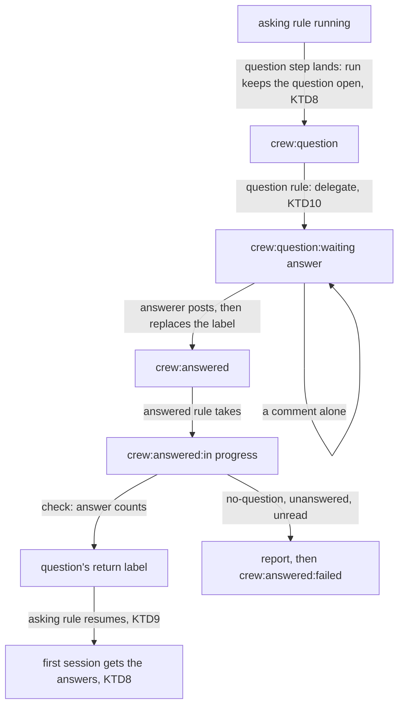

# Return an answered question to the rule that asked - Plan

## Goal Capsule

- **Objective:** a rule can ask a question without knowing who will answer it, and it picks up again on its own once the answer is in. The whole exchange shows on the item, and nobody moves a label by hand to get the rule going again.
- **Means:** a second built-in rule takes `crew:answered`, checks the answer and moves the item to the question's return label (KTD1 to KTD4). The rule that asked resumes and hands the answer to its next session (KTD8).
- **Product authority:** issue #311, part 2 of 2 of #308. Its Product Contract wins on behaviour, and the KTDs below win on mechanism. Part 1 (#310, shipped as #313, `docs/plans/2026-10-07-2037-feat-rule-asks-question-plan.md`) built the question step, the question rule and `questions:`. #255 (shipped as #309, `docs/plans/2026-10-07-1724-feat-session-waits-for-answers-plan.md`) built who may answer, crew's markers and how a resumed session gets its answers.
- **Stop conditions:** stop and report when a settled Key Decision proves unworkable, when a unit cannot keep `go test -race ./...` green without changing a requirement, or when the work would need edits to `acceptance/scenarios/`, which only the tester makes.
- **Execution profile:** one branch and one pull request whose body contains `Closes #311`. Units land in U-ID order, and every unit keeps every gate green.

---

## Product Contract

Product Contract preservation: unchanged. R7 to R11, A1 to A4, F1 and AE2 to AE5 are issue #311's, carried as written there. Its one deferred question is resolved in Planning Contract: the item waits in part 1's `crew:question:waiting answer` (R6), and fails to `crew:answered:failed` (KTD1).

### Summary

The answerer posts the answer and moves the item to `crew:answered`. A second built-in rule checks that a trusted answer was posted after the question and moves the item to the label the question named, or to a failed label with a report. The rule that asked resumes and reads the answer.

### Problem Frame

Today a rule reacts only to labels. A run that needs an answer can pause through a `waiting` route (#255), but it resumes only when someone moves the item back to the rule's ready label by hand: #255 leaves "crew watching the issue for an answer" out of scope. Part 1 added a question a rule asks and its delegation, but the answered item still goes back by hand.

The sketch in #307 wants crew to drive a skill's flow step by step, with steps asking for help the way a remote, asynchronous team does in a thread. Without a way to ask and get an answer back, every intermediate step needs a label of its own, and every pause needs a person to move a label.

### Key Decisions

- **Questions travel through the tracker, as labels and comments.** (session-settled: user-directed — chosen over a local chat held as a second tracker: for a remote, asynchronous team the tracker is enough.) Governs R7.
- **Two labels and two built-in rules, not a watcher over every comment.** The labels tell crew which items to read, and every rule stays triggered by a label. (session-settled: user-directed — chosen over a repository-wide comment feed where `@bot name` commands trigger rules: crew needs to know which items to read.) Governs R9.
- **The return label always comes from the question, never from the answer.** (session-settled: user-directed — stated by the boss.) Governs R9.
- **Only a move to `crew:answered` returns the item.** A comment alone resumes nothing, so a "let me think about it" does not send the asking rule back early. (session-settled: user-approved — proposed in the synthesis in place of "any comment that counts resumes the run", and accepted.) Governs R7, R9.

### Actors

- A1. The boss: a code owner who answers questions and moves the item to `crew:answered`.
- A2. A rule that asks: it posts a question as its bot and later resumes with the answer.
- A3. crew's built-in rules: one delegates each question, the other returns each answered item.
- A4. The answerer: the person or App the config names, the boss in this repository.

### Requirements

**Answering**

- R7. The answerer posts the answer on the item with the question's parameters and moves the item to `crew:answered`.
- R8. A person may answer in plain text, without the parameters. crew takes it as the answer to the item's open question.

**Returning**

- R9. A built-in rule takes the items in `crew:answered`, finds the answer to the open question and moves the item to the question's return label. The rule that asked resumes where it stopped (#254's R22).
- R10. An answer counts only when its author may answer under #255 (R37 to R43) and it was posted after the question. Without such an answer, the item goes to a failed label, and crew's report says why.
- R11. The rule that asked can read the answer when it resumes. A resumed session receives it the way #255 hands answers to a resumed session (R23, R44).

### Key Flows

- F1. A question, its answer and the return
  - **Trigger:** a rule's action ends with a verdict whose route holds a question step, or the rule runs a question step as an action.
  - **Actors:** A1, A2, A3, A4
  - **Steps:** the question step posts the question as the rule's bot and moves the item to `crew:question`. At the next poll, the built-in rule mentions the answerer on the item and leaves it waiting (R6). The answerer posts the answer and moves the item to `crew:answered`. At the next poll, the second built-in rule checks the answer and moves the item to the question's return label. At the poll after that, the rule that asked takes the item and resumes.
  - **Outcome:** the rule that asked continues with the answer, and the item's thread shows the question, the delegation and the answer.
  - **Covered by:** R1, R4, R6, R7, R9, R11

### Acceptance Examples

- AE2. **Covers R7, R8, R9, R11.** Given an item that waits for its answerer, when the boss replies "yes, #284 removes the tests R20 rewrites" in plain text and moves the item to `crew:answered`, the item returns to `crew:deps:ready`, and the deps rule resumes with that answer.
- AE3. **Covers R9.** Given an answer whose parameters name another label, when the built-in rule returns the item, it moves the item to the question's return label and ignores the label in the answer.
- AE4. **Covers R10.** Given an item moved to `crew:answered` whose only comment after the question comes from someone #255 does not trust, when crew polls, the item goes to the failed label, and the report says that no answer counted.
- AE5. **Covers R7.** Given an item that waits for its answerer, when the boss comments "let me think about it" and does not move the item, the item stays where it is, and the rule that asked does not resume.

### Scope Boundaries

- Choosing the answerer per question, by fixed rules or by an oracle such as the judge of #203.
- Bots that answer: a rule that answers a question and moves the item to `crew:answered`. The answer's parameters (KTD5) are what such a bot would write; nothing here writes them.
- A question someone writes on an item by hand: only a question step posts a question.
- More than one open question on an item.
- Moving the intermediate steps of the refinement or the brainstorm onto questions: the rules for #307's skills.
- This repository's own `.crew/config.yaml` keeps its rules as they are: whether its rules ask questions is the boss's call.
- Considered and not built: `@bot name [inputs]` commands typed in comments, a local chat as a second tracker, and webhooks. The issue records why.
- Considered and not built: taking an item that carries both `crew:question:waiting answer` and `crew:answered` as answered. crew already reports an item in two crew states as skipped at every poll, and the delegation asks the answerer to replace the label. Reports of answerers who add the label and keep the old one would change the call.
- Considered and not built: guarding the moment between the delegation comment and the question rule's move to `crew:question:waiting answer`, when an answerer who moves the item at once loses the move. The window is one tracker call, and the delegation asks the answerer to answer first. A lost move seen in practice would change the call.
- Considered and not built: stopping a rule that needs no worktree from asking again after its question action. Part 1's KTD4 starts such a run fresh, so it asks again on every return; the answerer sees the same question repeat at once. A rule of only question and function actions in real use would change the call.
- Considered and not built: refusing at startup an answerer who could not answer, a user who is not a code owner or an App off the answering list. Such an answerer's first answer already fails the check, and the item lands in `crew:answered:failed` with a report naming why, and the check would refuse configs #313 accepts. An answerer who stays misconfigured unnoticed across several questions would change the call.
- Considered and not built: marking a question as returned, so a second move to `crew:answered` after the return sends the item back again. It needs a person's mistake, and the item lands on a label its rule takes anyway.

#### Deferred to Follow-Up Work

- A default board column for `crew:question:waiting answer` and `crew:answered:failed`, so an item waiting on a person stays on screen.
- The tester writes the scenarios for F1 and AE2 to AE5 against the built binary.

---

## Planning Contract

### Key Technical Decisions

**The answered rule**

- KTD1. **The answered rule is a second built-in rule of the config's `questions:`.** It is named `answered`, takes `crew:answered`, runs in `crew:answered:in progress`, fails to `crew:answered:failed`, runs in `questions.queue`, and does not notify.
  - The config adds it right after the question rule, before every user rule, as part 1's KTD7 adds that rule, and refuses a user rule that takes its name or one of its labels, as it does the question rule's.
  - Its labels follow the `crew:<rule>:<state>` shape only because it is named `answered`; every repository gets the same three.
- KTD2. **Its one action is crew's own: it reads the item's comments, then ends with a verdict.** The action is named `answer` and is of a new kind, `crew.ReturnSpec`, which the config's grammar has no word for.
  - Decide starts it with a new event that puts the action in a new state while crew reads, as `ActionFunctionAsked` does for a function. The core then sends a read of the comments, as `ReadQuestion` does, and turns what it read into a fact that ends the action.
  - The comments reach only the check (KTD3). No comment text reaches a run event, the journal, a report or the status, as #255's correction 6 (`docs/solutions/design-patterns/rule-sequences-read-their-full-plan-narrowly.md`) keeps for a session's answers.
  - Chosen over three other shapes:
    - A function action: `port.FunctionCall` carries no tracker.
    - A route step that reads and moves: a step cannot choose between returning the item and failing it with a report.
    - One route per return label: a route's name follows the verdict grammar, and neither labels nor rule names do.
- KTD3. **The check is one pure function over the comments, `crew.CheckReturn`.** It returns the return label, or one of three failure verdicts that names why (R10):
  - `no-question`: no question was found. Among the comments by one of crew's writers that hold crew's marker and a question marker, crew keeps those whose id, rule and return label are a question the config declares (part 1's question steps and actions), and the latest of them is the question. A forged marker, such as one an issue title carries into a comment step, is skipped, so it claims nothing the config did not already allow. Since the config refuses a return label that is no issue rule's ready label (KTD4), a declared question always returns to one; a config changed since the question was asked fails here. It also fails when a delegation by crew's writer after the question names another id, or is the one that found no question: the question rule found no open question, so an older question's answer must not return the item (part 1's KTD8). A delegation that could not read the comments names no id either, so it writes a marker of its own, still under the delegated prefix, and lets the question stand (KTD10).
  - `unanswered`: no answer counts after the question (KTD5).
  - `unread`: crew could not read the comments.
- KTD4. **The route moves the item to the label the check found, recorded when the route is chosen.**
  - `passed` is one `crew.ReturnStep`. When Decide chooses that route, it writes the check's label into the step's plan as a move, so `RouteChosen` journals it. From then on, the board, the status and the history read it as any final move.
  - `failed`, which every failure verdict reaches as no `on:` maps it, is a report and then a move to `crew:answered:failed`.
  - The answered rule never runs `passed` alone after a move crew gave up: its next run starts fresh and checks again. The check is a read, so running it again costs nothing.
  - The config also refuses a question whose return label is the ready label of a rule that takes pull requests. The return moves an issue, which such a rule never takes.
- KTD5. **One answer rule serves the check, a session's answers and the read command.** An answer is a comment after the question, by a code owner whom the tracker does not mark as an App, or by an App on the answering list that did not ask.
  - For a rule's question, crew's writers asked it, so an App among them never answers it, `tracker.bot` included when it is on the list. A person among them still answers: crew writes as your `gh` login when no bot acts, and your answer holds none of crew's markers, while every comment crew posts as you holds its own.
  - An answer may carry the question's parameters as `<!-- crew:answer question=<id> rule=<rule> return=<label> -->` (R7). crew strips each well-formed one and reads none of its values (AE3, R8). A comment that still holds any other crew marker counts for nothing, so `<!-- crew:answer end -->` can never end a quoted answer early.
  - `crew.Answers` finds a rule's question by its question marker, crew's marker and a writer login, alongside #255's session questions. The read command of a failed read (`answerFilter`) does the same.
- KTD6. **A stop keeps the check's verdict.** The read finishes within the lookup timeout, so a stop that reaches the run meanwhile does not force `failed`, which would fail an item whose answer counts. This is how a rule without actions already treats a stop.
- KTD7. **The failure report says why in crew's own words.** `crew.ActionFailure` gains a typed reason, set from the answer action's failure verdict. The tracker words it, as it words a failure cause in the status. It is never comment text.

**The rule that asked**

- KTD8. **An asking run keeps its question open once the question lands, and the next run's first session gets its answers.**
  - A question step's plan carries the question's id. When that step lands, the run adds the rule's question to its open questions, beside #255's session questions.
  - A rule's question is tied to no action. The first session a later run starts reads the answers to it, whatever action that run starts at: a session after a question action, a session a route-step question resumes, or the first action after a fresh start.
  - It stays open until a session that received it ends well with a verdict other than `waiting`. That rule is `endedOn`'s for #255's questions, and it holds across runs through `RunTaken`.
  - Unlike a session's question, it also survives a finished `passed` route, so a question asked on `passed` still reaches the next run.
  - The prompt words it as the rule's question, by its id, and not as one an earlier session asked.
- KTD9. **A resume steps past a question only when it was asked, and never back across one.**
  - `askedAfter` starts after a question action only when its question landed; otherwise the next run starts at the question action and asks it again.
  - A judge that steps back to the session before it (`sessionBefore`) stops at a question action, so a failed judge after an answered question does not run the earlier session and ask the question again.
- KTD10. **The delegation tells the answerer how to answer.** Once crew found the question, or could not read the comments, it says to post the answer first, then replace `crew:question:waiting answer` with `crew:answered`. `crew.Delegation` gains that label. The delegation that could not read writes its own marker, so the check tells it from the one that found no question (KTD3). The delegation that found no question does not ask for the move, since the check would fail on it.
- KTD12. **The run journal stays at version 3.** `internal/adapter/jsonl` gains the new action event, the question id on a question step's plan, and the id on an open question. A journal written before this change holds none of them, so nothing old changes meaning. An item a #313 run asked before the upgrade still returns, but the session that resumes gets no answers paragraph.

Jev is not used: who may answer and which comment is the question are exact rules over logins and markers, not a judgment on free text.

### High-Level Technical Design

How an item moves through the three rules (F1, KTD1, KTD3, KTD4):



How the answer action runs between the run, the core and the engine (KTD2 to KTD4):

```mermaid
sequenceDiagram
  participant Run as RuleRun (answered rule)
  participant Core
  participant Engine
  participant T as Tracker
  Run->>Core: answer action asked (new event, new state)
  Core->>Engine: read the issue's comments
  Engine->>T: Comments (CommentLister), within the lookup timeout
  Engine->>Core: comments, or failed
  Core->>Core: crew.CheckReturn over the comments, the declared questions, the writers and who may answer
  Core->>Run: fact: the return label, or a failure verdict
  Run->>Run: ActionEnded; RouteChosen with the move planned to that label, or failed
  Core->>Engine: Move running label to return label (run lane)
```

### Assumptions

- R7's "with the question's parameters" reads as optional: R8 lets a person answer in plain text, and bots that answer are out of scope. The answer marker of KTD5 is the parameters' form, and crew ignores its values (AE3).
- The answer reaches the rule that asked (R11). A return label that is another rule's ready label moves the item there, and that rule's sessions get no answers paragraph, as the history is kept per rule. The README says so.
- The three failure verdicts are crew's words and show as the action's verdict in the report and the status. They are names on the verdict grammar, so no new vocabulary reaches the config.
- An answer posted after the move to `crew:answered`, before crew polls, is read like any other: the check reads every comment there is at its turn.

### Deferred to Implementation

- The exact Go names of the action kind, its event and state, the fact, the command and the input.
- The wording of the three failure reasons in the GitHub report, of the delegation's move instruction, and of the answers paragraph for a rule's question.
- Whether `crew.Answerers` gains the writers or `crew.Answers` takes them beside it.
- How `History.Questions` keeps a rule's question past a finished `passed` route without changing what it returns for session questions.

### Sequencing

U1 and U2 build the domain: the check and the answered rule's run. U3 builds the asking rule's side. U4 adds the rule to the config. U5 runs it in the core and the engine. U6 wires the adapters, journal and views and proves F1 on the in-memory tracker. U7 documents it. Every unit keeps every gate green.

---

## Implementation Units

### U1. Domain: the answer check and the shared answer rule

- **Goal:** `internal/crew` can find a rule's question and its answers in an item's comments, and say whether the item returns and where.
- **Requirements:** R7, R8, R9, R10; KTD3, KTD5.
- **Dependencies:** none.
- **Files:**
  - Domain: `internal/crew/marker.go` (the answer marker and stripping its well-formed copies, and the unread delegation's marker), `internal/crew/answer.go` (the shared answer rule, and rule questions in `Answers`), a new `internal/crew/returning.go` (`CheckReturn`, its result and the three failure verdicts, and the questions a set of rules declares).
  - Tests: `internal/crew/marker_test.go`, `internal/crew/answer_test.go`, a new `internal/crew/returning_test.go`.
- **Approach:**
  1. Add the answer marker and its stripping per KTD5. Strip only markers that parse with the three keys in order, as `markerValues` parses a question's.
  2. Move the answer rule into one predicate that both `answers` and `CheckReturn` use, with the Apps among crew's writers excluded for a rule's question (KTD5).
  3. Write `CheckReturn` per KTD3: question, delegation, answers, then the return label against the issue rules' ready labels.
  4. `Answers` learns rule questions per KTD5, and `Answered` says which question it found, so the prompt can word it (KTD8).
- **Execution note:** write `CheckReturn` and the answer rule test-first, as tables.
- **Patterns to follow:** `OpenQuestion` in `internal/crew/ask.go`, `Answers` and `answers` in `internal/crew/answer.go`, `FindQuestionMarker` and `markerValues` in `internal/crew/marker.go`.
- **Test scenarios:**
  - Covers AE2. A question by crew's writer for `deps`, return `crew:deps:ready`, its delegation, then the boss's plain "yes, #284 removes the tests R20 rewrites": the check returns `crew:deps:ready`.
  - Covers AE3. The same answer carrying `<!-- crew:answer question=blocks rule=deps return=crew:other:ready -->`: the check returns `crew:deps:ready`.
  - Covers AE4. The only comment after the question is by a collaborator who is not a code owner: the check fails with `unanswered`.
  - An App on the answering list that is one of crew's writers answers: `unanswered`. Another App on the list answers: it counts.
  - A code owner whose login is also crew's `gh` writer login answers in plain text: it counts.
  - A code owner's comment before the question does not count; one after it does.
  - A code owner's comment that holds crew's marker, a session's marker, or `<!-- crew:answer end -->` beside a well-formed answer marker does not count.
  - A question marker on a comment by someone other than crew's writers, or without crew's marker, is no question: `no-question`.
  - A question marker by crew's writer whose id, rule or return label no rule of the config declares is skipped: a declared question before it still stands, and with none, the check fails with `no-question`.
  - The latest question was delegated, then the delegation that found no question follows: `no-question`. A delegation naming the question's id, the unread delegation's marker, or none after it, lets it stand.
  - Two questions by crew's writer: the later one is the question, and answers before it do not count.
  - A question asked under a config that has since dropped that question, or changed its return label: `no-question`.
  - `Answers` with an open rule question finds it by its marker and a writer login, and returns the answers after it with the answer marker stripped from their bodies.
  - `Answers` with both a session question and a later rule question takes the later one.
- **Verification:** `go test -race ./internal/crew` passes, and no existing row of `answer_test.go` changes its result.

### U2. Domain: the answered rule's action and its route

- **Goal:** a run of a rule whose action is a `ReturnSpec` reads, ends with the check's verdict, and moves the item to the label the check found, or fails with a reason.
- **Requirements:** R9, R10; KTD2, KTD4, KTD6, KTD7.
- **Dependencies:** U1.
- **Files:**
  - Domain: `internal/crew/actionkind.go` (`ReturnSpec`), `internal/crew/route.go` and `internal/crew/routing.go` (`ReturnStep` and its plan), `internal/crew/event.go` and `internal/crew/apply.go` (the action's asked event and state), `internal/crew/action.go` (the state), `internal/crew/fact.go` and `internal/crew/fact_action.go` (the fact that ends the action), `internal/crew/decide.go` (`start`, and `choose` writing the return label into the plan), `internal/crew/history.go` (never the `passed` route alone for a rule that returns; `judges`), `internal/crew/rule.go` (`needsWorkspace`; `ActionFailure`'s reason), `internal/crew/report.go`.
  - Tests: `internal/crew/decide_test.go`, `internal/crew/history_test.go`, `internal/crew/report_test.go`, `internal/crew/fixtures_test.go`.
- **Approach:**
  1. Add `ReturnSpec`, its asked event and state. `start` emits the event, so the core reads (KTD2).
  2. The fact carries the check's label or failure verdict. It ends the action with that verdict through its target, also once a stop reached the run (KTD6).
  3. `choose` writes the label into `ReturnStep`'s plan as a move (KTD4).
  4. `startAfter` starts fresh where it would run the `passed` route alone for a rule whose `passed` route holds a `ReturnStep`.
  5. `FailureReport` sets the typed reason from the answer action's failure verdict (KTD7).
- **Patterns to follow:** the function action's states and events (`ActionFunctionAsked`, `InFunction`, `FunctionEnded`) in `internal/crew/fact_action.go`; the decision tables in `internal/crew/decide_test.go`.
- **Test scenarios:**
  - A run reaching the answer action emits its asked event, and asks for no session, script or function.
  - A fact with the label `crew:deps:ready` ends the action with `passed` and chooses `passed`, whose one plan is a move to `crew:deps:ready`.
  - A fact with `unanswered` ends the action with `unanswered` and chooses `failed`: a report, then a move to `crew:answered:failed`.
  - A stop before the fact arrives, then the fact with a label: the run still chooses `passed`.
  - A stop before the action starts ends it through `failed`, as any action's start does.
  - A fact for an action not in that state is refused.
  - A last run of the answered rule whose `passed` move was given up: the next run starts fresh. One that failed or crashed mid-read also starts fresh.
  - The failure report of the answered rule names the action, its verdict and the typed reason. A session's failure report carries no reason, as today.
  - A rule whose only action is a `ReturnSpec` needs no workspace.
- **Verification:** `go test -race ./internal/crew` passes, and no existing decision or history row changes.

### U3. Domain: the asking rule's open question and its resume

- **Goal:** a run that asked keeps its question open, the next run's first session gets its answers, and a resume neither skips an unasked question nor asks an answered one again.
- **Requirements:** R9, R11; KTD8, KTD9.
- **Dependencies:** U1.
- **Files:**
  - Domain: `internal/crew/routing.go` (the question id on a question step's plan), `internal/crew/question.go` (rule questions: added, delivered to the first session, closed, kept past `passed`), `internal/crew/apply.go` (`StepEnded` adds the question when it landed), `internal/crew/history.go` (`askedAfter`, `sessionBefore`).
  - Tests: `internal/crew/question_test.go`, `internal/crew/history_test.go`, `internal/crew/run_test.go`.
- **Approach:**
  1. A `StepQuestion` plan carries the question's id. `StepEnded` with `StepLanded` for it adds the rule's question to the run's open questions (KTD8).
  2. `RuleRun.Questions(action)` also returns the open rule questions while no session of the run has started. `endedOn` closes them when the session that received them ends well with a verdict other than `waiting`.
  3. `History.Questions` passes rule questions on also after a finished `passed` route.
  4. `askedAfter` applies only when the last run's question landed (KTD9). `sessionBefore` stops at a question action.
- **Patterns to follow:** `asked` and `endedOn` in `internal/crew/question.go`; the history tables in `internal/crew/history_test.go`.
- **Test scenarios:**
  - A route whose question step landed leaves one open rule question with its id. One whose question step was given up leaves none.
  - The next run, resumed at the session whose verdict chose the question route, returns the rule question for that session's action.
  - The next run after a question action, resumed at the session after it, returns the rule question for that session.
  - The next run started fresh, its first action a shell action and its second a session: the rule question goes to the session.
  - A second session in the same run, after the first one started, gets no rule question.
  - The session that received it ends with `passed`: closed. It ends with `waiting`: still open. It fails: still open, and the next run inherits it.
  - A question asked on the `passed` route, whose final move landed: the next run inherits the rule question.
  - The last run's question action ended with `asked` but its question step was given up: the next run starts at the question action.
  - Actions `[session, question, shell judge]`, the judge failed after the question landed: the next run starts at the judge, not the session.
  - #255's existing rows for session questions keep their results.
- **Verification:** `go test -race ./internal/crew` passes.

### U4. Config: the answered rule

- **Goal:** `questions:` adds the answered rule beside the question rule, and the config refuses what would strand a returned item.
- **Requirements:** R9, R10; KTD1, KTD4.
- **Dependencies:** U2.
- **Files:**
  - Config: `internal/config/questions.go` (the rule, its labels, reserved names and labels, the return label of a pull-request rule).
  - Fixtures: `.crew/config.example.yaml` only if its comments describe the question rule's labels; `schema/config.schema.json` has no new key.
  - Tests: `internal/config/questions_test.go`, `internal/config/config_test.go` (the `rejectCase` table).
- **Approach:**
  1. `withQuestionRule` adds the answered rule after the question rule, per KTD1 and KTD4.
  2. `checkReserved` refuses the answered rule's name and its three labels.
  3. `checkAsk` refuses a return label that is the ready label of a rule taking pull requests.
- **Patterns to follow:** `withQuestionRule`, `checkReserved` and `checkAsk` in `internal/config/questions.go`.
- **Test scenarios:**
  - With `questions: {answerer: octocat}`, the rules start with `question`, then `answered`: ready `crew:answered`, running `crew:answered:in progress`, one action `answer`, `passed` one return step, `failed` a report and a move to `crew:answered:failed`, notify off, in `questions.queue`.
  - A user rule named `answered`, or taking, running in or moving to one of the three labels in another letter case, is refused when `questions:` is written and loads when it is not.
  - A question whose return label is the ready label of a rule with `takes: pull_requests` is refused at its key path and line.
  - A config without `questions:` loads the same rules as before.
- **Verification:** `go test -race ./internal/config` passes.

### U5. Core and engine: reading, returning and handing the answer on

- **Goal:** the answer action reads the comments and returns the item, a resumed session reads a rule's question's answers, and the delegation asks for the move.
- **Requirements:** R7, R9, R10, R11; KTD2, KTD4, KTD5, KTD8, KTD10.
- **Dependencies:** U1, U2, U3.
- **Files:**
  - Core: a new `internal/core/answered.go` (the read command, its input, and the fact built with `crew.CheckReturn` from the core's rules, writers and answerers), `internal/core/steps.go` (`askStep` moves a `ReturnStep` to its plan's label), `internal/core/runs.go` or `internal/core/function.go` (the action event's command), `internal/core/answers.go`, `internal/core/waiting.go` and `internal/core/paragraph.go` (writers into the answer rule, the read command's filter for a rule question, the answers paragraph's wording), `internal/core/ask.go` (the delegation's move label), `internal/core/command.go`, `internal/core/input.go`, `internal/core/update.go`.
  - Engine: `internal/engine/answers.go` (the read through the shared listing helper), `internal/engine/exec.go` (dispatch).
  - Tests: a new `internal/core/answered_test.go`, `internal/core/answers_test.go`, `internal/core/paragraph_test.go`, `internal/core/question_test.go`, `internal/core/steps_test.go`, `internal/engine/answers_test.go`, `internal/engine/engine_test.go`.
- **Approach:**
  1. On the answer action's asked event, the core sends the read. The engine lists the comments within `lookupTimeout`, as `readQuestion` does. A read for a run or action the core no longer waits on changes nothing.
  2. The core runs `CheckReturn` and hands the run the fact (KTD3). Only the label or the verdict leaves the core's memory.
  3. `askStep` delivers a `ReturnStep` as a move from the running label to its plan's label.
  4. `crew.Answers` and `answerFilter` get the writers. The answers paragraph and the failed-read paragraph word a rule's question (KTD8).
  5. The delegation carries `crew:answered` when crew found the question or could not read (KTD10).
- **Patterns to follow:** `questionRead` in `internal/core/ask.go`; `sessionAsked` and `answersRead` in `internal/core/answers.go`; `readQuestion` and `readAnswers` in `internal/engine/answers.go`.
- **Test scenarios:**
  - Covers AE2. The answered rule's run sends the read. Given a writer's question for `deps` and the boss's answer, it moves the item from `crew:answered:in progress` to `crew:deps:ready`.
  - Covers AE4. Given only an untrusted comment after the question, the run posts a report with the `unanswered` reason, then moves the item to `crew:answered:failed`.
  - A failed read: the run fails with `unread`.
  - A read that arrives after the run moved on changes nothing.
  - Covers R11. The deps rule's resumed session at the action that asked starts after a read, and its prompt holds the answers paragraph for the rule's question with the boss's answer quoted, its answer marker stripped.
  - A failed read before that session: its prompt holds the failed-read paragraph, whose command's filter finds the rule's question by a writer login with crew's marker.
  - The delegation for a found question carries `crew:answered`; the one for no question does not.
  - The engine's read posts the listed comments, or a failed read with a scrubbed reason on an error or timeout.
  - The unread delegation carries `crew:answered` and its own marker.
- **Verification:** `go test -race ./internal/core ./internal/engine` passes.

### U6. Adapters, journal and views: the whole return on any tracker

- **Goal:** the journal keeps the new event, plans and questions, the GitHub adapter words the delegation and the report, the views word the answer action, and F1 runs on the in-memory tracker.
- **Requirements:** R7, R9, R10, R11; KTD7, KTD10, KTD12; AE5.
- **Dependencies:** U4, U5.
- **Files:**
  - Journal: `internal/adapter/jsonl/line.go`, `encode.go`, `decode.go` and their tests.
  - GitHub: `internal/adapter/github/delegate.go` (the move instruction), `internal/adapter/github/report.go` (the typed reason), `internal/adapter/github/status_render.go` if the status words the new state, and their tests.
  - Fake: `internal/fake/routing.go`, with settable code owners if it has none, so an app test answers as a code owner.
  - Views: `internal/ui/lines/lines.go`, `internal/core/view.go`; TUI golden files only if a view changes.
  - Tests: a new `internal/app/app_answered_test.go`.
- **Approach:**
  1. Encode and decode the new action event, the question id on a question step's plan, and the id on an open question (KTD12).
  2. Word the delegation's move instruction, the unread delegation's marker and the report's three reasons.
  3. Word the answer action where the lines view and the status word a running function action.
  4. Write F1's app test on `fake.NewRoutingTracker`.
- **Patterns to follow:** `internal/app/app_questions_test.go` from #313; the step and event maps in `internal/adapter/jsonl/line.go`.
- **Test scenarios:**
  - Covers F1, AE2. A rule whose session's verdict leads to a question route asks. The question rule delegates. The test posts the boss's plain answer as a code owner and moves the item to `crew:answered`. The answered rule returns it to the rule's ready label. The rule's next session gets a prompt holding the answer, and the item's thread holds the question, the delegation and the answer.
  - Covers AE5. The same flow, but the test only comments: after more polls the item stays in `crew:question:waiting answer`, and the asking rule runs no session.
  - Covers AE4. An answer by a non-code owner, then the move: the item ends in `crew:answered:failed` with a report naming the reason.
  - A question action between two shell actions, answered and returned: the second shell action runs, and the first does not run again.
  - The new event, a question step plan with its id, and an open rule question round-trip through the journal; a version 3 line from before decodes as before.
  - The GitHub adapter renders a found delegation with the move to `crew:answered`, and the not-found one without it.
  - The GitHub report of the answered rule words each of the three reasons and carries no comment text.
- **Verification:** `go test -race ./internal/app ./internal/adapter/... ./internal/ui/...` passes.

### U7. Docs and the acceptance doubles

- **Goal:** the README and the glossary describe the return, its labels, and the answer's parameters, and the acceptance doubles serve every `gh` call the flow makes.
- **Requirements:** R7 to R11 as documented behaviour; AGENTS.md's "Keep it true".
- **Dependencies:** U6.
- **Files:** `README.md`, `CONCEPTS.md`, `AGENTS.md`, and `acceptance/fakegithub` only if the check below finds a call it does not serve.
- **Approach:**
  1. README, questions: the answered rule and its three labels, the delegation's instruction, the check and its three failure reasons, the answer's parameters and that crew ignores them, that the answer reaches the rule that asked, and the resume rules of KTD9. Remove "a person moves an answered item to the return label until crew does".
  2. `CONCEPTS.md`: an entry for the answered rule; the Question rule, Answerer, Answer and Resume entries updated for a rule's question and its answers.
  3. `AGENTS.md`: `internal/crew`'s and `internal/config`'s descriptions name the answered rule and the check.
  4. Check that `acceptance/fakegithub` serves the comment listing and moves the flow uses. The flow adds no new kind of `gh` call, so no change is expected.
- **Test expectation:** none -- documentation; U4's tests pin the labels the README names.
- **Verification:** the README names no label or behaviour U1 to U6 did not build; `go -C acceptance vet ./...` passes.

---

## Verification Contract

| Gate | Command | Applies to |
|---|---|---|
| Format | `gofmt -l cmd internal tools acceptance` prints nothing | every unit |
| Vet | `go vet ./...` | every unit |
| Lint and layering | `go run github.com/golangci/golangci-lint/v2/cmd/golangci-lint@v2.14.0 run` | every unit |
| Tests | `go test -race ./...` | every unit |
| Coverage floors | `go test -race -covermode=atomic -coverpkg=./... -coverprofile=coverage.out ./...`, then `go run github.com/vladopajic/go-test-coverage/v2@v2.19.0 --config=.testcoverage.yml` (total at least 90%) and `git diff -U0 origin/main...HEAD \| go run ./tools/diffcover -profile coverage.out` (changed lines at least 90%) | before the pull request |
| Vulnerabilities | `go run golang.org/x/vuln/cmd/govulncheck@v1.8.0 ./...` | before the pull request |
| Acceptance module | `go -C acceptance vet ./...` and golangci-lint in `acceptance/` | before the pull request |
| Acceptance smoke | `go -C acceptance run ./cmd/acceptance -count=1 -run TestSmoke` | before the pull request |
| Codacy limits | functions of at most 50 NLOC and complexity 15, files of at most 500 lines | every new or changed file, especially `internal/crew/decide.go`, `internal/crew/history.go`, `internal/crew/answer.go`, `internal/core/paragraph.go` and `internal/config/questions.go` |

---

## Definition of Done

- Every unit's Verification holds, and every gate above passes.
- A config without `questions:` behaves exactly as before: same rules, same labels, no comment read beyond #255's.
- No comment text reaches a run event, the journal, a report or the status.
- README, `CONCEPTS.md` and `AGENTS.md` describe the answered rule, its labels and the check.
- Code from abandoned approaches is removed from the diff.
- The pull request body contains `Closes #311`, states the readings in Assumptions, and hands F1 and AE2 to AE5's acceptance scenarios to the tester.
