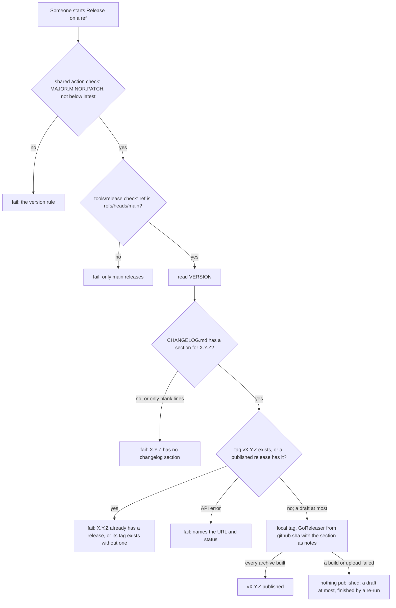

# Release workflow started by hand - Plan

## Goal Capsule

- **Objective:** no crew version reaches users unless a person started its release on the commit of `main` it ships, and its release text tells users what changed for them.
- **Means:** a Release workflow that only `workflow_dispatch` starts, whose checks live in a small Go command, `tools/release` (KTD1, KTD2).
- **Product authority:** the boss, through the brainstorm of #261 and the re-brainstorm of #316. The Product Contract below is #319's. Its siblings own the rest of #316: #320 waits for the acceptance suite and adds the `v*` tag ruleset, #321 limits who may start or re-run a release.
- **Stop conditions:** stop and report if GoReleaser can no longer publish only after every archive built, or if the GitHub API cannot tell a published release from a draft.
- **Execution profile:** one small Go command under `tools/release` with unit tests against an `httptest` GitHub API, a rewritten `.github/workflows/release.yml`, a new `CHANGELOG.md` and docs. No change to the `crew` binary.
- **Who finishes:** the implementer opens the pull request with `Closes #319`. The first release under this flow is the boss's own later bump pull request, which changes `VERSION` and adds its `CHANGELOG.md` section.

---

## Product Contract

Product Contract preservation: changed only in Dependencies / Assumptions and Outstanding Questions. The parent's assumptions about the acceptance suite, the tag ruleset and `github.actor` belong to #320 and #321 and are dropped here. The questions on the boss's login and the ruleset belong to those issues. The question on `CHANGELOG.md` for 0.1.0 and 0.1.1 is answered by U2: 0.1.1 was never released.

### Summary

Merging a version bump publishes nothing. A Release workflow started by hand on `main` checks that `VERSION`'s version has no release yet and has a `CHANGELOG.md` section, then builds and publishes crew with that section as the release text.

### Problem Frame

`STRATEGY.md` sets one boundary: "No autonomous releases: every release goes through me, whatever its size".

Today the merge of a pull request that changes `VERSION` is the release. On that push to `main`, `.github/workflows/release.yml` tags `vX.Y.Z` and GoReleaser publishes crew for Linux and macOS on amd64 and arm64. The release text is the list of merged pull request titles that GitHub generates. Between "merged" and "published" there is no point where the boss can look at what is about to ship or say no to it.

### Key Decisions

- **The merge publishes nothing; the boss starts the release, as uv does.** (session-settled: user-approved — chosen over keeping the merge as the trigger, publishing a draft release from the merge to publish by hand, and pushing the tag by hand: the approval then sits on the commit that ships, and a hand-pushed tag drops the `VERSION` convention and its check.) Governs R6, R7.
- **The release text is a `CHANGELOG.md` section written for users, as uv's is.** (session-settled: user-directed — chosen over GitHub's generated notes and over a flow without a changelog: the user wanted uv's full flow, with release text written for users.) Governs R9, R12. The Prepare release workflow that writes the section is part 2 of #261; until then the bump pull request is written by hand.
- **The release rebuilds from the started commit and trusts `main`'s CI.** It is the same code and the same GoReleaser config, built again. (session-settled: user-approved — chosen over running the acceptance suite against the Linux binaries about to be published, as Terraform does: 9 of the 11 CLIs surveyed, uv among them, trust `main`'s CI, and macOS would stay untested either way.) Governs R12.
- **No protected-environment approval while the repository is private on GitHub Team.** (session-settled: user-directed — chosen over an environment with required reviewers: GitHub offers required reviewers on Team only for public repositories.) That gate belongs to #318.

### Requirements

**Release**

- R6. Merging a pull request, a bump included, publishes nothing: the Release workflow runs only when a person starts it.
- R7. The Release workflow runs only on `main` and releases the commit of `main` it was started on, as the version `VERSION` names there.
- R8. It ends without publishing, saying why, when that version already has a release.
- R9. It ends without publishing, saying why, when `CHANGELOG.md` has no section for that version.
- R12. It builds crew from that commit and publishes the release with the archives for Linux and macOS on amd64 and arm64 and `checksums.txt`, with that version's `CHANGELOG.md` section as the release text; nothing is published unless every archive built.

### Acceptance Examples

- AE4. **Covers R8.** **Given** `VERSION` says 0.2.0 and `v0.2.0` is already released, **when** the boss starts the Release workflow, **then** it ends without publishing and says 0.2.0 already has a release.
- AE5. **Covers R9.** **Given** a pull request changed `VERSION` to 0.2.1 without a `CHANGELOG.md` section, **when** the boss starts the Release workflow on that commit, **then** it ends without publishing and says 0.2.1 has no changelog section.
- AE8. **Covers R7.** **Given** a branch other than `main`, **when** someone starts the Release workflow on it, **then** it ends without publishing.

### Scope Boundaries

- Pre-release or release-candidate versions: deferred.
- Running the acceptance suite against the binaries about to be published: deferred (see Key Decisions).
- Signing or attesting the published archives, which uv does: not part of this work.
- A reminder when a bump is merged but its version is not released: not part of this work.
- Narrowing the bots' `contents: write`: not part of this work.
- Changes to the shared version check in `thatsnotmynameio/.github`: none needed.
- Considered and not built: a pull-request check that a `VERSION` bump carries its `CHANGELOG.md` section. R9 already stops the release, and part 2's Prepare workflow writes the section. Build it if hand-written bumps keep missing it.
- Considered and not built: keeping a branch's own `release.yml` from dropping the R7 check. `workflow_dispatch` runs the started branch's workflow file, so KTD5's check guards against a mistaken start, not a hostile branch. crew's bots cannot start workflows (`internal/bots/manifest.go` asks for `actions: read`), and who may start a release is #321's. Without the `workflows` permission they cannot change a branch's `release.yml` either.
- Considered and not built: running the checks and the build in a job without `contents: write`. Today's workflow already builds and publishes in one write job; GoReleaser publishes prepared artifacts from a separate job only in its Pro edition, and `tools/release` uses only the standard library and gets the token only in its own step.

### Deferred to Follow-Up Work

- #320: the Release workflow waits for the acceptance suite of the started commit, and a `v*` tag ruleset keeps the bots from publishing outside the workflow. A draft named `vX.Y.Z` that another identity created is reused by GoReleaser and published with any extra assets on it, and a tag ruleset does not cover drafts; #320 decides whether `check` refuses a draft the workflow did not create.
- #321: only the boss may start or re-run a release, and the docs state the limits of that approval.
- Part 2 of #261: the Prepare release workflow that opens the bump pull request with its `CHANGELOG.md` section (its R1 to R5, R13, R14).
- #318: approval on a protected environment, once the repository is public or the org is on Enterprise.

### Dependencies / Assumptions

- PR #258 (release 0.1.1) was closed without merging, so `v0.1.0`, which has no binaries, is still the latest release. The README's install command gets a 404 until the first release under this flow.
- `VERSION` is `0.1.0` on `main`, so a run started there today refuses under R8, as AE4 describes.

### Sources / Research

- The first plan for #316, written by its development run: `docs/plans/2026-10-08-1119-feat-gated-manual-release-plan.md` at commit b6eeebf on the local branch `crew/issue-316-development`, not pushed. Its checks, `CHANGELOG.md` format and tests carry over here (its KTD2, KTD4, KTD6 and U1). Its wait on the suite (KTD3, U2) moves to #320. Its environment gate (KTD5, KTD7) is dropped.
- uv's flow: `.github/workflows/release.yml` and the "Releases" section of `CONTRIBUTING.md` in https://github.com/astral-sh/uv.
- The survey of 11 CLIs' release workflows in #261 and #259.

---

## Planning Contract

### Key Technical Decisions

- KTD1. **One `publish` job that only `workflow_dispatch` starts, and a refusal fails it.** The `push` trigger goes (R6). Each refusal prints one `::error::` line saying why and fails the job, so a run that publishes nothing never shows green. The README's Release badge then shows the refused run until the next release, which is the honest state. A job-level `if:` on the ref was rejected: it would skip the run, which shows grey and says nothing. The `release` concurrency group stays, so two runs never publish at once. One job, not a separate read-only `check` job: there is no gate between the checks and the publish yet, and #320 splits the job when it adds the wait.
- KTD2. **The checks live in a Go command, `tools/release`, not in inline shell.** It has one subcommand, `check`, which #320 extends with `wait`. It uses only the standard library, like `tools/diffcover`, and talks to the GitHub REST API through `GITHUB_API_URL`, `GITHUB_REPOSITORY` and the job's token. Inline shell, as in the `codacy gate` job, was rejected: AE4, AE5 and AE8 could then be checked only by real releases, while Go tests against an `httptest` GitHub run in CI's `go` job and count toward both coverage floors. `docs/solutions/logic-errors/set-e-ignored-left-of-and-in-install-command.md` shows how quietly a shell check can pass on failure.
- KTD3. **"Already released" means the tag `vX.Y.Z` exists or a published release has that tag (R8).** One request reads the tag's ref, and one reads the release by tag, which GitHub documents as returning only a published release, so a draft answers 404. A draft does not count: a failed upload leaves one, and GoReleaser's `use_existing_draft` finishes it on the next run. A draft has no tag on GitHub until it is published, and GoReleaser v2.18.2 sends the configured `target_commitish` when it updates a reused draft (`internal/client/github.go`, `CreateRelease`), so a draft an older commit left moves to the commit being released. A tag pushed by hand without a release refuses too, with its own message saying the tag exists without a published release, so GoReleaser never publishes over a tag it did not create. The shared release action keeps its `check` mode for `MAJOR.MINOR.PATCH` and "not below the latest release". Its `check` mode passes an already released version, so it cannot answer R8.
- KTD4. **A `CHANGELOG.md` section is a line that reads exactly `## X.Y.Z` and the text up to the next line that starts with `## ` (R9).** Trailing whitespace, carriage returns and a leading byte-order mark are ignored, so a file saved on Windows parses. `###` subsections stay inside their section. Sections are newest first, under a `# Changelog` title. A missing heading, one followed only by blank lines, or the same heading twice fails R9. The message names the heading it looked for, `## X.Y.Z`, which is the hint for a near miss. `## v0.2.1`, `## [0.2.1] - date`, `## 0.2.10` and `## 0.2.1-rc1` do not match 0.2.1. The section's text, trimmed and without its heading, is written to the notes file that GoReleaser takes as `--release-notes`.
- KTD5. **The ref check is `tools/release check`'s first, before any file or API read (R7).** It refuses unless the ref is `refs/heads/main`. The workflow passes `GITHUB_REF`. GoReleaser builds the checked-out `github.sha`, which is the commit of `main` the run was started on.
- KTD6. **Exit codes follow `tools/diffcover`: 0 passes, 1 refuses, 2 is an error.** An error covers bad usage, a missing file or environment variable, and an API status other than 200 or 404. Both 1 and 2 print one `::error::` line to stderr, so both fail the step with a reason. On a pass the command prints `version=X.Y.Z` and `tag=vX.Y.Z` to stdout, which the workflow appends to `$GITHUB_OUTPUT`.
- KTD7. **The notes file is written outside the checkout,** at a path the workflow points at `$RUNNER_TEMP`. GoReleaser refuses a dirty tree, so a notes file inside the repository would fail every release.

### High-Level Technical Design

### Assumptions

- The job's token reads tags and releases with the `contents` scope the job already holds for publishing.
- The GoReleaser pin stays `v2.18.2`. `acceptance/cmd/acceptance/main.go` pins the same version and says to keep the two in step.

### Sequencing

U1 first. U2 and U3 need U1. U4 comes last.

---

## Implementation Units

### U1. `tools/release check`

- **Goal:** one command that refuses a release on R7, R8 and R9, and otherwise prints the version and tag and writes the release notes.
- **Requirements:** R7, R8, R9, R12 (KTD2 to KTD7).
- **Dependencies:** none.
- **Files:** `tools/release/main.go`, `tools/release/changelog.go`, `tools/release/github.go`, `tools/release/main_test.go`, `tools/release/changelog_test.go`, `tools/release/github_test.go`.
- **Approach:**
  1. `main.go`: a `// Command release …` package doc with its usage. `main()` only calls `os.Exit(run(…))`. `run` takes the arguments, an environment lookup and the two writers, dispatches the `check` subcommand and returns KTD6's codes.
  2. `check` flags: the ref, the `VERSION` path, the `CHANGELOG.md` path and the notes path. The API base, repository and token come from the environment.
  3. Order: ref (KTD5), version file, changelog section (KTD4), then tag and published release (KTD3). The first refusal prints its `::error::` line and returns 1.
  4. `github.go`: a small GET helper that sets GitHub's headers and the token, escapes each path segment, and returns found, not found (404), or an error naming the URL and status.
- **Patterns to follow:** `tools/diffcover/main.go` (package doc, `run`, flag set, constants, exit codes, nolint form); `internal/bots/github.go` for the request headers and the 404 branch (copied, not imported: depguard's `bots-users` rule forbids the import); `internal/bots/github_test.go` for the `httptest` helper. `docs/solutions/tooling-decisions/codacy-lizard-and-golangci-lint-limits.md` for the size limits, which `_test.go` files meet too.
- **Test scenarios:**
  - Covers AE8. Ref `refs/heads/feature`: exit 1, stderr says only `main` releases, and the test server receives no request.
  - Covers AE4. Tag `v0.2.0` exists and a published release has it: exit 1, stderr says 0.2.0 already has a release.
  - No tag ref, but a published release `v0.2.0`: exit 1, the same message.
  - Tag `v0.2.0` exists and no published release has it: exit 1, stderr says the tag exists without a published release.
  - A draft only (both endpoints 404) and a `## 0.2.0` section: exit 0.
  - Covers AE5. `VERSION` 0.2.1 and a changelog with only `## 0.2.0`: exit 1, stderr says 0.2.1 has no changelog section, before any API request.
  - `## 0.2.1` followed only by blank lines before `## 0.2.0`: exit 1, the same message.
  - `## 0.2.10`, `## v0.2.1`, `## [0.2.1]` and `### 0.2.1` do not match 0.2.1.
  - `## 0.2.1` as the last section: the notes are its text to the end of the file, trimmed.
  - A CRLF changelog, one with a byte-order mark, and a heading with trailing spaces parse.
  - A `### Fixes` subsection inside `## 0.2.1` stays in the notes.
  - `## 0.2.1` twice: exit 1, stderr names the duplicate.
  - All checks pass: stdout is `version=0.2.1` and `tag=v0.2.1`, and the notes file holds the section's text without its heading.
  - `VERSION` with a trailing newline reads as the bare version.
  - Each request carries the token and GitHub's API version header, on the paths for the tag ref and the release by tag.
  - A 500 or a 403 from the API: exit 2, stderr names the URL and status.
  - A missing `VERSION` or `CHANGELOG.md`, a missing `GITHUB_REPOSITORY` or token, no subcommand, an unknown subcommand and an unknown flag: each exits 2 with a message.
- **Verification:** the tests pass under `go test -race ./tools/release`, and the package's lines are covered to the changed-lines floor; only `main()` stays uncovered.

### U2. `CHANGELOG.md`

- **Goal:** the file R9 and R12 read exists, in KTD4's format.
- **Requirements:** R9, R12 (KTD4).
- **Dependencies:** U1, for its test.
- **Files:** `CHANGELOG.md`, `tools/release/changelog_test.go`.
- **Approach:** a `# Changelog` title, one line on what a section is for and that the newest comes first, and a `## 0.1.0` section saying it was the first tagged version, published without binaries. No section for 0.1.1, which was never released. The next bump pull request adds its own section.
- **Test scenarios:**
  - The repository's real `CHANGELOG.md` parses and has a non-empty `0.1.0` section.
- **Verification:** that test passes, so a format slip in the real file fails CI before it fails a release.

### U3. The Release workflow

- **Goal:** `.github/workflows/release.yml` runs only by hand and publishes only after `tools/release check` passed.
- **Requirements:** R6, R7, R8, R9, R12 (KTD1, KTD5, KTD6, KTD7).
- **Dependencies:** U1.
- **Files:** `.github/workflows/release.yml`.
- **Approach:**
  1. Trigger: `workflow_dispatch` only. Workflow permissions `contents: read`; the `release` concurrency group stays.
  2. The `publish` job keeps `contents: write` and `timeout-minutes`. Its steps, in order:
     1. checkout of `github.sha` with `fetch-depth: 0` and without persisted credentials;
     2. the shared release action in `check` mode, so `tools/release` only sees a well-formed version;
     3. setup-go;
     4. `go run ./tools/release check` with `GITHUB_REF`, the token in its step's `env` and the notes path under `$RUNNER_TEMP`, its stdout appended to `$GITHUB_OUTPUT`;
     5. the local tag from that step's `tag` output;
     6. GoReleaser with `--release-notes` on the notes file.
  3. The generate-notes step and the "already released, nothing to publish" branch go: R8 now refuses instead of passing silently.
  4. Rewrite the header comment to the new flow: started by hand on `main`, the checks, the notes from `CHANGELOG.md`, nothing published unless every archive built, and a re-run finishing a draft.
- **Patterns to follow:** today's `.github/workflows/release.yml` (pinned actions, local tag, GoReleaser step and pin); the `::error::` lines of the `codacy gate` job in `.github/workflows/ci.yml`.
- **Test expectation:** none -- workflow wiring. Its logic is U1's, and CI's actionlint job checks the file with shellcheck.
- **Verification:** actionlint passes; the workflow has no `push` trigger; every step after the check depends on its success; the notes path is outside the checkout.

### U4. Docs

- **Goal:** the docs describe the release as it now works.
- **Requirements:** R6 to R12.
- **Dependencies:** U2, U3.
- **Files:** `AGENTS.md`, `README.md`.
- **Approach:**
  1. `AGENTS.md`, Releases: a bump pull request changes `VERSION` and adds its `CHANGELOG.md` section. Merging it publishes nothing. The boss starts the Release workflow on `main`, which refuses a version that already has a release or has no section, then publishes with the section as the release text. Keep the sentences on the shared action's `check` mode and on the version rule. A run that refused is fixed by a new pull request and a new start: re-running it checks the same commit again. Mention `tools/release` there, not in Commands, since nobody runs it by hand.
  2. `README.md`, "What's inside": rewrite the `release.yml` and `VERSION` rows and add a `CHANGELOG.md` row. No admin setup goes in the README.
- **Test expectation:** none -- docs.
- **Verification:** no page still says that a merge or a push to `main` publishes a release (the `release.yml` and `VERSION` rows of the README, the Releases entry of `AGENTS.md`).

---

## Verification Contract

| Gate | Command | Applies to |
| --- | --- | --- |
| Formatting | `gofmt -l cmd internal tools acceptance` prints nothing | U1, U2 |
| Vet and lint | `go vet ./...`; `go run github.com/golangci/golangci-lint/v2/cmd/golangci-lint@v2.14.0 run` | U1, U2 |
| Tests | `go test -race ./...` | U1, U2 |
| Coverage floors | the total floor (`.testcoverage.yml`) and `tools/diffcover` on the branch's diff | U1, U2 |
| Workflows | actionlint, as CI's `actionlint` job runs it | U3 |
| Vulnerabilities | `go run golang.org/x/vuln/cmd/govulncheck@v1.8.0 ./...` | U1 |

The acceptance suite is not affected: the `crew` binary does not change.

---

## Definition of Done

- U1 to U4 are done as their Verification lines state, and every gate above passes.
- The Release workflow has no trigger but a manual start, and it publishes only after `tools/release check` passed on `main`.
- The pull request body carries `Closes #319` and says that the first release under this flow is the boss's next bump pull request, with its `CHANGELOG.md` section.
- No experimental or abandoned code is left in the diff.
