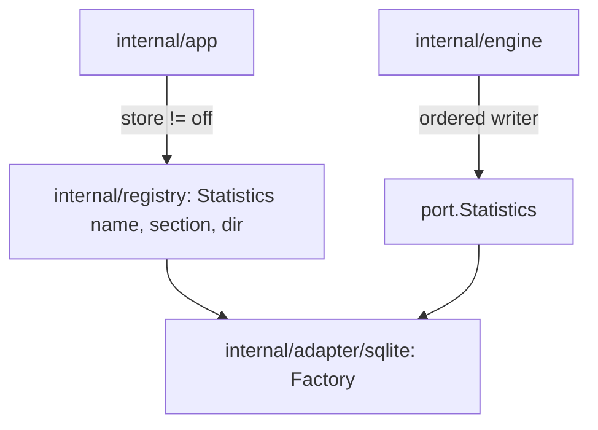

## Goal Capsule

- **Objective:** the types every later part of the statistics store names exist on `main`: the process record, the store's port and factory, the registry's store map and a scripted fake store.
- **Parent:** #340, part 1 of 5. Read it only for a question this part does not answer.
- **Open blockers:** none.

## Product Contract

### Summary

A sealed `crew.Statistic` record with its first variant, `crew.Process`, a `port.Statistics` interface with its `StatisticsFactory`, a fourth registry map for stores with `registry.Statistics`, and a scripted fake store for the tests of the later parts.

### Context

Every later part writes or tests through these types, so they land first and change no behaviour. This part builds some of R1, R2 and R5, which part 5 completes.

### Key Decisions

- **Entities, events and spans are different things.** An entity exists and has attributes (a process, a repository, an issue). An event is an instant (an issue moved from one label to another). A span is work with a start, an end, a cost and children (a rule run, an action). Cost and time live on spans, and waiting time comes from the gaps between events. Governs R5.
- **The process is recorded once, like a telemetry Resource, and is not a level of the tree.** One crew process works on many issues and one issue's runs span many processes, so every span points to the process that ran it. Governs R5. (session-settled: user-approved — chosen over issue → process → rule run: the relation is many-to-many)
- **SQLite with `modernc.org/sqlite`.** crew's release builds with `CGO_ENABLED=0`, and `modernc.org/sqlite` is the pure-Go driver most Go projects use for that (PocketBase, memos, Syncthing, Gitea, soft-serve). Governs R1, R4. (session-settled: user-directed — chosen over Postgres as an opt-in dependency started with docker compose, and over `mattn/go-sqlite3`, which needs cgo and per-platform C toolchains in the release: no external service, and the store's port lets another database replace it later)
- **The store is an adapter the config chooses and crew's registry builds.** Like trackers and harnesses, a store is a package with a factory registered in the registry, and the app builds it for any entry point. `cmd/crew` only hands it the global data folder. A later web view or statistics command builds the same store, and another database is another registered adapter. Governs R1, R2. (session-settled: user-approved — chosen over `cmd/crew` building the store directly, as it builds the run journal: a second entry point would duplicate the wiring)
- **The core decides what to record, the engine writes it.** The core already knows the issue, its labels, the run's rule, action, bot, verdict and route, so it builds the records and emits commands. The engine executes them through the port, the way it executes journal records today. crew's own time reaches the core with the fact the engine hands it, so the core keeps no clock. Harness-specific detail stays in the harness's adapter. Governs R5. (session-settled: user-approved — chosen over the engine assembling records on its own: the core keeps the decision pure and table-testable)
- **On by default.** Recording needs no external service, so it is on unless the config turns it off. Governs R2.

### Scope Boundaries

- This part adds types, a registry map and a fake only. `default.go` registers no store: part 2 registers `sqlite`. Nothing builds or calls a store yet: the core is part 3's, the engine's writer part 4's, the config section and the app's wiring part 5's.
- No README text: part 5 documents the store once it records.
- The "Parts 3 to 5" in KTD1 are #315's parts, which add later record variants, not this split's.

### Sources / Research

Split from #340.

- `internal/registry/default.go` and `internal/app`: how trackers and harnesses are chosen by the config and built through the registry.
- `internal/port/port.go` (`Journal`).
- The gh CLI's telemetry (`internal/gh/ghtelemetry`, `internal/telemetry` in cli/cli): an interface package apart from its implementation, common dimensions set once, a no-op service, and failures that never break a command.
- syncthing `internal/db`: a `DB` interface with its SQLite implementation in its own package.
- OpenTelemetry Go: Resource apart from attributes.

## Planning Contract

### Key Technical Decisions

- KTD1. **A `Statistics` port and a sealed domain record.** `internal/port` gains a `Statistics` interface: write one record with a context, and close. It also gains a `StatisticsFactory` that takes the adapter's `port.Decode` and the data folder. The records are `crew` types, because the core may not import `port` (`.golangci.yml`, the `core` depguard rule). The core emits a sealed `crew.Statistic` interface whose first variant is the process (`crew.Process`: id, version, folder, start). Parts 3 to 5 add variants. Governs R1, R2 through the store Key Decision. Names here and below are directional; the implementer may refine them.
- KTD2. **The registry gains a store map, and the factory never touches the disk.** `registry.New` takes a fourth map of store factories, and `registry.Statistics(name, section, dir)` looks one up with the same "no store is named …; the registered stores are: …" error as `lookup`. `default.go` registers `sqlite`. As with every factory (`internal/port/factory.go`), the SQLite factory only decodes and checks its section: an unknown store name or key is a config error and exits 2, like a wrong tracker. Opening the file is not the factory's job (KTD6), so no open failure can take that path. This instantiates the store Key Decision (Governs R1, R2).

### High-Level Technical Design

How the store is chosen and built, and who talks to whom:



### Output Structure

```text
internal/fake/statistics.go
```

### Deferred to Implementation

- The exact names of the port, the record, the core input, command and event, and the engine writer's type.

### Sequencing

U1 is this part's only unit.

## Implementation Units

### U1. Domain record, port, registry and fake

**Goal:** the types every other unit names: the process record, the store's port and factory, the registry's store map and a scripted fake.

**Requirements:** R1, R2, R5 (KTD1, KTD2).

**Dependencies:** none.

**Files:**
- Create `internal/crew/statistic.go` and `internal/crew/statistic_test.go`.
- Modify `internal/port/port.go` (the `Statistics` interface) and `internal/port/factory.go` (`StatisticsFactory`).
- Modify `internal/registry/registry.go`, `internal/registry/default.go` (an empty store map until U2) and `internal/registry/registry_test.go`.
- Modify every `registry.New` call site: `internal/app/app_test.go`, `internal/app/app_agents_test.go`, `internal/app/app_functions_test.go`, `internal/registry/function_test.go`.
- Create `internal/fake/statistics.go` and extend `internal/fake/fake_test.go`.

**Approach:**
- `crew.Statistic` is a `//sumtype:decl` interface with an unexported marker method, so `gochecksumtype` forces every switch to name each later variant.
- `crew.Process` holds a `ProcessID` (a distinct string type), the version, the folder and the start time.
- `registry.Statistics(name, section, dir)` returns the built store or the lookup error, and is the only path to a store.
- The fake mirrors `internal/fake/journal.go`. It is safe for concurrent use, records what it was given, can fail records with a scripted error, can block until released (for U5's no-delay test), and counts `Close`. `fake.StatisticsFactory(s)` decodes into an empty settings struct and returns `s`.

**Patterns to follow:** `port.Journal` and `internal/fake/journal.go`; `registry.Tracker` and `lookup`; `fake.TrackerFactory`.

**Test scenarios:**
- A registry with `sqlite` registered returns its store for `statistics.store: sqlite`.
- A registry asked for `postgres` fails with an error naming `postgres` and listing the registered stores.
- A section with an unknown key fails through the factory's strict decode, and the error names the key.
- The fake records two records in order, returns its scripted error when told to fail, and holds `Record` until released when told to block.

**Verification:** the packages compile with the new map, every existing registry and app test still passes, and lint names no missing sumtype case.

## Verification Contract

| Gate | Command | Applies to |
|---|---|---|
| Format | `gofmt -l cmd internal tools acceptance` prints nothing | every unit |
| Vet | `go vet ./...` | every unit |
| Lint and layering | `go run github.com/golangci/golangci-lint/v2/cmd/golangci-lint@v2.14.0 run` | every unit |
| Tests | `go test -race ./...` | every unit |
| Coverage floors | `go test -race -covermode=atomic -coverpkg=./... -coverprofile=coverage.out ./...`, then `go run github.com/vladopajic/go-test-coverage/v2@v2.19.0 --config=.testcoverage.yml` (total at least 90%) and `git diff -U0 origin/main...HEAD \| go run ./tools/diffcover -profile coverage.out` (changed lines at least 90%) | before the pull request |
| Vulnerabilities | `go run golang.org/x/vuln/cmd/govulncheck@v1.8.0 ./...` | before the pull request |
| Acceptance module | `go -C acceptance vet ./...` and golangci-lint in `acceptance/` | before the pull request |
| Acceptance smoke | `go -C acceptance run ./cmd/acceptance -count=1 -run TestSmoke`: the startup screen is unchanged | before the pull request |
| Codacy limits | functions of at most 50 NLOC and complexity 15, files of at most 500 lines | every new or changed file |

## Definition of Done

- Every unit's Verification holds, and every gate above passes.
- Code from abandoned approaches is removed from the diff.

<!-- cw-split-ce-plan: part of #340 -->

<!-- publish-split: part 1 of #340 -->

