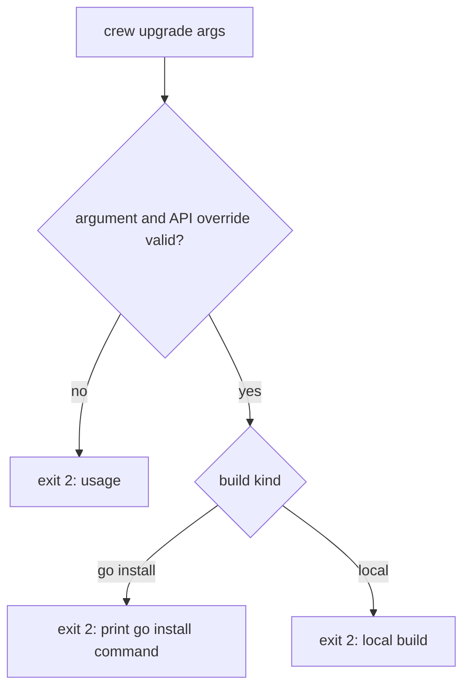

## Goal Capsule

- **Objective:** a new `internal/upgrade` package parses `crew upgrade`'s version argument and tells a release build from a `go install` build and a local build.
- **Parent:** #268, part 1 of 6. Read it only for a question this part does not answer.
- **Open blockers:** none.

## Product Contract

### Summary

The first piece of `crew upgrade`: the version argument parser, the build-kind classifier and the `EnvError` that carries the exit-2 kind, with their table tests. No command calls them yet.

### Context

`crew upgrade` must refuse to replace a binary it did not build, and must read its version argument before any I/O. Part 2 (the release client) and part 3 (the install) use this part's `EnvError`. Branch `crew/issue-268-lfg` already holds an earlier `internal/upgrade/version.go`: take it from there and bring it to this part rather than rewriting it, leaving out that branch's plan file.

This part builds some of R1, R11 and R12, which part 4 completes when it wires the command.

### Key Decisions

- **The command is `crew upgrade`.** Across `apt`, `brew`, `deno` and `bun`, `upgrade` is the verb for installing a newer version of the binary, while `update` refreshes an index or dependencies. (session-settled: user-directed — chosen over `crew update`, `crew self-update` and `upgrade` with an `update` alias: `upgrade` has the most consistent meaning among comparable CLIs and keeps `update` free.) Governs R1.
- **Only release builds upgrade.** A binary built by `go install` or `go build` is never replaced; the command says what to run instead. (session-settled: user-approved — chosen over replacing a `go install` binary and over replacing any binary: either would overwrite a binary being tested in a checkout.) Governs R11.
- **A version can be given.** `crew upgrade vX.Y.Z` installs that release, which is also how a user rolls back from a release that broke. (session-settled: user-approved — chosen over latest only and over also adding a `--check` flag.) Governs R1.

### Acceptance Examples

- AE7. **Covers R11, R12.** **Given** crew built by `go install github.com/thatsnotmynameio/crew/cmd/crew@v0.4.0`, **when** the user runs `crew upgrade`, **then** nothing changes, the command prints the `go install` command for the latest release, and it exits 2.
- AE8. **Covers R11, R12.** **Given** crew built by `go build` in a checkout, **when** the user runs `crew upgrade`, **then** nothing changes, the command says it is a local build, and it exits 2.

### Scope Boundaries

- The release client is part 2, the install is part 3, and the command that prints AE7's and AE8's messages and exits 2 is part 4. This part's tests cover the classification AE7 and AE8 rest on.
- `doc.go` describes only what this part builds. Part 2 adds the API override to the package doc and part 4 the layering rule; each keeps it true for what it adds.
- Considered and not built: **A second ldflags stamp such as `main.builtBy=goreleaser`.** Only someone who passes `-X main.version` by hand makes a local build look like a release, and that is deliberate. A GoReleaser snapshot is also stamped and counts as a release; acceptance versions stay relative to the copy's own `--version`. A build tool in this repository that stamps `main.version` outside GoReleaser would change this.

### Sources / Research

Split from #268.

- `cmd/crew/main.go`: `var version`, `crewVersion`.
- `internal/bots/name.go` (`EnvError`).
- `.goreleaser.yaml`: `-s -w -X main.version={{ .Tag }}`, `-trimpath`.
- `internal/app/app.go`: exit codes 0 clean, 1 failure, 2 config or environment.
- [Go 1.24 release notes](https://go.dev/doc/go1.24#go-command) on VCS-stamped versions.

## Planning Contract

### Key Technical Decisions

- KTD1. **A release build is one whose `main.version` was stamped. A `go install` build is one whose build info carries a module checksum. Anything else is a local build.** Since Go 1.24, `go build` in a clean checkout at a tag reports a plain `vX.Y.Z`, and the v0.1.1 release binary reports `Main.Version v0.1.1` with an empty `Sum` too, so the version string cannot tell them apart. Only `go install …@vX.Y.Z` records `Main.Sum` (`h1:…`), through the proxy or with `GOPROXY=direct`. `-trimpath` keeps `-ldflags` out of the build info, so the stamp is the only release marker. The classifier takes the stamped value and the whole `*debug.BuildInfo`, as `crewVersion` takes its parts. A `+dirty` suffix does not affect the result. Governs R11.
- KTD9. **The version argument is `vX.Y.Z` or `X.Y.Z`, with decimal parts and no leading zeros, and is normalised to `vX.Y.Z`.** CI's `version` check holds releases to the same shape, and GitHub's `releases/tags/0.1.1` answers 404 where `v0.1.1` answers 200. Any other text exits 2. `crewVersion`'s stamped value is the tag, so both sides compare as `vX.Y.Z` strings. Governs R1, R12.

### High-Level Technical Design



### Output Structure

```text
internal/upgrade/
  doc.go          package doc: what it does, the API override, the layering rule
  version.go      version argument parsing, build kind, EnvError
  *_test.go
```

The file split is directional. Each file stays under the 500-line limit, and each function within funlen 50 and cyclop 15.

### Assumptions

- `X.Y.Z` without the `v` is accepted (KTD9). The contract's examples use `vX.Y.Z`, and both forms name the same release.

### Sequencing

U1 alone. Take `internal/upgrade/version.go` from the earlier branch, then bring it to the steps below.

## Implementation Units

### U1. Version argument and build kind

- **Goal:** tell a release build from a `go install` build and a local build, and parse the version argument.
- **Requirements:** R1, R11, R12; KTD1, KTD9.
- **Dependencies:** none.
- **Files:** `internal/upgrade/doc.go`, `internal/upgrade/version.go`, `internal/upgrade/version_test.go`.
- **Approach:**
  1. A build-kind function takes the stamped version and `*debug.BuildInfo`, and returns release, go install (with the module's version) or local.
  2. A parser takes the optional argument and returns the normalised `vX.Y.Z`, or an environment error. `-h` and `--help` give the usage error without the "not a release version" wording.
  3. An `EnvError` type and constructor, like `internal/bots/name.go`'s, carry the exit-2 kind.
- **From the earlier branch:** `internal/upgrade/version.go` exists. Check the help case against step 2.
- **Patterns to follow:** `crewVersion` in `cmd/crew/main.go` and its table test; `internal/bots/name.go` for `EnvError`.
- **Test scenarios:**
  - Stamped `v0.4.0` with any build info is a release build.
  - No stamp, `Main.Version` `v0.4.0` and `Main.Sum` `h1:abc` is a go install build of v0.4.0. Covers AE7.
  - No stamp, `Main.Version` `v0.4.0` with an empty `Sum` (a clean `go build` at a tag, or the shape of the v0.1.1 release binary without its stamp) is a local build. Covers AE8.
  - No stamp with a pseudo-version, `+dirty`, `(devel)` or nil build info is a local build.
  - `v1.2.3` and `1.2.3` both parse to `v1.2.3`. No argument means latest.
  - `v1.2`, `1.2.3.4`, `v01.2.3`, `latest`, `v1.2.3-rc1` and an empty string are environment errors that name the argument.
  - `-h` and `--help` are environment errors whose text is the usage line.
- **Verification:** the table tests pass, and an environment error is distinguishable with `errors.AsType`.

## Verification Contract

| Gate | Command or check | Applies to |
| --- | --- | --- |
| Format | `gofmt -l cmd internal tools acceptance` prints nothing | all |
| Vet | `go vet ./...` and `go -C acceptance vet ./...` | all |
| Lint and layering | `go run github.com/golangci/golangci-lint/v2/cmd/golangci-lint@v2.14.0 run`, and the same with `go -C acceptance` | all |
| Unit tests | `go test -race ./...` | U1 |
| Coverage | `go test -race -covermode=atomic -coverpkg=./... -coverprofile=coverage.out ./...`, then `go run github.com/vladopajic/go-test-coverage/v2@v2.19.0 --config=.testcoverage.yml` (total at least 90%) and `git diff -U0 origin/main...HEAD \| go run ./tools/diffcover -profile coverage.out` (changed lines at least 90%) | U1 |
| Vulnerabilities | `go run golang.org/x/vuln/cmd/govulncheck@v1.8.0 ./...`, and in `acceptance/` | all |

## Definition of Done

- Every unit's verification holds, and every gate above passes.

<!-- cw-split-ce-plan: part of #268 -->

<!-- publish-split: part 1 of #268 -->

