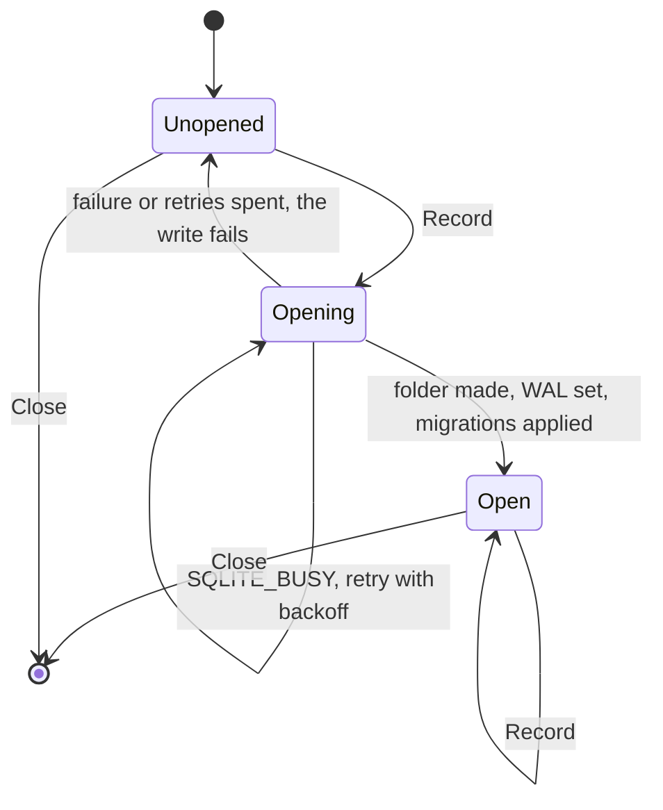

## Goal Capsule

- **Objective:** a registered `sqlite` store writes process records to `statistics.db` in a data folder it is given, safely for several crew processes at once.
- **Parent:** #340, part 2 of 5. Read it only for a question this part does not answer.
- **Open blockers:** none.

## Builds on

Already on main when this part starts; read the code, not these parts' files.

- Part 1 (U1): the sealed `crew.Statistic` record with `crew.Process`, the `port.Statistics` interface and `port.StatisticsFactory`, the registry's store map with `registry.Statistics`, and the scripted fake store.

## Product Contract

### Summary

The SQLite adapter, `internal/adapter/sqlite`, registered as `sqlite` in `default.go`, with the `modernc.org/sqlite` dependency, its pinned `modernc.org/libc` and the Dependabot rule that keeps libc at the driver's version.

### Context

The store every later record goes through, safe for several writers from its first version. This part builds some of R1, R3 and R5, which part 5 completes, and of R4, which part 4 completes.

### Key Decisions

- **Entities, events and spans are different things.** An entity exists and has attributes (a process, a repository, an issue). An event is an instant (an issue moved from one label to another). A span is work with a start, an end, a cost and children (a rule run, an action). Cost and time live on spans, and waiting time comes from the gaps between events. Governs R5.
- **The process is recorded once, like a telemetry Resource, and is not a level of the tree.** One crew process works on many issues and one issue's runs span many processes, so every span points to the process that ran it. Governs R5. (session-settled: user-approved — chosen over issue → process → rule run: the relation is many-to-many)
- **SQLite with `modernc.org/sqlite`.** crew's release builds with `CGO_ENABLED=0`, and `modernc.org/sqlite` is the pure-Go driver most Go projects use for that (PocketBase, memos, Syncthing, Gitea, soft-serve). Governs R1, R4. (session-settled: user-directed — chosen over Postgres as an opt-in dependency started with docker compose, and over `mattn/go-sqlite3`, which needs cgo and per-platform C toolchains in the release: no external service, and the store's port lets another database replace it later)
- **The store is an adapter the config chooses and crew's registry builds.** Like trackers and harnesses, a store is a package with a factory registered in the registry, and the app builds it for any entry point. `cmd/crew` only hands it the global data folder. A later web view or statistics command builds the same store, and another database is another registered adapter. Governs R1, R2. (session-settled: user-approved — chosen over `cmd/crew` building the store directly, as it builds the run journal: a second entry point would duplicate the wiring)
- **The core decides what to record, the engine writes it.** The core already knows the issue, its labels, the run's rule, action, bot, verdict and route, so it builds the records and emits commands. The engine executes them through the port, the way it executes journal records today. crew's own time reaches the core with the fact the engine hands it, so the core keeps no clock. Harness-specific detail stays in the harness's adapter. Governs R5. (session-settled: user-approved — chosen over the engine assembling records on its own: the core keeps the decision pure and table-testable)

### Scope Boundaries

- The adapter is registered but nothing builds it yet: the app asks the registry for it in part 5, and the engine's writer that calls `Record` is part 4's. No config key or README text in this part.
- This part records only processes. Repositories, issues and their moves are part 3's of #315; rule run spans part 4's of #315; action, route and step spans part 5's of #315. The "parts 3 to 5" and "parts 4 and 5" of the KTDs below are #315's parts, not this split's.
- AE9 (two processes writing at once, R4) is tested in part 5 of #315, the first part that writes spans; this part still makes concurrent writers safe.
- Postgres or any other database server.

**Considered and not built**

- A lock that keeps a second crew process out of the data folder, as charmbracelet/crush does. crew's processes must share the file (R4). Only a demand for exclusive access would change that.
- Detecting a data folder on a network filesystem, where WAL does not work. The README warns about it, and every failure surfaces as the warning. Reports of corrupted stores would change that.

**Deferred to Follow-Up Work**

- The release archives ship no third-party license notices for any dependency today (`.goreleaser.yaml` archives only `LICENSE` and `README.md`). The SQLite driver adds BSD-3-Clause and MIT dependencies to that existing gap. A separate issue should add generated notices to the archives for every dependency.

### Dependencies / Assumptions

- `modernc.org/sqlite` and its dependencies are BSD-3-Clause, MIT or public domain, compatible with crew's MIT license; like crew's other dependencies, their notices belong with the binaries (see Deferred to Follow-Up Work).

### Sources / Research

Split from #340.

- `.goreleaser.yaml` (`CGO_ENABLED=0`).
- charmbracelet/crush `internal/db`: an AI coding CLI that stores sessions and usage in SQLite, with versioned migrations, named statistics queries, and its driver in one build-tagged file. Its pragmas and `_txlock=immediate` carry over; its data-folder lock does not.
- modernc.org/sqlite v1.60.1 documentation (https://pkg.go.dev/modernc.org/sqlite): DSN `_pragma` and `_txlock`, and the rule to pin `modernc.org/libc` to the version in the driver's `go.mod`.
- SQLite's WAL, transaction and `user_version` documentation (https://sqlite.org/wal.html, https://sqlite.org/lang_transaction.html, https://sqlite.org/pragma.html#pragma_user_version).
- golang-migrate's SQLite driver locks with an in-process `atomic.Bool`, and goose's lockers cover Postgres and MySQL only, so neither is safe across processes (KTD8).

## Planning Contract

### Key Technical Decisions

- KTD6. **The adapter opens on its first write; any failure is the one warning.** The SQLite store opens, creates the folder and migrates on its first `Record`, inside the writer. A failed open fails that write and leaves the store unopened, so the next write tries again. An empty or relative data folder is an open failure ("no data folder: set XDG_DATA_HOME or HOME"), not a config error. Every failure therefore reaches the boss the same way: the core turns `StatisticFailed` into a published `StatisticNotRecorded` event, with what was lost and why. `--plain` prints it as a `crew: warning: …` line, and the live view shows it in Events. It goes through `e.step` because `--plain` must print it (the same learning). There is no new startup step and no startup line when the store opens (`docs/solutions/design-patterns/prepare-steps-are-startup-lines-in-acceptance-snapshots.md`). Governs R3, AE8.
- KTD7. **SQLite settings for several writers.** The DSN is a `file:` URI built from the absolute, escaped path `<data folder>/statistics.db`. It sets `busy_timeout(5000)` first, then `journal_mode(WAL)` and `synchronous(NORMAL)`, plus `_txlock=immediate`. Each process uses one connection (`SetMaxOpenConns(1)`) and closes it when crew exits. `_txlock=immediate` is required: under the default `deferred`, a transaction that reads and then writes fails with `SQLITE_BUSY` at once despite the busy timeout. The research probe measured 279 failures in 300 transactions with deferred and none with immediate. A brand-new file opened by several processes at once can return `SQLITE_BUSY` while it switches to WAL. The open therefore retries `SQLITE_BUSY` with a short backoff, bounded to a few seconds, and gives up as a failed open (KTD6). Governs R4.
- KTD8. **Migrations are numbered SQL files applied under `PRAGMA user_version` in one immediate transaction.** The adapter embeds `migrations/0001_processes.sql`, …. At open it begins an immediate transaction, reads `user_version`, applies the files above it, sets `user_version` and commits, so two processes migrating at once apply each file once. Migrations only add things: a table, or a column with a default. A newer crew may share the file with an older one, so a `user_version` above the files this binary knows is not an error: the older binary writes what it knows. No goose or golang-migrate, because neither locks across processes on SQLite. Queries are plain SQL constants in the adapter, with no ORM or code generation. Governs R4, R1.
- KTD9. **The process table, and how time is stored.** `processes` has `id` (text, the UUID, primary key), `version`, `folder` and `started_at`. Times are integer Unix milliseconds in UTC, which parts 4 and 5 subtract for durations. The spans' layout is parts 4 and 5's to decide. The driver adds about 4.6 MB to the stripped binary and about 40 s to a cold build, and govulncheck reports nothing for it. It is pinned with `modernc.org/libc` at exactly the version the driver's `go.mod` names, and Dependabot ignores `modernc.org/libc`, so libc moves only when a driver bump raises it through `go.mod`. A Dependabot group would not do: it bumps each module in the group to its own latest version, libc past the driver's pin included. Governs R1.

### High-Level Technical Design

The SQLite store's open, inside the writer:



### Output Structure

```text
internal/adapter/sqlite/
  store.go             factory, Record, Close, the lazy open
  open.go              data folder, DSN, BUSY retry
  migrate.go           user_version and the embedded migrations
  migrations/0001_processes.sql
  store_test.go
  concurrent_test.go
```

### Assumptions

These are unconfirmed bets made while planning. Review them in the pull request.

- The database file is `statistics.db` in the data folder.
- Unescaped SQLite errors may name the database's path in the warning. That is the boss's own data folder, so the path is not scrubbed, but nothing else from SQLite's message is added.

### Deferred to Implementation

- The retry's exact backoff and bound within "a few seconds" (KTD7).

### Sequencing

U2 is this part's only unit.

## Implementation Units

### U2. The SQLite adapter and its dependency

**Goal:** a store that writes process records to `statistics.db` in the data folder, safe for several processes.

**Requirements:** R1, R3, R4, R5 (KTD6, KTD7, KTD8, KTD9).

**Dependencies:** U1.

**Files:**
- Create `internal/adapter/sqlite/store.go`, `internal/adapter/sqlite/open.go`, `internal/adapter/sqlite/migrate.go` and `internal/adapter/sqlite/migrations/0001_processes.sql`.
- Create `internal/adapter/sqlite/store_test.go` and `internal/adapter/sqlite/concurrent_test.go`.
- Modify `internal/registry/default.go` (register `sqlite`), `go.mod`, `go.sum` and `.github/dependabot.yml` (`modernc.org/libc` in the root `gomod` entry's `ignore` list, KTD9).

**Approach:**
1. `Factory()` returns a `port.StatisticsFactory` that strictly decodes an empty settings struct and keeps the folder. It touches no file.
2. The first `Record` opens the store (KTD6): it refuses an empty or relative folder, makes the folder, opens with the KTD7 DSN, retries `SQLITE_BUSY`, then migrates (KTD8).
3. `Record` switches on the `crew.Statistic` variant and inserts a process row (KTD9) inside a context-bound immediate transaction.
4. `Close` closes the pool when it was opened and is a no-op otherwise.
5. Errors from `database/sql` and the driver are wrapped (`wrapcheck`), naming what failed.

**Execution note:** keep the SQLite tests few and small. The driver's tests run about 30 times slower under `-race`, and every other package tests against the U1 fake.

**Patterns to follow:** `internal/adapter/jsonl/journal.go` (compile-time port guard, a folder made on first write, real files in `t.TempDir()`); `config.GlobalFile`'s refusal of relative paths.

**Test scenarios:**
- Recording a process into a new folder under `t.TempDir()` creates `statistics.db`, and reading it back with SQL returns the id, version, folder and start as Unix milliseconds.
- Recording a second process appends a second row, and `user_version` stays at the number of migration files.
- Opening a file whose `user_version` is above the known migrations still records a process.
- Two stores on the same file, each in its own goroutine, record 50 processes each, and all 100 rows are present (R4).
- Several stores opening a file that does not exist yet, at the same time, all record their process: the BUSY retry and the immediate migration hold (R4).
- An empty folder fails the record with an error that says there is no data folder. A later record still fails the same way, and the store does not panic.
- A file of garbage bytes fails the record (SQLite's "not a database"), and `Close` still returns.
- A read-only database file fails the record. Skip this when running as root.
- The factory rejects an unknown key, such as `path:`, and creates no file.

**Verification:** the adapter's tests pass under `-race`, `govulncheck` is clean, and depguard accepts the adapter, which imports only `crew`, `port` and the driver.

## Verification Contract

| Gate | Command | Applies to |
|---|---|---|
| Format | `gofmt -l cmd internal tools acceptance` prints nothing | every unit |
| Vet | `go vet ./...` | every unit |
| Lint and layering | `go run github.com/golangci/golangci-lint/v2/cmd/golangci-lint@v2.14.0 run` | every unit |
| Tests | `go test -race ./...` | every unit |
| Coverage floors | `go test -race -covermode=atomic -coverpkg=./... -coverprofile=coverage.out ./...`, then `go run github.com/vladopajic/go-test-coverage/v2@v2.19.0 --config=.testcoverage.yml` (total at least 90%) and `git diff -U0 origin/main...HEAD \| go run ./tools/diffcover -profile coverage.out` (changed lines at least 90%) | before the pull request |
| Vulnerabilities | `go run golang.org/x/vuln/cmd/govulncheck@v1.8.0 ./...` | U2 and before the pull request |
| Acceptance module | `go -C acceptance vet ./...` and golangci-lint in `acceptance/` | before the pull request |
| Acceptance smoke | `go -C acceptance run ./cmd/acceptance -count=1 -run TestSmoke`: the startup screen is unchanged | before the pull request |
| Codacy limits | functions of at most 50 NLOC and complexity 15, files of at most 500 lines | every new or changed file |

## Definition of Done

- Every unit's Verification holds, and every gate above passes.
- The release build still uses `CGO_ENABLED=0`, and `modernc.org/libc` matches the driver's `go.mod`, with Dependabot ignoring libc.
- Code from abandoned approaches is removed from the diff.

<!-- cw-split-ce-plan: part of #340 -->

<!-- publish-split: part 2 of #340 -->

