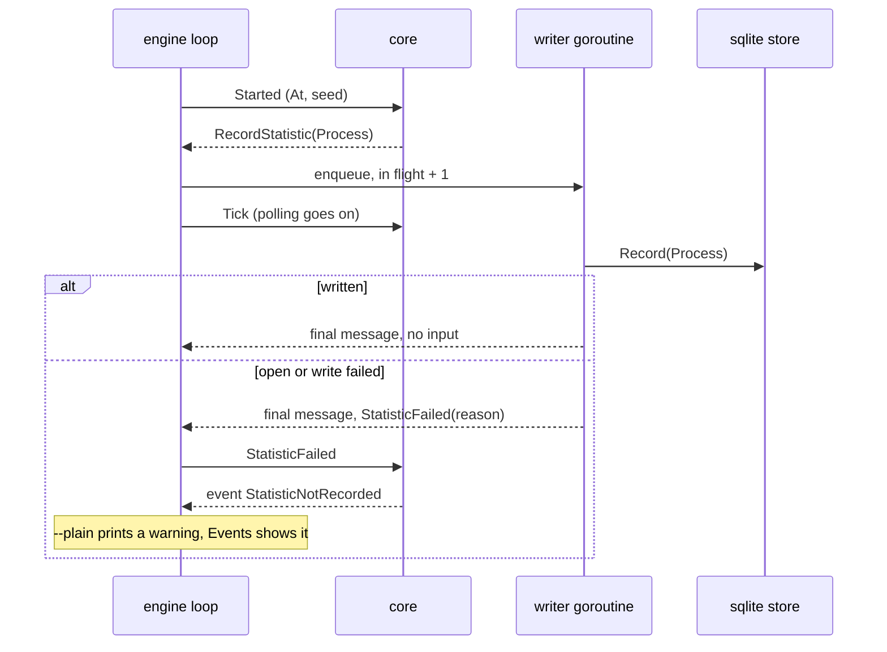

## Goal Capsule

- **Objective:** the core decides the record of each crew process on a `Started` input and turns a failed statistics write into a published warning, without changing anything when recording is not on.
- **Parent:** #340, part 3 of 5. Read it only for a question this part does not answer.
- **Open blockers:** none.

## Builds on

Already on main when this part starts; read the code, not these parts' files.

- Part 1 (U1): the sealed `crew.Statistic` record with `crew.Process`, the `port.Statistics` interface and `port.StatisticsFactory`, the registry's store map with `registry.Statistics`, and the scripted fake store.

## Product Contract

### Summary

The core's `Started` and `StatisticFailed` inputs, its `RecordStatistic` command, its `StatisticNotRecorded` event and its `RecordingStatistics` option, with the exhaustive switches outside the core that name them.

### Context

The core keeps the decision of what to record pure and table-testable; no one turns its option on until the engine does in part 4. This part builds some of R3 and R5, which part 5 completes, and the process id F3's later spans point to.

### Key Decisions

- **Entities, events and spans are different things.** An entity exists and has attributes (a process, a repository, an issue). An event is an instant (an issue moved from one label to another). A span is work with a start, an end, a cost and children (a rule run, an action). Cost and time live on spans, and waiting time comes from the gaps between events. Governs R5.
- **The process is recorded once, like a telemetry Resource, and is not a level of the tree.** One crew process works on many issues and one issue's runs span many processes, so every span points to the process that ran it. Governs R5. (session-settled: user-approved — chosen over issue → process → rule run: the relation is many-to-many)
- **The core decides what to record, the engine writes it.** The core already knows the issue, its labels, the run's rule, action, bot, verdict and route, so it builds the records and emits commands. The engine executes them through the port, the way it executes journal records today. crew's own time reaches the core with the fact the engine hands it, so the core keeps no clock. Harness-specific detail stays in the harness's adapter. Governs R5. (session-settled: user-approved — chosen over the engine assembling records on its own: the core keeps the decision pure and table-testable)

### Key Flows

- F3. A rule run's life across a restart
  - **Trigger:** a rule takes an issue, and crew restarts before the run ends.
  - **Steps:** the rule run's span is written when the run starts, while the first process runs; the restarted crew records a new process; the actions and route steps that end after the restart point to the new process; the rule run's span is completed when the run ends.
  - **Covered by:** R5, R9, R10, R11 (R9 is part 4's, #342). This part records each process with an id the later spans point to.

### Acceptance Examples

- AE8. **Covers R3.** Given the store cannot be written (the disk is full, or the file is locked past the wait), the rule run continues exactly as it would without statistics, and crew warns that a record was lost.
- AE12. **Covers R2.** Given recording is turned off in the config, crew runs every rule as before and creates no store.

### Scope Boundaries

- Nothing turns `RecordingStatistics` on yet: the engine adds it, steps `Started` and writes `RecordStatistic` in part 4. Until then `launch` treats `RecordStatistic` as a no-op.
- U6, in part 5, extends `internal/ui/lines/lines.go`'s tests for the wording this part adds; this part still keeps the changed-lines coverage gate.
- This part records only processes. F3's rule run spans and the "part 4's, #342" it names belong to #315's later parts, not this split's.
- The run journal (`.crew/logs/runs.jsonl`) stays as it is; the store is a new record, not its replacement.

### Sources / Research

Split from #340.

- OpenTelemetry Go: Resource apart from attributes.

## Planning Contract

### Key Technical Decisions

- KTD4. **A `Started` input records the process.** The engine steps a new `core.Started` scheduler input once, after `checkBots` and `pendingPauses` and right before the first `Tick` (`internal/engine/engine.go`, `Run`). Stepping it earlier would make its update the first one subscribers get, before the bots' state, which `TestAE4AFallbackDuringPrepareShowsAtTheFirstUpdate` (`internal/engine/bots_test.go`) forbids. Like `IssuesListed`, it keeps the seed the engine stamps it with. With `RecordingStatistics(version, folder)` on, the core mints the process id from that seed (a UUIDv7, ordered by time) and keeps it in the model, so later parts' spans can point to it. It then emits one `RecordStatistic` command carrying `crew.Process` with the input's `At` as the start. Without the option, `Started` changes nothing. The process id is the store's own and is separate from the run journal's RFC3339 process id. Governs R5, F3.
- KTD6. **The adapter opens on its first write; any failure is the one warning.** The SQLite store opens, creates the folder and migrates on its first `Record`, inside the writer. A failed open fails that write and leaves the store unopened, so the next write tries again. An empty or relative data folder is an open failure ("no data folder: set XDG_DATA_HOME or HOME"), not a config error. Every failure therefore reaches the boss the same way: the core turns `StatisticFailed` into a published `StatisticNotRecorded` event, with what was lost and why. `--plain` prints it as a `crew: warning: …` line, and the live view shows it in Events. It goes through `e.step` because `--plain` must print it (the same learning). There is no new startup step and no startup line when the store opens (`docs/solutions/design-patterns/prepare-steps-are-startup-lines-in-acceptance-snapshots.md`). Governs R3, AE8.

### High-Level Technical Design

The process record at startup, and a failed write:

### Assumptions

These are unconfirmed bets made while planning. Review them in the pull request.

- Each failed record is one warning, worded like `RunNotRecorded`'s line: what was lost and the scrubbed reason. With one record per process, a run warns at most once.

### Deferred to Implementation

- The exact names of the port, the record, the core input, command and event, and the engine writer's type.
- The warning's final wording in `internal/ui/lines/lines.go`.

### Sequencing

U4 is this part's only unit.

## Implementation Units

### U4. The core records the process and reports a lost record

**Goal:** the core decides the process record and turns a failed write into a published warning.

**Requirements:** R3, R5, F3 (KTD4, KTD6).

**Dependencies:** U1.

**Files:**
- Modify `internal/core/input.go` (`Started`, which keeps its seed, and `StatisticFailed`), `internal/core/command.go` (`RecordStatistic`), `internal/core/event.go` (`StatisticNotRecorded`), `internal/core/model.go` (the `RecordingStatistics` option and the process id) and `internal/core/update.go` (dispatch).
- Modify the exhaustive switches outside the core that the new command and event reach, so lint stays green after this unit: `internal/engine/exec.go` (`launch` names `RecordStatistic`, a no-op until U5), `internal/ui/lines/lines.go` (`crewText` words `StatisticNotRecorded`) and `internal/ui/tui/detail.go` (`coreEventIssue` names it as having no issue).
- Create `internal/core/statistics.go` and `internal/core/statistics_test.go`.

**Approach:**
- `RecordStatistic` is a `Command` of neither the tracker nor the run family: it concerns crew as a whole. Update the `Command` doc and add it to every exhaustive switch.
- `Started` and `StatisticFailed` are scheduler inputs.
- A second `Started` records nothing more (R5: once).
- `StatisticNotRecorded` carries what was lost (the process) and the reason. It belongs to the crew-wide events, like `ListingFailed`.

**Patterns to follow:** `Journaling` and `step.record` in `internal/core/claims.go`; `RecordFailed` → `RunNotRecorded`; `IssuesListed.Stamped`, which keeps the seed.

**Test scenarios:**
- With `RecordingStatistics("v0.1.1", "/repo")`, a `Started` stamped at T with seed S yields one `RecordStatistic` with process id from S, version `v0.1.1`, folder `/repo` and start T, and no event.
- A second `Started` yields nothing.
- Without the option, `Started` yields no command and no event (AE12).
- `StatisticFailed{reason}` yields a `StatisticNotRecorded` event with that reason and no command. The model's runs, slots and queues are unchanged (AE8).
- A `Tick` after `Started` lists issues exactly as a first `Tick` without `Started` does.

**Verification:** table tests pass with no clock or I/O, and `gochecksumtype` reports every switch complete.

## Verification Contract

| Gate | Command | Applies to |
|---|---|---|
| Format | `gofmt -l cmd internal tools acceptance` prints nothing | every unit |
| Vet | `go vet ./...` | every unit |
| Lint and layering | `go run github.com/golangci/golangci-lint/v2/cmd/golangci-lint@v2.14.0 run` | every unit |
| Tests | `go test -race ./...` | every unit |
| Coverage floors | `go test -race -covermode=atomic -coverpkg=./... -coverprofile=coverage.out ./...`, then `go run github.com/vladopajic/go-test-coverage/v2@v2.19.0 --config=.testcoverage.yml` (total at least 90%) and `git diff -U0 origin/main...HEAD \| go run ./tools/diffcover -profile coverage.out` (changed lines at least 90%) | before the pull request |
| Vulnerabilities | `go run golang.org/x/vuln/cmd/govulncheck@v1.8.0 ./...` | before the pull request |
| Acceptance module | `go -C acceptance vet ./...` and golangci-lint in `acceptance/` | before the pull request |
| Acceptance smoke | `go -C acceptance run ./cmd/acceptance -count=1 -run TestSmoke`: the startup screen is unchanged | before the pull request |
| Codacy limits | functions of at most 50 NLOC and complexity 15, files of at most 500 lines | every new or changed file, especially `internal/core/update.go` |

## Definition of Done

- Every unit's Verification holds, and every gate above passes.
- Code from abandoned approaches is removed from the diff.

<!-- cw-split-ce-plan: part of #340 -->

<!-- publish-split: part 3 of #340 -->

