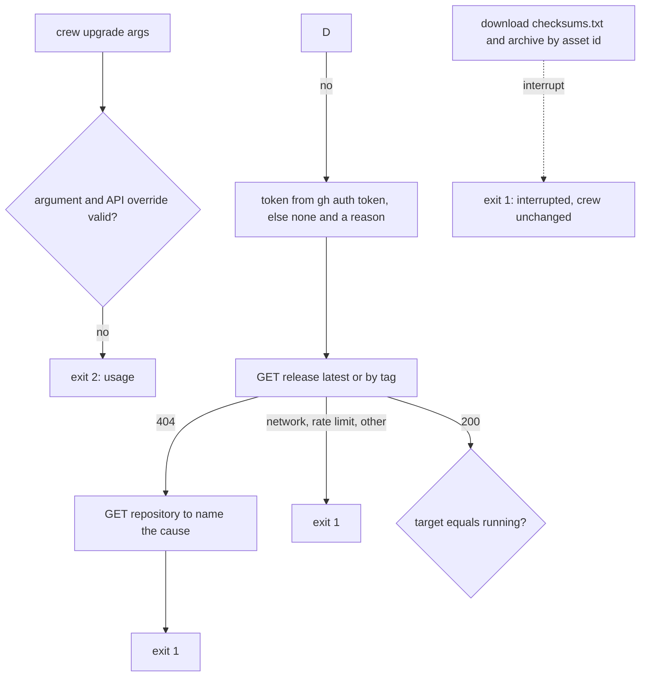
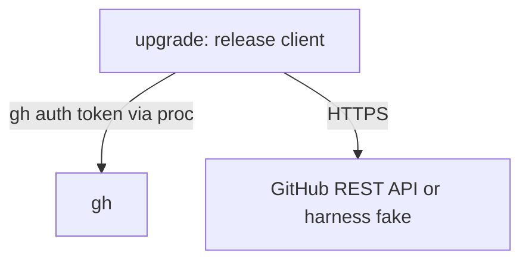

## Goal Capsule

- **Objective:** `internal/upgrade` finds a crew release on GitHub and downloads its assets through the REST API, with the `gh` login's token when there is one, and names each failure's cause.
- **Parent:** #268, part 2 of 6. Read it only for a question this part does not answer.
- **Open blockers:** none.

## Builds on

Already on main when this part starts; read the code, not these parts' files.

- Part 1 (U1): `internal/upgrade` with the version argument parser (`vX.Y.Z`, KTD9), the build-kind classifier and `EnvError`.

## Product Contract

### Summary

The release client: it validates the API base and its loopback override, gets a token from `gh auth token`, looks a release up by latest or by tag, downloads an asset by id under a cap, and maps every network failure to a message and an exit kind. No command calls it yet.

### Context

The repository is private today and will be public, and `crew upgrade` must reach its releases in both states without a password. Branch `crew/issue-268-lfg` already holds an earlier `internal/upgrade/release.go`: take it from there and bring it to this part rather than rewriting it, leaving out that branch's plan file.

This part builds some of R5 and R7, which part 3 completes, and of R12, which part 4 completes.

### Key Decisions

- **Private now, public later.** The repository is private today and will become public, and the command works in both states. (session-settled: user-directed — stated by the user as the model to build.) Governs R6.

### Requirements

**Download and verification**

- R6. While the repository is private, the command reaches the release with the user's `gh` login. Once the repository is public, it reaches it with no login at all.

### Acceptance Examples

- AE5. **Covers R7, R12.** **Given** a release build, **when** the user runs `crew upgrade v9.9.9` and no such release exists, **then** the binary is unchanged, the message says the release does not exist, and it exits 1.
- AE9. **Covers R6, R7.** **Given** the repository is private and `gh` is logged in, **when** the user runs `crew upgrade`, **then** the upgrade succeeds. **Given** the repository is private and `gh` is not logged in, **then** nothing changes and the message names the missing login. **Given** the repository is public and `gh` is not logged in, **then** the upgrade succeeds.

### Scope Boundaries

- Checking the archive and replacing the binary is part 3. The command, its exit codes and the manual check against the real repository are part 4. The acceptance doubles that serve releases are part 5.
- The package doc gains the API override (KTD4); keep the doc part 1 wrote true for what this part adds.
- Pre-release or release-candidate channels.

Considered and not built:

- **Checking who published the release (its author, immutable releases, or a signature).** `checksums.txt` sits in the same release as the archive, so anyone who can write the repository's releases can replace both together, crew's own bots with `contents: write` included. The checksum proves the archive is intact, not who published it. The README's install snippet has the same trust root, so this is accepted for now. Signed or immutable releases would change this.
- **Reading `GH_TOKEN` or `GITHUB_TOKEN` without `gh`.** `gh auth token` already returns them for github.com, and R6 names the `gh` login. A user who has a token but no `gh` would change this.
- **Retrying a 401 without the token.** A stale `gh` login on a public repository fails with a message naming `gh auth login`, which the user fixes with one command.

### Dependencies / Assumptions

- The private download path was checked by hand on 2026-10-08 against the real repository. `GET /repos/thatsnotmynameio/crew/releases/assets/{id}` with `Accept: application/octet-stream` and the `gh auth token` bearer answers 302 to `release-assets.githubusercontent.com`, then 200. Without a token, `releases/latest`, the repository and the README snippet's `releases/latest/download/...` URL all answer 404. `browser_download_url` answers 404 even with a token.
- GitHub's "latest" is the last full release published (`make_latest` defaults to true), not the highest version. crew's release check (`tools/release check` and CI's `version` job) refuses a version below the latest release, so in practice the latest is also the highest. If it is not, `crew upgrade` installs it as R1 says.

### Sources / Research

Split from #268.

- `internal/bots/github.go`: crew's only direct HTTPS client (`NewClient`, `do`, `request`, `statusError`, `replyError`, `rateLimited`, `transient`, and the `gosec` G704 nolint on `http.Do`). `internal/bots/repo.go` (`gh` through `proc`).
- `internal/proc/proc.go`: `Runner`, and `Command.Unset`, which removes named variables from a child's environment.
- `docs/solutions/security-issues/session-environment-values-in-codex-command-line.md`.
- GitHub REST docs: [releases](https://docs.github.com/en/rest/releases/releases?apiVersion=2022-11-28), [release assets](https://docs.github.com/en/rest/releases/assets?apiVersion=2022-11-28), [rate limits](https://docs.github.com/en/rest/using-the-rest-api/rate-limits-for-the-rest-api?apiVersion=2022-11-28). gh manual: [`auth token`](https://cli.github.com/manual/gh_auth_token), [environment](https://cli.github.com/manual/gh_help_environment). [`net/http.Client`](https://pkg.go.dev/net/http#Client) on redirects.

## Planning Contract

### Key Technical Decisions

- KTD2. **One HTTPS path for both repository states: GitHub's REST API, with the `gh` login's token when there is one.**
  - The command reads `GET /repos/thatsnotmynameio/crew/releases/latest` or `/releases/tags/vX.Y.Z`.
  - It downloads each asset through `GET /repos/thatsnotmynameio/crew/releases/assets/{id}` with `Accept: application/octet-stream`, which answers 200 or a redirect to a signed URL. `browser_download_url` answers 404 on a private repository even with a token, so it is not used.
  - The token comes from `gh auth token --hostname <API host>`, run through `internal/proc` with a short timeout. `--hostname` makes the call immune to a user's `GH_HOST`. The host is `github.com` by default, and the override's own host under KTD4.
  - Under KTD4's override, the `gh` child runs with `GH_ENTERPRISE_TOKEN`, `GITHUB_ENTERPRISE_TOKEN`, `GH_TOKEN` and `GITHUB_TOKEN` unset (`proc.Command.Unset`). `gh` answers a non-github.com host with the two enterprise variables, so those are the ones that would leak; the other two are removed as well for symmetry. A real `gh` then has no login for a loopback host, and no github.com token reaches a local server.
  - When `gh` gives no token, the token function also returns why: `gh` not found, its first stderr line, or a timeout. Any failure means no token, and the requests go anonymous.
  - The token is set on each `*http.Request` to the API base, never in a transport. It never goes into an argument, a URL or a message.
  - The client has its own redirect policy. It refuses https to http when the base is https, and removes `Authorization` on any redirect whose `URL.Host`, port included, is not exactly the base's. Go's default policy compares hostnames without the port and keeps the header for subdomains, so it is not enough.
  - A network error is reported without the `*url.Error` URL, which may hold a signed query.
  - Governs R5, R6. Instantiates the Key Decision "Private now, public later".
- KTD3. **The asset URL is built from the asset's id on the API base, never taken from the release JSON.** This keeps the token on the API host whatever the JSON says. Governs R6.
- KTD4. **The API base is `https://api.github.com`. The environment variable `CREW_UPGRADE_API_URL` may replace it only with `http` or `https` on a loopback IP literal (`net.ParseIP(host).IsLoopback()`), with a port and nothing else.**
  - The acceptance harness needs a way to point a release binary at its fake GitHub.
  - Any other value exits 2 before any I/O: a name such as `localhost`, a user part, a path, a query or a fragment.
  - While the override is set, crew prints one stderr line naming it, so a stale export never acts silently.
  - Only `cmd/crew` reads the variable and hands its value to `internal/upgrade`. It is crew's first `CREW_*` input. `acceptance/README.md` and the package doc document it. The user README leaves it out.
- KTD6. **The archive is downloaded into memory and capped. It is hashed before it is opened, and only a regular file named `crew` is taken from it.**
  - The caps are 256 MiB for the archive and for the extracted binary (crew's archives are a few MB), 64 KiB for `checksums.txt`, and 1 MiB for each JSON answer.
  - The release's `tag_name` must parse as KTD9's `vX.Y.Z`, and must equal the requested tag when one was given. A draft or pre-release is refused. Any text from the server is stripped of control characters before crew prints it.
  - `checksums.txt` must hold exactly one line for the archive's name. A missing line, a missing asset, a duplicate `crew` entry or a `crew` entry that is a link fails closed.
  - Header names are never joined into a path (gosec G305), and every copy is bounded (gosec G110).
  - Governs R5, R7.
- KTD7. **Errors carry a kind that sets the exit code: an environment error exits 2 and any other failure exits 1.** This mirrors `bots.EnvError` and `botsExit`. Each failure names its cause in one line that starts with `crew:`:

  | Cause | Exit | What the message names |
  | --- | --- | --- |
  | Malformed or extra argument, `-h`, `--help`, bad `CREW_UPGRADE_API_URL` | 2 | the argument, and `usage: crew upgrade [vX.Y.Z]` |
  | `go install` build | 2 | `go install github.com/thatsnotmynameio/crew/cmd/crew@<vX.Y.Z or latest>` |
  | Local build | 2 | that it is a local build, its version, and the README's install |
  | crew cannot find its own path | 2 | the error from `os.Executable` |
  | Directory not writable (temp file or rename gets a permission or read-only error) | 2 | that crew cannot replace `<path>`, that crew never uses `sudo`, the README's install into `~/.local/bin`, and removing `<path>` |
  | Interrupted before the rename | 1 | that the upgrade was interrupted and crew is unchanged at `<path>` |
  | No network (`*url.Error`, timeout) | 1 | that GitHub could not be reached |
  | Rate limit (429, or 403 with `X-Ratelimit-Remaining: 0` or `Retry-After`) | 1 | GitHub's rate limit. Without a token, that a `gh` login raises it. With one, the reset time when `X-Ratelimit-Reset` is present |
  | Release endpoint 404, repository visible | 1 | that release vX.Y.Z does not exist, or that there is no published release |
  | Release endpoint 404, repository 404, no token | 1 | that the repository is private and no `gh` login was found, with the token function's reason, and `gh auth login` |
  | Release endpoint 404, repository 404, token sent | 1 | that the `gh` login cannot see `thatsnotmynameio/crew` |
  | 401 with a token | 1 | that GitHub rejected the `gh` login, so run `gh auth login` |
  | Another 4xx or 5xx | 1 | GitHub's status and its `message` |
  | Missing archive for this OS and architecture, missing `checksums.txt`, missing checksum line | 1 | the release and the missing file |
  | Checksum mismatch | 1 | the archive's name and "checksum mismatch" |
  | Archive without a regular `crew`, or over the cap | 1 | the archive's name and the defect |
  | Any other write error (disk full) | 1 | the path and the error |

  A 404 on a release endpoint is ambiguous on a private repository, so the command then reads `GET /repos/thatsnotmynameio/crew` with the same credentials to tell the causes apart. An interrupt is checked against the context before a `*url.Error` is mapped, so Ctrl-C never blames GitHub. Governs R7, R9, R12.
- KTD10. **`crew upgrade` catches SIGINT, SIGTERM and SIGHUP into the context of its calls, and bounds each call.** The bounds are 10 s for `gh auth token`, 30 s for each JSON call and 10 minutes for the archive. An interrupt before the rename leaves the old binary, the deferred remove deletes the temp file, and KTD7's interrupt row applies. A failed write of the success line after the rename still exits 0: the binary is installed, and stdout was the caller's to close. SIGPIPE is already ignored at the top of `run`.
- KTD11. **`internal/upgrade` is a package beside `internal/bots`: it imports the standard library and `internal/proc`, and only `cmd/crew` imports it.** Two depguard rules enforce this, `upgrade` and `upgrade-users`, modelled on `bots` and `bots-users`. The `upgrade` rule also denies `internal/function`, which #305 added after the earlier branch forked. The upgrade involves no tracker, engine or port, so it is not an adapter.

### High-Level Technical Design

The command's decision flow, cut to the release client. Each exit names its code.



How the pieces call each other:



### Output Structure

```text
internal/upgrade/
  release.go      GitHub release client, token lookup, error kinds
  *_test.go
```

The file split is directional. Each file stays under the 500-line limit, and each function within funlen 50 and cyclop 15.

### Assumptions

- The order of the checks (KTD8) and the message for each cause (KTD7) are inferred. The contract states the causes and exit codes, not the wording or the order.

### Sequencing

U2 alone. Take `internal/upgrade/release.go` from the earlier branch, then add what its "From the earlier branch" line says it lacks.

## Implementation Units

### U2. Release client

- **Goal:** find the target release and download its assets from GitHub, with or without the `gh` login, and name each failure's cause.
- **Requirements:** R5, R6, R7, R12; KTD2, KTD3, KTD4, KTD6, KTD7, KTD10.
- **Dependencies:** U1, for `EnvError`.
- **Files:** `internal/upgrade/release.go`, `internal/upgrade/release_test.go`.
- **Approach:**
  1. Validate the API base: `https://api.github.com` by default, or the override when it is loopback (KTD4). The caller passes the variable's value.
  2. A client holds the base, an `*http.Client` and a token function. Production's token function runs `gh auth token --hostname <API host>` through `proc.Runner`, with the unsets KTD2 lists under the override. It returns the token, or an empty token and its reason.
  3. Release lookup by latest or by tag returns the tag and the assets' names and ids. A 404 reads the repository to name the cause (KTD7).
  4. Asset download builds the URL from the asset's id (KTD3), sends `Accept: application/octet-stream` and reads the body through a cap (KTD6). A JSON content type in the answer is an error, since it means the header was lost.
  5. Requests carry GitHub's headers as `internal/bots/github.go` sets them: `Accept: application/vnd.github+json`, `X-Github-Api-Version: 2022-11-28` and `User-Agent`. The token goes as `Authorization: Bearer`.
  6. Error mapping checks the context before a `*url.Error`, so an interrupt is reported as one (KTD7).
- **From the earlier branch:** `internal/upgrade/release.go` exists with `DefaultAPI`, `APIEnv`, `ResolveAPI`, `GHToken`, `NewClient`, `Release`, `Download`, `checkRedirect`, `notFound`, `readCapped` and `clean`. It lacks the token-failure reason, the interrupt check, the rate-limit wording by token and the enterprise-variable unsets. Its redirect check must compare `URL.Host` with the port.
- **Patterns to follow:** `internal/bots/github.go` and its `httptest` helpers in `internal/bots/github_test.go`; `internal/bots/repo.go` for running `gh` through `proc`.
- **Test scenarios:**
  - Latest release with a token: the request carries `Authorization: Bearer <token>` and the client returns the tag and assets.
  - A tag lookup escapes the tag in the path and returns the release.
  - No token (the token function fails, or `gh` is missing): the requests carry no `Authorization`, and a public release is found. Covers AE9.
  - 404 on the tag with the repository visible gives "release v9.9.9 does not exist", exit 1. Covers AE5.
  - 404 on latest and on the repository with no token gives the private-repository message, with the token function's reason and `gh auth login`. Covers AE9.
  - 404 on both with a token gives the message that the login cannot see the repository, and no "log in" advice.
  - 401 with a token gives the rejected-login message, exit 1.
  - 403 with `X-Ratelimit-Remaining: 0`, and 429 with `Retry-After`, give the rate-limit message. It names a `gh` login only when no token was sent. A bare 403 gives GitHub's status and message.
  - A closed server gives "could not reach GitHub", exit 1.
  - A context cancelled during a download gives the interrupt error, not "could not reach GitHub".
  - Asset download: the server checks `Accept: application/octet-stream` and returns bytes. A 302 to a second `httptest` server on another host name (`127.0.0.1` against `localhost`) arrives there with no `Authorization`.
  - A 302 to the same IP on another port arrives with no `Authorization`.
  - A 302 from https to http is refused.
  - A redirect that fails to connect gives "could not reach GitHub" without the redirect's URL.
  - Asset download over the cap fails. A JSON answer fails. A release JSON or `checksums.txt` over its cap fails.
  - `/releases/tags/v0.4.0` answering `tag_name` `v0.5.0`, a `tag_name` that does not parse, a draft and a pre-release all fail, exit 1.
  - A GitHub `message` holding an escape sequence is printed without its control characters.
  - `CREW_UPGRADE_API_URL` set to `http://127.0.0.1:1234` and to `https://[::1]:8443` is accepted, and stderr names it. `http://localhost:1234`, `https://example.com`, `http://10.0.0.1`, `http://127.0.0.1@evil.example`, `http://127.0.0.1:1/path` and `ftp://127.0.0.1` are environment errors.
  - Under the override, the token function is asked for the override's host, never `github.com`, and the `gh` command carries all four token variables in `Unset`.
  - A planted probe token never shows up in a URL, in the `gh` arguments or in any error message.
- **Execution note:** unit tests inject the token function or a scripted `proc.Runner`, and never run the real `gh`: an empty `GH_CONFIG_DIR` does not hide the user's keyring login.
- **Verification:** every network row of KTD7 has a passing test, and the race detector is quiet.

## Verification Contract

| Gate | Command or check | Applies to |
| --- | --- | --- |
| Format | `gofmt -l cmd internal tools acceptance` prints nothing | all |
| Vet | `go vet ./...` and `go -C acceptance vet ./...` | all |
| Lint and layering | `go run github.com/golangci/golangci-lint/v2/cmd/golangci-lint@v2.14.0 run`, and the same with `go -C acceptance` | all |
| Unit tests | `go test -race ./...` | U2 |
| Coverage | `go test -race -covermode=atomic -coverpkg=./... -coverprofile=coverage.out ./...`, then `go run github.com/vladopajic/go-test-coverage/v2@v2.19.0 --config=.testcoverage.yml` (total at least 90%) and `git diff -U0 origin/main...HEAD \| go run ./tools/diffcover -profile coverage.out` (changed lines at least 90%) | U2 |
| Vulnerabilities | `go run golang.org/x/vuln/cmd/govulncheck@v1.8.0 ./...`, and in `acceptance/` | all |

## Definition of Done

- Every unit's verification holds, and every gate above passes.

<!-- cw-split-ce-plan: part of #268 -->

<!-- publish-split: part 2 of #268 -->

