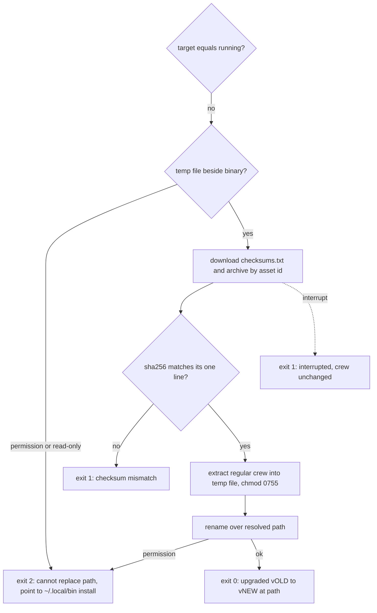

## Goal Capsule

- **Objective:** `internal/upgrade` checks a downloaded release archive against `checksums.txt`, extracts its `crew`, and renames it over the running binary's resolved path, or changes nothing.
- **Parent:** #268, part 3 of 6. Read it only for a question this part does not answer.
- **Open blockers:** none.

## Builds on

Already on main when this part starts; read the code, not these parts' files.

- Part 1 (U1): `internal/upgrade` with the version argument parser (`vX.Y.Z`, KTD9), the build-kind classifier and `EnvError`.

## Product Contract

### Summary

The install: archive name, checksum check, capped extraction of the one regular `crew`, the writability check, and the replacement by a hidden temp file renamed over the target. No command calls it yet.

### Context

A failed upgrade must never leave a broken or half-written crew, and a running crew must keep its old binary. Branch `crew/issue-268-lfg` already holds an earlier `internal/upgrade/install.go`: take it from there and bring it to this part rather than rewriting it, leaving out that branch's plan file.

Part 2 builds the download half of R5 and R7. This part builds some of R8, which part 4 completes. R9 and R10 reach the user once part 4 wires the command.

### Key Decisions

- **Never `sudo`.** (session-settled: user-directed — chosen over calling `sudo` for the final copy as the README once did: the upgrade must never ask for elevated permissions.) Governs R8, R9.
- **A running crew keeps its version.** The upgrade neither warns about nor stops crew processes already running. Governs R10.

### Requirements

**Download and verification**

- R5. The command downloads the archive for the machine's OS and architecture from the target release, and verifies it against that release's `checksums.txt` before it replaces anything.
- R7. Any failure leaves the installed binary untouched and names its cause, whether the failure is no network, a rate limit, a missing login on a private repository, a release that does not exist, or a checksum that does not match.

**Installing**

- R9. When it cannot write to that path, the command stops without changing anything and says why. For a binary in `/usr/local/bin`, it points to the README's install into `~/.local/bin` and to removing the old binary.
- R10. crew processes already running keep running the version they started with.

### Acceptance Examples

- AE4. **Covers R5, R7, R12.** **Given** a release whose archive does not match its line in `checksums.txt`, **when** the user runs `crew upgrade`, **then** the installed binary is unchanged, the message names the checksum mismatch, and it exits 1.
- AE6. **Covers R8, R9, R12.** **Given** a release build in `/usr/local/bin/crew` owned by root, **when** the user runs `crew upgrade`, **then** nothing changes, no `sudo` runs, the message explains the install into `~/.local/bin` and removing the old binary, and it exits 2.
- AE10. **Covers R10.** **Given** `crew` is running in one terminal, **when** the user runs `crew upgrade` in another, **then** the running crew keeps working on its old version, and the next start runs the new one.

### Scope Boundaries

- Finding and downloading the release is part 2. The command, its exit codes and its messages on stdout are part 4. The acceptance doubles and scenarios are parts 5 and 6.
- Calling `sudo`, or moving an existing install out of `/usr/local/bin` automatically.

Considered and not built:

- **Running the new binary's `--version` before the rename.** The checksum already proves the archive is the one the release lists, and running downloaded code before the user asked for it is worse. A report of a release whose binary cannot start on its own platform would change this.
- **GitHub's per-asset `digest` field as a second check.** The release JSON now carries `sha256:<hex>` for each asset, but it comes from the same release as `checksums.txt` and adds no trust root. R5 names `checksums.txt`.
- **Removing temp files a killed upgrade left behind.** They are hidden files beside the binary, and a killed process leaves the binary itself intact.

### Dependencies / Assumptions

- The archive holds `crew` (mode 0755), `LICENSE` and `README.md` at its top level, and its SHA-256 matches its line in `checksums.txt`.
- Release archives keep version-free names, one per OS and architecture, with one `checksums.txt` per release (`.goreleaser.yaml`).

### Sources / Research

Split from #268.

- `internal/bots/store.go` (`writeTemp`), `internal/bots/act.go` (`resolved`, the rename).
- `.goreleaser.yaml`: `crew_<os>_<arch>.tar.gz`, SHA-256 `checksums.txt`.
- `docs/solutions/logic-errors/set-e-ignored-left-of-and-in-install-command.md`.
- Apple's [Updating Mac Software](https://developer.apple.com/documentation/security/updating-mac-software) on replacing a signed binary by rename.

## Planning Contract

### Key Technical Decisions

- KTD5. **The replacement is a hidden temp file beside the resolved binary, renamed over it. The target is never opened for writing.**
  - The path is `os.Executable()` with symlinks resolved, so a symlinked install gets a new target and keeps its link. A failure of `os.Executable` is an environment error (exit 2).
  - The steps are:
    1. Create a temp file in the same directory.
    2. Write it, then set mode 0755 and sync it through the open file.
    3. Close it and rename it over the target.
    4. Sync the directory, best effort: once the rename succeeded, the binary is installed.
    5. Remove the temp file on any failure.
  - Rename gives the path a new inode. Running processes keep the old one (R10), and on macOS the kernel's cached code signature never meets new bytes (Go ad-hoc signs darwin/arm64 binaries). Writing in place fails with ETXTBSY on Linux and can get the binary killed on macOS.
  - Creating that temp file is also the writability check. Governs R8, R9, R10.
- KTD6. **The archive is downloaded into memory and capped. It is hashed before it is opened, and only a regular file named `crew` is taken from it.**
  - The caps are 256 MiB for the archive and for the extracted binary (crew's archives are a few MB), 64 KiB for `checksums.txt`, and 1 MiB for each JSON answer.
  - The release's `tag_name` must parse as KTD9's `vX.Y.Z`, and must equal the requested tag when one was given. A draft or pre-release is refused. Any text from the server is stripped of control characters before crew prints it.
  - `checksums.txt` must hold exactly one line for the archive's name. A missing line, a missing asset, a duplicate `crew` entry or a `crew` entry that is a link fails closed.
  - Header names are never joined into a path (gosec G305), and every copy is bounded (gosec G110).
  - Governs R5, R7.
- KTD7. **Errors carry a kind that sets the exit code: an environment error exits 2 and any other failure exits 1.** This mirrors `bots.EnvError` and `botsExit`. Each failure names its cause in one line that starts with `crew:`:

  | Cause | Exit | What the message names |
  | --- | --- | --- |
  | Malformed or extra argument, `-h`, `--help`, bad `CREW_UPGRADE_API_URL` | 2 | the argument, and `usage: crew upgrade [vX.Y.Z]` |
  | `go install` build | 2 | `go install github.com/thatsnotmynameio/crew/cmd/crew@<vX.Y.Z or latest>` |
  | Local build | 2 | that it is a local build, its version, and the README's install |
  | crew cannot find its own path | 2 | the error from `os.Executable` |
  | Directory not writable (temp file or rename gets a permission or read-only error) | 2 | that crew cannot replace `<path>`, that crew never uses `sudo`, the README's install into `~/.local/bin`, and removing `<path>` |
  | Interrupted before the rename | 1 | that the upgrade was interrupted and crew is unchanged at `<path>` |
  | No network (`*url.Error`, timeout) | 1 | that GitHub could not be reached |
  | Rate limit (429, or 403 with `X-Ratelimit-Remaining: 0` or `Retry-After`) | 1 | GitHub's rate limit. Without a token, that a `gh` login raises it. With one, the reset time when `X-Ratelimit-Reset` is present |
  | Release endpoint 404, repository visible | 1 | that release vX.Y.Z does not exist, or that there is no published release |
  | Release endpoint 404, repository 404, no token | 1 | that the repository is private and no `gh` login was found, with the token function's reason, and `gh auth login` |
  | Release endpoint 404, repository 404, token sent | 1 | that the `gh` login cannot see `thatsnotmynameio/crew` |
  | 401 with a token | 1 | that GitHub rejected the `gh` login, so run `gh auth login` |
  | Another 4xx or 5xx | 1 | GitHub's status and its `message` |
  | Missing archive for this OS and architecture, missing `checksums.txt`, missing checksum line | 1 | the release and the missing file |
  | Checksum mismatch | 1 | the archive's name and "checksum mismatch" |
  | Archive without a regular `crew`, or over the cap | 1 | the archive's name and the defect |
  | Any other write error (disk full) | 1 | the path and the error |

  A 404 on a release endpoint is ambiguous on a private repository, so the command then reads `GET /repos/thatsnotmynameio/crew` with the same credentials to tell the causes apart. An interrupt is checked against the context before a `*url.Error` is mapped, so Ctrl-C never blames GitHub. Governs R7, R9, R12.
- KTD10. **`crew upgrade` catches SIGINT, SIGTERM and SIGHUP into the context of its calls, and bounds each call.** The bounds are 10 s for `gh auth token`, 30 s for each JSON call and 10 minutes for the archive. An interrupt before the rename leaves the old binary, the deferred remove deletes the temp file, and KTD7's interrupt row applies. A failed write of the success line after the rename still exits 0: the binary is installed, and stdout was the caller's to close. SIGPIPE is already ignored at the top of `run`.

### High-Level Technical Design

The command's decision flow, cut to the install. Each exit names its code; "binary untouched" holds on every path except the last.



### Output Structure

```text
internal/upgrade/
  install.go      checksum, extraction, writability, atomic replace
  *_test.go
```

The file split is directional. Each file stays under the 500-line limit, and each function within funlen 50 and cyclop 15.

### Assumptions

- The order of the checks (KTD8) and the message for each cause (KTD7) are inferred. The contract states the causes and exit codes, not the wording or the order.
- R9's pointer to `~/.local/bin` is given for any path crew cannot write, naming that path, and the message is worded "crew cannot replace <path>" so it fits every cause. R9 asks for it for `/usr/local/bin`. The acceptance suite can only make a directory under `$HOME` unwritable.
- The new file is always mode 0755 and owned by the user who ran the upgrade, as the README's install makes it.
- AE6, AE7, AE8 and the root-owned case run where the suite can reach them. AE7 and AE8 are unit tests in `cmd/crew`, because `CREW_BIN` is always a GoReleaser build. A read-only-directory scenario skips when the suite runs as root.

### Sequencing

U3 alone, failure-path tests first. Take `internal/upgrade/install.go` from the earlier branch, then check it against KTD5 and KTD7.

## Implementation Units

### U3. Verify, extract and replace

- **Goal:** turn the downloaded archive into the new binary at the running binary's path, or change nothing.
- **Requirements:** R5, R7, R8, R9, R10; KTD5, KTD6, KTD7.
- **Dependencies:** U1, for `EnvError`.
- **Files:** `internal/upgrade/install.go`, `internal/upgrade/install_test.go`.
- **Approach:**
  1. The archive name is `crew_<goos>_<goarch>.tar.gz`, from parameters, as `browserCommand(goos)` takes its OS.
  2. A checksum check parses `checksums.txt` lines (`<hex>  <name>`), requires exactly one line for the name, and compares SHA-256.
  3. Extraction streams gzip then tar and takes the one regular entry whose cleaned name is `crew`. Every other entry is skipped, and links or duplicates fail.
  4. The writability check resolves the executable path, creates and removes a hidden temp file (`.crew-upgrade-*`) in its directory, and maps a permission or read-only error to an `EnvError` worded "crew cannot replace <path>".
  5. The replacement follows KTD5's steps, with mode 0755 under a `gosec` G302 nolint that gives the reason. A permission error on the rename is the same `EnvError`.
- **From the earlier branch:** `internal/upgrade/install.go` exists. Check the message wording and the `os.Executable` failure against KTD5 and KTD7.
- **Execution note:** write the failure-path tests first. Each asserts that the target file's bytes and inode are unchanged afterwards (`docs/solutions/logic-errors/set-e-ignored-left-of-and-in-install-command.md`).
- **Patterns to follow:** `writeTemp` in `internal/bots/store.go` and the rename in `internal/bots/act.go`; `resolved` in `internal/bots/act.go` for `EvalSymlinks`.
- **Test scenarios:**
  - A good archive with a matching line installs: the target holds the new bytes with mode 0755, and the directory holds no temp file.
  - An archive with one byte changed fails with "checksum mismatch", and the target is unchanged. Covers AE4.
  - `checksums.txt` without the archive's line, or with two, fails, and the target is unchanged.
  - An archive with `crew`, `LICENSE` and `README.md` takes only `crew`.
  - An archive without `crew`, with `crew` as a symlink, with two `crew` entries, or with `../crew` fails.
  - An extracted `crew` over the cap fails.
  - A directory with mode 0555 is an environment error that names the path and points to `~/.local/bin`, and the target is unchanged. Skip when running as root. Covers AE6.
  - A symlinked executable path replaces the link's target and keeps the link.
  - A file descriptor opened on the old binary before the replace still reads the old bytes after it, which proves a new inode. Covers AE10.
  - A context cancelled before the rename leaves the target unchanged and no temp file.
- **Verification:** no test leaves a temp file in its directory, and no failure path changes the target.

## Verification Contract

| Gate | Command or check | Applies to |
| --- | --- | --- |
| Format | `gofmt -l cmd internal tools acceptance` prints nothing | all |
| Vet | `go vet ./...` and `go -C acceptance vet ./...` | all |
| Lint and layering | `go run github.com/golangci/golangci-lint/v2/cmd/golangci-lint@v2.14.0 run`, and the same with `go -C acceptance` | all |
| Unit tests | `go test -race ./...` | U3 |
| Coverage | `go test -race -covermode=atomic -coverpkg=./... -coverprofile=coverage.out ./...`, then `go run github.com/vladopajic/go-test-coverage/v2@v2.19.0 --config=.testcoverage.yml` (total at least 90%) and `git diff -U0 origin/main...HEAD \| go run ./tools/diffcover -profile coverage.out` (changed lines at least 90%) | U3 |
| Vulnerabilities | `go run golang.org/x/vuln/cmd/govulncheck@v1.8.0 ./...`, and in `acceptance/` | all |

## Definition of Done

- Every unit's verification holds, and every gate above passes.

<!-- cw-split-ce-plan: part of #268 -->

<!-- publish-split: part 3 of #268 -->

