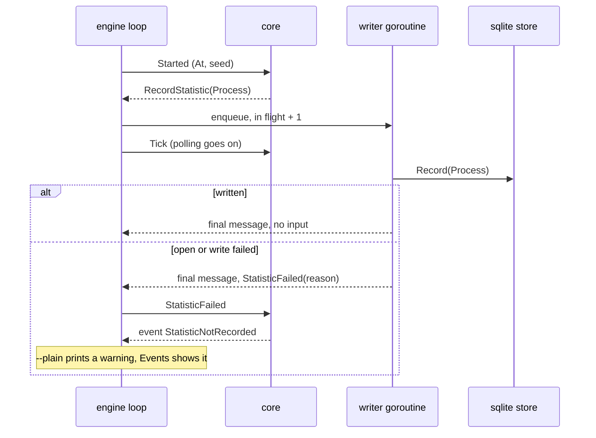

## Goal Capsule

- **Objective:** the engine writes every statistics record the core emits, in order, through one writer goroutine, so the loop never waits on the store and a failed write reaches the core as `StatisticFailed`.
- **Parent:** #340, part 4 of 5. Read it only for a question this part does not answer.
- **Open blockers:** none.

## Builds on

Already on main when this part starts; read the code, not these parts' files.

- Part 3 (U4): the core's `Started` and `StatisticFailed` inputs, `RecordStatistic` command, `StatisticNotRecorded` event and `RecordingStatistics` option, with `launch` naming `RecordStatistic` as a no-op.

## Product Contract

### Summary

`engine.Config.Statistics` and `engine.Config.Version`, the `RecordingStatistics` option when a store is set, the `Started` step before the first `Tick`, and the ordered writer that drains the records and posts each failure back to the loop.

### Context

The writer keeps a slow or locked store from ever delaying a tick, a session or a tracker call, which is what lets several crew processes share one file. The fake store from part 1 drives its tests; the app sets `Config.Statistics` in part 5. This part builds some of R3 and R5, which part 5 completes.

### Key Decisions

- **Entities, events and spans are different things.** An entity exists and has attributes (a process, a repository, an issue). An event is an instant (an issue moved from one label to another). A span is work with a start, an end, a cost and children (a rule run, an action). Cost and time live on spans, and waiting time comes from the gaps between events. Governs R5.
- **The process is recorded once, like a telemetry Resource, and is not a level of the tree.** One crew process works on many issues and one issue's runs span many processes, so every span points to the process that ran it. Governs R5. (session-settled: user-approved — chosen over issue → process → rule run: the relation is many-to-many)
- **SQLite with `modernc.org/sqlite`.** crew's release builds with `CGO_ENABLED=0`, and `modernc.org/sqlite` is the pure-Go driver most Go projects use for that (PocketBase, memos, Syncthing, Gitea, soft-serve). Governs R1, R4. (session-settled: user-directed — chosen over Postgres as an opt-in dependency started with docker compose, and over `mattn/go-sqlite3`, which needs cgo and per-platform C toolchains in the release: no external service, and the store's port lets another database replace it later)
- **The core decides what to record, the engine writes it.** The core already knows the issue, its labels, the run's rule, action, bot, verdict and route, so it builds the records and emits commands. The engine executes them through the port, the way it executes journal records today. crew's own time reaches the core with the fact the engine hands it, so the core keeps no clock. Harness-specific detail stays in the harness's adapter. Governs R5. (session-settled: user-approved — chosen over the engine assembling records on its own: the core keeps the decision pure and table-testable)

### Requirements

**The store**

- R4. Several crew processes, on different repositories, can write to the same store at the same time without losing a record.

### Acceptance Examples

- AE8. **Covers R3.** Given the store cannot be written (the disk is full, or the file is locked past the wait), the rule run continues exactly as it would without statistics, and crew warns that a record was lost.
- AE12. **Covers R2.** Given recording is turned off in the config, crew runs every rule as before and creates no store.

### Scope Boundaries

- Nothing sets `Config.Statistics` or `Config.Version` yet: the app builds the store and passes them in part 5, with the config section and the views' tests.
- AE9 (two processes writing at once, R4) is tested in part 5 of #315, the first part that writes spans; this part still makes concurrent writers safe.
- The run journal (`.crew/logs/runs.jsonl`) stays as it is; the store is a new record, not its replacement.

**Considered and not built**

- Keeping a failed record on disk to write it later. A lost record is warned about (R3). A part whose records cannot be lost would change that.
- Rate-limiting the warning. This part writes one record per process, so at most one warning. Part 5, the first part with frequent writes, decides whether failures repeat too often.

The "Part 5" in that entry, and "parts 3 to 5" in KTD5, are #315's parts, not this split's.

### Dependencies / Assumptions

- The engine already executes recorded run events from its loop in order.

### Sources / Research

Split from #340.

- `internal/engine/exec.go`.
- The gh CLI's telemetry (`internal/gh/ghtelemetry`, `internal/telemetry` in cli/cli): an interface package apart from its implementation, common dimensions set once, a no-op service, and failures that never break a command.

## Planning Contract

### Key Technical Decisions

- KTD4. **A `Started` input records the process.** The engine steps a new `core.Started` scheduler input once, after `checkBots` and `pendingPauses` and right before the first `Tick` (`internal/engine/engine.go`, `Run`). Stepping it earlier would make its update the first one subscribers get, before the bots' state, which `TestAE4AFallbackDuringPrepareShowsAtTheFirstUpdate` (`internal/engine/bots_test.go`) forbids. Like `IssuesListed`, it keeps the seed the engine stamps it with. With `RecordingStatistics(version, folder)` on, the core mints the process id from that seed (a UUIDv7, ordered by time) and keeps it in the model, so later parts' spans can point to it. It then emits one `RecordStatistic` command carrying `crew.Process` with the input's `At` as the start. Without the option, `Started` changes nothing. The process id is the store's own and is separate from the run journal's RFC3339 process id. Governs R5, F3.
- KTD5. **One ordered writer, off the engine loop.** The loop never calls the store. On `RecordStatistic` it appends the record to an unbounded in-memory queue and counts it in flight. One goroutine started in `Run` writes the queue in order, so parts 3 to 5 get their records in the order the core emitted them, such as a span's start before its end. For each record the writer posts one final message: no input on success, or a `StatisticFailed` input with the scrubbed reason. Because every queued record is in flight, `Run` keeps looping until the queue is written, and no post can reach an inbox nobody reads (`docs/solutions/design-patterns/mid-run-adapter-state-reaches-the-view-by-polling.md`). A write blocked on another process's lock therefore waits in the writer and never delays a tick, a session or a tracker call. This is why the journal's in-loop append (`internal/engine/exec.go`, `core.Record`) is not copied. Governs R3, R4.
- KTD6. **The adapter opens on its first write; any failure is the one warning.** The SQLite store opens, creates the folder and migrates on its first `Record`, inside the writer. A failed open fails that write and leaves the store unopened, so the next write tries again. An empty or relative data folder is an open failure ("no data folder: set XDG_DATA_HOME or HOME"), not a config error. Every failure therefore reaches the boss the same way: the core turns `StatisticFailed` into a published `StatisticNotRecorded` event, with what was lost and why. `--plain` prints it as a `crew: warning: …` line, and the live view shows it in Events. It goes through `e.step` because `--plain` must print it (the same learning). There is no new startup step and no startup line when the store opens (`docs/solutions/design-patterns/prepare-steps-are-startup-lines-in-acceptance-snapshots.md`). Governs R3, AE8.

### High-Level Technical Design

The process record at startup, and a failed write:



### Output Structure

```text
internal/engine/statistics.go   the ordered writer
```

### Assumptions

These are unconfirmed bets made while planning. Review them in the pull request.

- Unescaped SQLite errors may name the database's path in the warning. That is the boss's own data folder, so the path is not scrubbed, but nothing else from SQLite's message is added.

### Deferred to Implementation

- The exact names of the port, the record, the core input, command and event, and the engine writer's type.

### Sequencing

U5 is this part's only unit.

## Implementation Units

### U5. The engine's ordered writer

**Goal:** the engine writes every statistics record in order without the loop ever waiting on the store.

**Requirements:** R3, R4, R5 (KTD4, KTD5).

**Dependencies:** U4.

**Files:**
- Create `internal/engine/statistics.go` and `internal/engine/statistics_test.go`.
- Modify `internal/engine/engine.go` (`Config.Statistics`, `Config.Version`, the option in `New` or `Prepare`, the `Started` step in `Run`, and starting and stopping the writer) and `internal/engine/exec.go` (`RecordStatistic` in `launch`).

**Approach:**
1. When `Config.Statistics` is nil, there is no option and no writer, and `Started` is still stepped, harmlessly.
2. Otherwise the core gets `RecordingStatistics(cfg.Version, cfg.Root)`.
3. `Run` starts the writer, then steps `Started` right before the first `Tick` (KTD4).
4. `launch` enqueues each `RecordStatistic` and increments `inflight`.
5. The writer posts one final message per record (KTD5), with `e.scrub` applied to failure reasons.
6. `Run` ends the writer after the loop exits; `inflight` guarantees the queue is empty by then.

**Execution note:** write these tests under `testing/synctest`, like the other engine timing tests, so a leaked writer goroutine fails the test.

**Patterns to follow:** `trackerJob` and `post` in `internal/engine/exec.go`; `TestAJournalThatCannotBeWrittenIsReportedAndTheRunGoesOn` in `internal/engine/resume_test.go`.

**Test scenarios:**
- With a fake store, `Run` records exactly one process, with the configured version, the root as its folder and a start equal to the engine's clock at startup.
- Covers AE8. With a fake store that fails every record, the rule run takes, runs and moves its issue exactly as with no store. One `StatisticNotRecorded` event is published, and `Run` returns nil.
- With a fake store that blocks `Record` until released, ticks still list issues and a rule run still starts and ends. After release and a stop, `Run` returns only once the record was written (R3, KTD5).
- Covers AE12. With no store configured, nothing is enqueued, no writer runs and no statistics event is published.
- Records enqueued directly on the writer in the order A, B reach the store as A, B. This is a direct writer test, because the core emits only one record in this part.

**Verification:** engine tests pass under `-race` and `synctest`, and no test waits on real time.

## Verification Contract

| Gate | Command | Applies to |
|---|---|---|
| Format | `gofmt -l cmd internal tools acceptance` prints nothing | every unit |
| Vet | `go vet ./...` | every unit |
| Lint and layering | `go run github.com/golangci/golangci-lint/v2/cmd/golangci-lint@v2.14.0 run` | every unit |
| Tests | `go test -race ./...` | every unit |
| Coverage floors | `go test -race -covermode=atomic -coverpkg=./... -coverprofile=coverage.out ./...`, then `go run github.com/vladopajic/go-test-coverage/v2@v2.19.0 --config=.testcoverage.yml` (total at least 90%) and `git diff -U0 origin/main...HEAD \| go run ./tools/diffcover -profile coverage.out` (changed lines at least 90%) | before the pull request |
| Vulnerabilities | `go run golang.org/x/vuln/cmd/govulncheck@v1.8.0 ./...` | before the pull request |
| Acceptance module | `go -C acceptance vet ./...` and golangci-lint in `acceptance/` | before the pull request |
| Acceptance smoke | `go -C acceptance run ./cmd/acceptance -count=1 -run TestSmoke`: the startup screen is unchanged | before the pull request |
| Codacy limits | functions of at most 50 NLOC and complexity 15, files of at most 500 lines | every new or changed file, especially `internal/engine/engine.go` |

## Definition of Done

- Every unit's Verification holds, and every gate above passes.
- Code from abandoned approaches is removed from the diff.

<!-- cw-split-ce-plan: part of #340 -->

<!-- publish-split: part 4 of #340 -->

