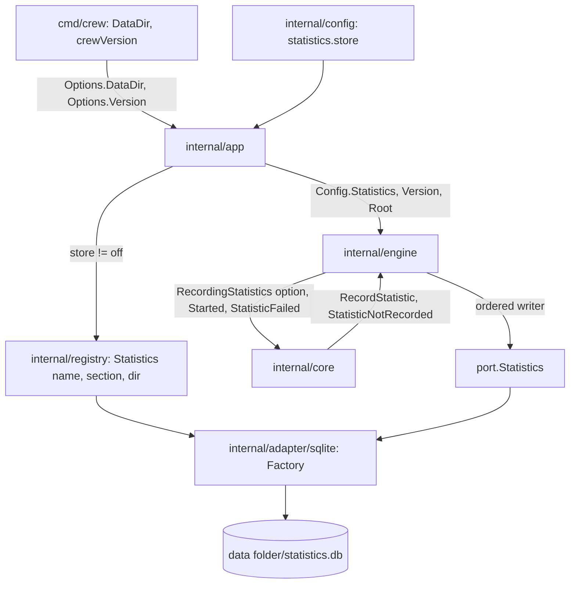

## Goal Capsule

- **Objective:** a real crew run builds the store the config chooses in its global data folder, records itself once, shows a lost record as a warning, and the README says what crew records, where, and how to turn it off.
- **Parent:** #340, part 5 of 5. Read it only for a question this part does not answer.
- **Open blockers:** none.

## Builds on

Already on main when this part starts; read the code, not these parts' files.

- Part 2 (U2): the `sqlite` store registered in `default.go`, writing process records to `statistics.db` in the folder it is given, opening on its first write and safe for several processes.
- Part 4 (U5): `engine.Config.Statistics` and `engine.Config.Version`, the `Started` step before the first `Tick`, and the ordered writer that turns a failed write into a published `StatisticNotRecorded` event.

## Product Contract

### Summary

The config key that chooses the store or turns recording off, `config.DataDir`, the app building the store through the registry and closing it, `cmd/crew` handing the data folder and crew's version to the app, the warning's line in `--plain` and the TUI, and the README, `AGENTS.md` and `CONCEPTS.md` text on the store.

### Context

This part turns recording on: until it merges, nothing builds a store. Parts 1 to 4 built the record, the port, the registry's store map and fake (part 1), the adapter (part 2), the core's decision and its `StatisticNotRecorded` wording (part 3) and the engine's writer (part 4). The config key ships with the behaviour it chooses and the README text that describes both.

### Key Decisions

- **Entities, events and spans are different things.** An entity exists and has attributes (a process, a repository, an issue). An event is an instant (an issue moved from one label to another). A span is work with a start, an end, a cost and children (a rule run, an action). Cost and time live on spans, and waiting time comes from the gaps between events. Governs R5.
- **The process is recorded once, like a telemetry Resource, and is not a level of the tree.** One crew process works on many issues and one issue's runs span many processes, so every span points to the process that ran it. Governs R5. (session-settled: user-approved — chosen over issue → process → rule run: the relation is many-to-many)
- **SQLite with `modernc.org/sqlite`.** crew's release builds with `CGO_ENABLED=0`, and `modernc.org/sqlite` is the pure-Go driver most Go projects use for that (PocketBase, memos, Syncthing, Gitea, soft-serve). Governs R1, R4. (session-settled: user-directed — chosen over Postgres as an opt-in dependency started with docker compose, and over `mattn/go-sqlite3`, which needs cgo and per-platform C toolchains in the release: no external service, and the store's port lets another database replace it later)
- **The store is an adapter the config chooses and crew's registry builds.** Like trackers and harnesses, a store is a package with a factory registered in the registry, and the app builds it for any entry point. `cmd/crew` only hands it the global data folder. A later web view or statistics command builds the same store, and another database is another registered adapter. Governs R1, R2. (session-settled: user-approved — chosen over `cmd/crew` building the store directly, as it builds the run journal: a second entry point would duplicate the wiring)
- **The core decides what to record, the engine writes it.** The core already knows the issue, its labels, the run's rule, action, bot, verdict and route, so it builds the records and emits commands. The engine executes them through the port, the way it executes journal records today. crew's own time reaches the core with the fact the engine hands it, so the core keeps no clock. Harness-specific detail stays in the harness's adapter. Governs R5. (session-settled: user-approved — chosen over the engine assembling records on its own: the core keeps the decision pure and table-testable)
- **On by default.** Recording needs no external service, so it is on unless the config turns it off. Governs R2.

### Requirements

**The store**

- R1. crew records its statistics in one SQLite database in its global data folder: `$XDG_DATA_HOME/crew`, else `~/.local/share/crew`, on every OS.
- R2. The config chooses the store, `sqlite` by default, or turns recording off; when off, crew neither creates nor writes a store.
- R3. A failure to open or write the store never stops, fails or delays a rule: crew warns and keeps running.

**Entities and events**

- R5. Each crew process is recorded once, when it starts, with crew's version, its local folder (the repository root) and its start time.

**The documentation**

- R17. The README says what crew records, where the store lives and how to turn recording off.

### Key Flows

- F2. A session action ends and its route runs
  - **Trigger:** the harness's session for an action of a rule run exits.
  - **Steps:** the engine reads the session's usage and hands the core the fact that the session ended; the core decides the action's verdict and, besides its usual commands, emits the action's span with its kind's detail; when the verdict leads to a route, the route's span opens inside the action, each of its shell and function steps is a span inside it when it ends, and the route's span closes when its last step ends; the engine writes every record through the port, and a failed write becomes a warning.
  - **Covered by:** R3, R10, R11, R12, R14 (R10 to R14 are part 5's, #343). This part builds the port, the ordered writer and the warning that F2's writes go through.
- F3. A rule run's life across a restart
  - **Trigger:** a rule takes an issue, and crew restarts before the run ends.
  - **Steps:** the rule run's span is written when the run starts, while the first process runs; the restarted crew records a new process; the actions and route steps that end after the restart point to the new process; the rule run's span is completed when the run ends.
  - **Covered by:** R5, R9, R10, R11 (R9 is part 4's, #342). This part records each process with an id the later spans point to.

### Acceptance Examples

- AE8. **Covers R3.** Given the store cannot be written (the disk is full, or the file is locked past the wait), the rule run continues exactly as it would without statistics, and crew warns that a record was lost.
- AE12. **Covers R2.** Given recording is turned off in the config, crew runs every rule as before and creates no store.

### Scope Boundaries

- This part records only processes. Repositories, issues and their moves are part 3's of #315; rule run spans part 4's of #315; action, route and step spans part 5's of #315. The README says only what this part records; each later part of #315 keeps it true for what it adds. The "part 4's" and "part 5's" in F2 and F3 are #315's parts too.
- AE9 (two processes writing at once, R4) is tested in part 5 of #315, the first part that writes spans.
- The run journal (`.crew/logs/runs.jsonl`) stays as it is; the store is a new record, not its replacement.
- No view, command or query reads the store yet.
- Postgres or any other database server.

**Considered and not built**

- Detecting a data folder on a network filesystem, where WAL does not work. The README warns about it, and every failure surfaces as the warning. Reports of corrupted stores would change that.

### Sources / Research

Split from #340.

- `internal/registry/default.go` and `internal/app`: how trackers and harnesses are chosen by the config and built through the registry.
- `internal/config/files.go`.
- The gh CLI's telemetry (`internal/gh/ghtelemetry`, `internal/telemetry` in cli/cli): an interface package apart from its implementation, common dimensions set once, a no-op service, and failures that never break a command.

## Planning Contract

### Key Technical Decisions

- KTD2. **The registry gains a store map, and the factory never touches the disk.** `registry.New` takes a fourth map of store factories, and `registry.Statistics(name, section, dir)` looks one up with the same "no store is named …; the registered stores are: …" error as `lookup`. `default.go` registers `sqlite`. As with every factory (`internal/port/factory.go`), the SQLite factory only decodes and checks its section: an unknown store name or key is a config error and exits 2, like a wrong tracker. Opening the file is not the factory's job (KTD6), so no open failure can take that path. This instantiates the store Key Decision (Governs R1, R2).
- KTD3. **Off means nothing is built and the core emits nothing.** The config's `statistics:` section holds `store:`, a registered store's name, `sqlite` by default, or `off`. With `off`, the app builds no store, `engine.Config.Statistics` stays nil, and the engine does not add the core's `RecordingStatistics` option. The core then emits no statistics command, the precedent being `core.Journaling` when no journal is configured (`internal/core/claims.go`). The rest of the section is bound for the adapter the way `tracker:` is (`split` and `bind` in `internal/config/config.go`). The SQLite adapter takes no keys yet. Governs R2, AE12.
- KTD6. **The adapter opens on its first write; any failure is the one warning.** The SQLite store opens, creates the folder and migrates on its first `Record`, inside the writer. A failed open fails that write and leaves the store unopened, so the next write tries again. An empty or relative data folder is an open failure ("no data folder: set XDG_DATA_HOME or HOME"), not a config error. Every failure therefore reaches the boss the same way: the core turns `StatisticFailed` into a published `StatisticNotRecorded` event, with what was lost and why. `--plain` prints it as a `crew: warning: …` line, and the live view shows it in Events. It goes through `e.step` because `--plain` must print it (the same learning). There is no new startup step and no startup line when the store opens (`docs/solutions/design-patterns/prepare-steps-are-startup-lines-in-acceptance-snapshots.md`). Governs R3, AE8.
- KTD10. **The data folder is resolved once, in `cmd/crew`.** `config.DataDir(xdgDataHome, home)` sits beside `GlobalFile` in `internal/config/files.go` and returns `$XDG_DATA_HOME/crew`, else `home/.local/share/crew`. It returns `""` when the result is relative or unknown, mirroring `GlobalFile`, and it never uses an `os.User*Dir` helper (`docs/solutions/integration-issues/user-config-dir-is-library-application-support-on-macos.md`, `docs/solutions/design-patterns/global-config-path-is-one-rule-kept-in-two-places.md`). `cmd/crew` hands the result, and crew's version from `crewVersion`, to `app.Options`. The app passes the folder to the registry and the version and root to the engine. Governs R1, R5.

### High-Level Technical Design

How the store is chosen and built, and who talks to whom:



### Output Structure

```text
internal/config/statistics.go   the statistics: section
```

### Assumptions

These are unconfirmed bets made while planning. Review them in the pull request.

- The config shape is `statistics: {store: sqlite}`, with `store: off` to turn recording off. It sits in any of the three config files, so a global `statistics: {store: off}` turns recording off in every repository unless a repository's file sets it again.
- Only a crew run (`app.Run`) is a process. `crew --version`, `crew bots create` and `crew sessions …` record nothing.
- The version recorded is the value `crew --version` prints after `crew `: `vX.Y.Z` for a release, a module version for `go install`, `dev` otherwise. The folder is the repository root as `git rev-parse --show-toplevel` gives it.
- The database file is `statistics.db` in the data folder.
- A relative `XDG_DATA_HOME` means no data folder, as a relative `XDG_CONFIG_HOME` means no global file. It does not fall back to `~/.local/share`.
- Each failed record is one warning, worded like `RunNotRecorded`'s line: what was lost and the scrubbed reason. With one record per process, a run warns at most once.

### Deferred to Implementation

- Whether app tests register a fake store under `sqlite` or set `statistics: {store: fake}` in their configs. Either keeps them off the real database.
- The warning's final wording in `internal/ui/lines/lines.go`.

### Sequencing

U3 (config) first, then U6 (app, cmd/crew, views), which reads U3's section, then U7 (docs) last.

## Implementation Units

### U3. The `statistics:` config section and the data folder

**Goal:** the config chooses the store or turns recording off, and crew knows its data folder.

**Requirements:** R1, R2 (KTD3, KTD10).

**Dependencies:** U1.

**Files:**
- Create `internal/config/statistics.go` and `internal/config/statistics_test.go`.
- Modify `internal/config/config.go` (a `statistics` field in `document`, and `Config.Statistics` and `Config.StatisticsSection`) and `internal/config/files.go` (`DataDir`, with tests beside `GlobalFile`'s in `internal/config/config_global_test.go`).
- Modify `internal/config/export_test.go` (`sections`), `schema/config.schema.json`, `.crew/config.example.yaml` and `internal/config/testdata/translation/` (the fixture sets `statistics:`).

**Approach:**
- `statistics` is a raw section: crew reads `store`, defaulting to `sqlite`, and binds the rest for the adapter, as `tracker:` does.
- `off` yields an empty store name, which the app reads as "record nothing".
- `store: off` with any other key is a config error, because the keys would be ignored.
- `DataDir` follows KTD10.

**Patterns to follow:** `trackerSection`, `split`, `bind` and `GlobalFile` in `internal/config`; the section-per-file layout of `internal/config/questions.go`.

**Test scenarios:**
- A config with no `statistics:` yields store `sqlite` with an empty section.
- `statistics: {store: off}` yields recording off.
- `statistics: {store: off, path: x}` fails, naming the file and the key.
- `statistics:` in the global file and `statistics: {store: off}` in `.crew/config.local.yaml` yields off: the later file's top-level key wins.
- `statistics: [a]` fails as a wrong shape, naming the file.
- `DataDir("/x", "/home/u")` is `/x/crew`, and `DataDir("", "/home/u")` is `/home/u/.local/share/crew`.
- `DataDir("rel", "/home/u")` and `DataDir("", "")` are both `""`.
- The schema and the config keys still match (`TestSchemaAndConfigTakeTheSameKeys`), and the example config still loads once uncommented and sets every schema key.

**Verification:** `internal/config` tests pass, and the schema, the example and the key walk agree on `statistics.store`.

### U6. App, cmd/crew and the views

**Goal:** a real crew run builds the configured store in the data folder, records itself and shows a lost record as a warning.

**Requirements:** R1, R2, R3, R5 (KTD2, KTD3, KTD6, KTD10).

**Dependencies:** U2, U3, U5.

**Files:**
- Modify `internal/app/app.go` (`Options.DataDir`, `Options.Version`, building the store in `build`, passing it and the version to the engine, closing it once the engine's `Run` has returned) and its tests: `internal/app/app_test.go`, plus a new `internal/app/app_statistics_test.go`.
- Modify `cmd/crew/main.go` (fill `DataDir` from `XDG_DATA_HOME` and the home folder, and `Version` from `crewVersion`) and `cmd/crew/main_test.go`.
- Modify `internal/ui/lines/lines.go`'s tests (U4 worded `StatisticNotRecorded`).

**Approach:**
- `build` asks the registry for the store only when the config's store is not `off`. A lookup or decode error joins `build`'s errors and exits 2, like a wrong tracker.
- The app closes the store once the engine's `Run` has returned without an error. A failed engine, a panic included, never ended its writer, and a forced exit (`forceExit` in `internal/app/app.go`) returns while the engine still runs, so neither closes the store: the writer may be inside an open or its BUSY retry, and SQLite's WAL recovers on the next open.
- `cmd/crew` reads `XDG_DATA_HOME` and the home folder where it already reads `XDG_CONFIG_HOME` and the home folder for `GlobalFile`, and nowhere else.

**Patterns to follow:** how `build` handles the tracker and `o.journal()` in `internal/app/app.go`; `GlobalFile`'s call in `cmd/crew/main.go`; `RunNotRecorded`'s line in `internal/ui/lines/lines.go`.

**Test scenarios:**
- A config naming store `fake`, with the fake registered, runs and records one process whose version is `Options.Version` and whose folder is `Options.Root`.
- Covers AE12. `statistics: {store: off}` builds no store: the factory is never called, and with the real `sqlite` registered, no file appears in the data folder.
- `statistics: {store: postgres}` exits 2 with the registry's error.
- An empty `DataDir`, with the real `sqlite` registered, runs every rule and ends with one lost-record warning saying there is no data folder.
- `--plain` prints the lost-record warning as one `crew: warning: …` line, and the TUI's Events band shows it.
- `cmd/crew` hands `DataDir` `$XDG_DATA_HOME/crew` when it is set and `~/.local/share/crew` otherwise. A `--version` run creates no store.

**Verification:** `go test -race ./...` passes. A local `crew --plain` run in a scratch repository leaves one row in `~/.local/share/crew/statistics.db`, or under `$XDG_DATA_HOME`. The acceptance smoke run prints the same startup screen as before.

### U7. README, AGENTS.md and CONCEPTS.md

**Goal:** the docs say what crew records, where, and how to turn it off, and describe the new pieces.

**Requirements:** R17.

**Dependencies:** U6.

**Files:**
- Modify `README.md`, `AGENTS.md` and `CONCEPTS.md`.

**Approach:**
- `README.md` gains a "Statistics" section. It says what crew records (one row per crew run: its version, its repository folder and its start time) and where: `$XDG_DATA_HOME/crew/statistics.db`, else `~/.local/share/crew/statistics.db`, on Linux and macOS alike. It shows how to turn recording off (`statistics: {store: off}`, in the global file for every repository), says that a failed write is a warning and never stops a rule, and notes that the data folder must not be on a network filesystem. It says nothing about later parts' records.
- `AGENTS.md` describes the `sqlite` adapter, the `Statistics` port, the registry's store map, the fake and the engine's writer. Its layering list is unchanged.
- `CONCEPTS.md` gains a "Statistics store" entry beside "Run journal".

**Test expectation:** none: documentation only.

**Verification:** each README claim matches U2 to U6's behaviour, and the README's config paragraph links the new section.

## Verification Contract

| Gate | Command | Applies to |
|---|---|---|
| Format | `gofmt -l cmd internal tools acceptance` prints nothing | every unit |
| Vet | `go vet ./...` | every unit |
| Lint and layering | `go run github.com/golangci/golangci-lint/v2/cmd/golangci-lint@v2.14.0 run` | every unit |
| Tests | `go test -race ./...` | every unit |
| Coverage floors | `go test -race -covermode=atomic -coverpkg=./... -coverprofile=coverage.out ./...`, then `go run github.com/vladopajic/go-test-coverage/v2@v2.19.0 --config=.testcoverage.yml` (total at least 90%) and `git diff -U0 origin/main...HEAD \| go run ./tools/diffcover -profile coverage.out` (changed lines at least 90%) | before the pull request |
| Vulnerabilities | `go run golang.org/x/vuln/cmd/govulncheck@v1.8.0 ./...` | before the pull request |
| Acceptance module | `go -C acceptance vet ./...` and golangci-lint in `acceptance/` | before the pull request |
| Acceptance smoke | `go -C acceptance run ./cmd/acceptance -count=1 -run TestSmoke`: the startup screen is unchanged | before the pull request |
| Codacy limits | functions of at most 50 NLOC and complexity 15, files of at most 500 lines | every new or changed file, especially `internal/config/config.go` |

## Definition of Done

- Every unit's Verification holds, and every gate above passes.
- A config with `statistics: {store: off}` behaves exactly as before and creates no file in the data folder.
- With recording on, a crew run writes exactly one process row, and no store failure stops, fails or delays a rule.
- README, `AGENTS.md` and `CONCEPTS.md` describe the store, its folder and how to turn it off.
- Code from abandoned approaches is removed from the diff.
- The pull request body contains `Closes #340`, lists the Assumptions above for review, and hands AE8 and AE12's acceptance scenarios to the tester.

<!-- cw-split-ce-plan: part of #340 -->

<!-- publish-split: part 5 of #340 -->

