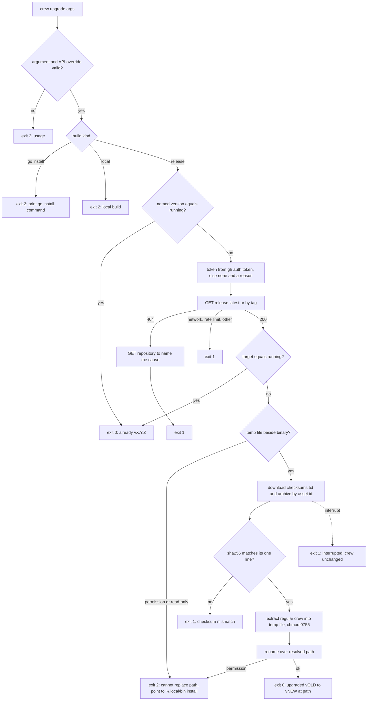
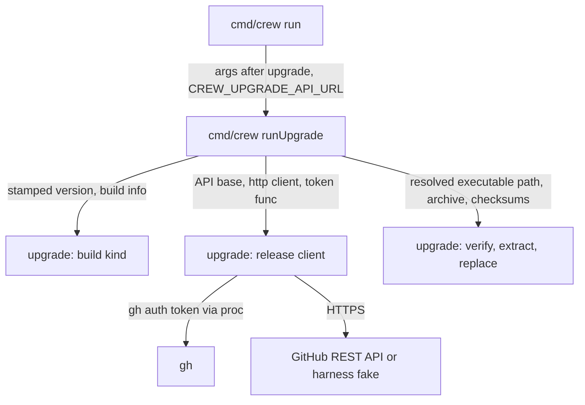

## Goal Capsule

- **Objective:** a user who installed crew from a release runs `crew upgrade [vX.Y.Z]` to install the latest release or the one named, and the README documents the command.
- **Parent:** #268, part 4 of 6. Read it only for a question this part does not answer.
- **Open blockers:** none.

## Builds on

Already on main when this part starts; read the code, not these parts' files.

- Part 2 (U2): the release client in `internal/upgrade`: the API base and its `CREW_UPGRADE_API_URL` override, the `gh auth token` lookup, release lookup, capped asset download and the network failures' messages.
- Part 3 (U3): the install in `internal/upgrade`: archive name, checksum check, extraction of `crew`, the writability check and the rename over the resolved path.

Part 1 (U1), which both build on, delivers the version argument parser, the build-kind classifier and `EnvError`.

## Product Contract

### Summary

`crew upgrade` downloads the latest release, or the version given as its argument, for the machine's OS and architecture. It checks the archive against the release's `checksums.txt` and replaces the running crew binary in place, without `sudo`. The README documents it, the depguard rules fence `internal/upgrade`, and `AGENTS.md` names the package.

### Context

crew publishes a release for every pull request that changes `VERSION`, so an installed crew falls behind quickly, and today the only way to update is to rerun the README's install snippet, which fails while the repository is private. This part wires the pieces parts 1 to 3 built into the command, so R5, R6, R7, R9 and R10, which those parts complete in the package, reach the user here.

Branch `crew/issue-268-lfg` already holds an earlier `cmd/crew/upgrade.go`, `processUpgrader()`, the two depguard rules and a README section: take them from there and bring them to this part rather than rewriting them (KTD12), leaving out that branch's plan file. Stop and report if the manual check against the real repository (Verification Contract) fails and the cause is not in crew's code.

### Key Decisions

- **The command is `crew upgrade`.** Across `apt`, `brew`, `deno` and `bun`, `upgrade` is the verb for installing a newer version of the binary, while `update` refreshes an index or dependencies. (session-settled: user-directed — chosen over `crew update`, `crew self-update` and `upgrade` with an `update` alias: `upgrade` has the most consistent meaning among comparable CLIs and keeps `update` free.) Governs R1.
- **Never `sudo`.** (session-settled: user-directed — chosen over calling `sudo` for the final copy as the README once did: the upgrade must never ask for elevated permissions.) Governs R8, R9.
- **Only release builds upgrade.** A binary built by `go install` or `go build` is never replaced; the command says what to run instead. (session-settled: user-approved — chosen over replacing a `go install` binary and over replacing any binary: either would overwrite a binary being tested in a checkout.) Governs R11.
- **A version can be given.** `crew upgrade vX.Y.Z` installs that release, which is also how a user rolls back from a release that broke. (session-settled: user-approved — chosen over latest only and over also adding a `--check` flag.) Governs R1.
- **No confirmation prompt, and no warning on a downgrade.** The user typed the command and, for a downgrade, the version. Governs R4.

### Requirements

**The command**

- R1. `crew upgrade` installs the latest published release, and `crew upgrade vX.Y.Z` installs release `vX.Y.Z`, whether it is newer or older than the running one.
- R2. When the running crew already is the target version, the command says so, changes nothing and exits 0.
- R3. After an upgrade, the command prints the version it replaced and the version it installed.
- R4. The command asks no question before it installs.

**Installing**

- R8. The command replaces the binary that is running, at its own path, and never calls `sudo`.

**Which binaries upgrade**

- R11. The command upgrades only a binary built by crew's release. A binary built by `go install` stops and prints the `go install` command for the target version. Any other local build, such as `go build` in a checkout, stops and says it is a local build.

**Exit codes**

- R12. The command exits 0 when it upgraded or the binary already was the target version, 1 when the download or the verification failed, and 2 for an environment the command cannot change: a binary that is not a release build, a path it cannot write, or a malformed version argument. These are the meanings crew's exit codes already have.

**README**

- R13. The README documents `crew upgrade`, its version argument and its exit codes.
- R15. The README says that an install made before `crew upgrade` existed, such as v0.1.0, reinstalls once with the snippet.

### Acceptance Examples

- AE1. **Covers R1, R3, R12.** **Given** a release build of v0.4.0 in `~/.local/bin/crew` and v0.5.0 as the latest release, **when** the user runs `crew upgrade`, **then** `~/.local/bin/crew --version` prints `crew v0.5.0`, the command printed both versions, and it exited 0.
- AE2. **Covers R2.** **Given** a release build of v0.5.0 and v0.5.0 as the latest release, **when** the user runs `crew upgrade`, **then** it says crew already is v0.5.0, the file is unchanged, and it exits 0.
- AE3. **Covers R1, R4.** **Given** a release build of v0.5.0, **when** the user runs `crew upgrade v0.4.0`, **then** v0.4.0 is installed with no question asked.
- AE6. **Covers R8, R9, R12.** **Given** a release build in `/usr/local/bin/crew` owned by root, **when** the user runs `crew upgrade`, **then** nothing changes, no `sudo` runs, the message explains the install into `~/.local/bin` and removing the old binary, and it exits 2.
- AE7. **Covers R11, R12.** **Given** crew built by `go install github.com/thatsnotmynameio/crew/cmd/crew@v0.4.0`, **when** the user runs `crew upgrade`, **then** nothing changes, the command prints the `go install` command for the latest release, and it exits 2.
- AE8. **Covers R11, R12.** **Given** crew built by `go build` in a checkout, **when** the user runs `crew upgrade`, **then** nothing changes, the command says it is a local build, and it exits 2.

### Scope Boundaries

- The acceptance doubles that serve releases are part 5, and the acceptance scenarios for the command are part 6. This part's tests run `runUpgrade` against `httptest` servers.
- The package doc gains the layering rule (KTD11); keep the doc parts 1 and 2 wrote true for what this part adds.
- A notice at startup or in the live view that a newer release exists, and automatic updates: #263.
- Windows: crew does not run there, and releases have no Windows build. That is #264.
- How a release is gated and approved: #261. `crew upgrade` installs whatever is published as the latest release.
- A `--check` flag that only reports whether a newer release exists.
- Pre-release or release-candidate channels.
- Calling `sudo`, or moving an existing install out of `/usr/local/bin` automatically.
- Upgrading through package managers such as Homebrew; crew is not distributed through one.
- The README's install into `~/.local/bin` without `sudo` (#260's R14) shipped in #274. This plan changes that install section only where R15 needs it.

Considered and not built:

- **A `GOPRIVATE` hint in the `go install` message.** The README's `go install` line has none either. Both would change together if a user hits it.
- **A progress line or bar during the download.** Archives are a few MB. A report of a slow download that looked hung would change this.

### Dependencies / Assumptions

- v0.1.1 is the latest release and carries `checksums.txt` and `crew_{linux,darwin}_{amd64,arm64}.tar.gz`. v0.1.0 carries no assets. The repository is still private. Neither release has `crew upgrade`: v0.1.1 answers `crew: unexpected argument "upgrade"` and exits 2.
- GitHub's "latest" is the last full release published (`make_latest` defaults to true), not the highest version. crew's release check (`tools/release check` and CI's `version` job) refuses a version below the latest release, so in practice the latest is also the highest. If it is not, `crew upgrade` installs it as R1 says.

### Sources / Research

Split from #268.

- Split from #260; part 1 shipped in #274 (README install into `~/.local/bin`).
- `cmd/crew/main.go`: `var version`, `run` (SIGPIPE ignored, `bots` and `sessions` dispatched before the flags), the usage text and package doc, `crewVersion`.
- `cmd/crew/bots.go` (`runBots`, `botsExit`, `signal.NotifyContext`) and `cmd/crew/sessions.go` (dependencies passed as arguments).
- `.golangci.yml`: the `bots` and `bots-users` depguard rules, the `function` rule (#305), funlen 50, cyclop 15, gocognit 15, file length 500.
- `internal/app/app.go`: exit codes 0 clean, 1 failure, 2 config or environment.
- `docs/solutions/runtime-errors/subcommand-before-start-dies-on-closed-stdout.md`.

## Planning Contract

### Key Technical Decisions

- KTD4. **The API base is `https://api.github.com`. The environment variable `CREW_UPGRADE_API_URL` may replace it only with `http` or `https` on a loopback IP literal (`net.ParseIP(host).IsLoopback()`), with a port and nothing else.**
  - The acceptance harness needs a way to point a release binary at its fake GitHub.
  - Any other value exits 2 before any I/O: a name such as `localhost`, a user part, a path, a query or a fragment.
  - While the override is set, crew prints one stderr line naming it, so a stale export never acts silently.
  - Only `cmd/crew` reads the variable and hands its value to `internal/upgrade`. It is crew's first `CREW_*` input. `acceptance/README.md` and the package doc document it. The user README leaves it out.
- KTD7. **Errors carry a kind that sets the exit code: an environment error exits 2 and any other failure exits 1.** This mirrors `bots.EnvError` and `botsExit`. Each failure names its cause in one line that starts with `crew:`:

  | Cause | Exit | What the message names |
  | --- | --- | --- |
  | Malformed or extra argument, `-h`, `--help`, bad `CREW_UPGRADE_API_URL` | 2 | the argument, and `usage: crew upgrade [vX.Y.Z]` |
  | `go install` build | 2 | `go install github.com/thatsnotmynameio/crew/cmd/crew@<vX.Y.Z or latest>` |
  | Local build | 2 | that it is a local build, its version, and the README's install |
  | crew cannot find its own path | 2 | the error from `os.Executable` |
  | Directory not writable (temp file or rename gets a permission or read-only error) | 2 | that crew cannot replace `<path>`, that crew never uses `sudo`, the README's install into `~/.local/bin`, and removing `<path>` |
  | Interrupted before the rename | 1 | that the upgrade was interrupted and crew is unchanged at `<path>` |
  | No network (`*url.Error`, timeout) | 1 | that GitHub could not be reached |
  | Rate limit (429, or 403 with `X-Ratelimit-Remaining: 0` or `Retry-After`) | 1 | GitHub's rate limit. Without a token, that a `gh` login raises it. With one, the reset time when `X-Ratelimit-Reset` is present |
  | Release endpoint 404, repository visible | 1 | that release vX.Y.Z does not exist, or that there is no published release |
  | Release endpoint 404, repository 404, no token | 1 | that the repository is private and no `gh` login was found, with the token function's reason, and `gh auth login` |
  | Release endpoint 404, repository 404, token sent | 1 | that the `gh` login cannot see `thatsnotmynameio/crew` |
  | 401 with a token | 1 | that GitHub rejected the `gh` login, so run `gh auth login` |
  | Another 4xx or 5xx | 1 | GitHub's status and its `message` |
  | Missing archive for this OS and architecture, missing `checksums.txt`, missing checksum line | 1 | the release and the missing file |
  | Checksum mismatch | 1 | the archive's name and "checksum mismatch" |
  | Archive without a regular `crew`, or over the cap | 1 | the archive's name and the defect |
  | Any other write error (disk full) | 1 | the path and the error |

  A 404 on a release endpoint is ambiguous on a private repository, so the command then reads `GET /repos/thatsnotmynameio/crew` with the same credentials to tell the causes apart. An interrupt is checked against the context before a `*url.Error` is mapped, so Ctrl-C never blames GitHub. Governs R7, R9, R12.
- KTD8. **Order: argument, build kind, already current, writable, download, verify, replace.**
  - The argument and the build kind are checked before any I/O, as `crew bots create` checks the bot name before git.
  - A named version equal to the running one says so with no network call.
  - The "already current" answer comes before the writability check, so `crew upgrade` and `crew upgrade v<running>` agree on R2 even in a directory crew cannot write.
  - The writability check comes before the archive download, so AE6 fails fast and downloads nothing.
  - Governs R2, R9, R12.
- KTD10. **`crew upgrade` catches SIGINT, SIGTERM and SIGHUP into the context of its calls, and bounds each call.** The bounds are 10 s for `gh auth token`, 30 s for each JSON call and 10 minutes for the archive. An interrupt before the rename leaves the old binary, the deferred remove deletes the temp file, and KTD7's interrupt row applies. A failed write of the success line after the rename still exits 0: the binary is installed, and stdout was the caller's to close. SIGPIPE is already ignored at the top of `run`.
- KTD11. **`internal/upgrade` is a package beside `internal/bots`: it imports the standard library and `internal/proc`, and only `cmd/crew` imports it.** Two depguard rules enforce this, `upgrade` and `upgrade-users`, modelled on `bots` and `bots-users`. The `upgrade` rule also denies `internal/function`, which #305 added after the earlier branch forked. The upgrade involves no tracker, engine or port, so it is not an adapter.
- KTD12. **Reuse the earlier branch by rebasing it onto `main`.** A dry merge of `crew/issue-268-lfg` into `main` conflicts only in `AGENTS.md`. Redo the `AGENTS.md` edits against `main`'s text instead of resolving the conflict by hand, because `main` now also names `captain`, `function`, `fileline` and the question rules there. Each unit below lists what the branch lacks against this plan. The branch has no `acceptance/scenarios/upgrade/` yet: the earlier run was stopped while the tester wrote it.

### High-Level Technical Design

The command's decision flow. Each exit names its code; "binary untouched" holds on every path except the last.



How the pieces call each other:



### Output Structure

```text
cmd/crew/upgrade.go, upgrade_test.go
```

The file split is directional. Each file stays under the 500-line limit, and each function within funlen 50 and cyclop 15.

### Assumptions

- The order of the checks (KTD8) and the message for each cause (KTD7) are inferred. The contract states the causes and exit codes, not the wording or the order.
- The success line names the resolved path as well as both versions: `crew: upgraded vOLD to vNEW at <path>`. R3 asks for the versions; the path tells a user with two crews on `PATH` which one changed.
- R9's pointer to `~/.local/bin` is given for any path crew cannot write, naming that path, and the message is worded "crew cannot replace <path>" so it fits every cause. R9 asks for it for `/usr/local/bin`. The acceptance suite can only make a directory under `$HOME` unwritable.
- AE7's command for "the latest release" is printed as `@latest`, with no network call. Go resolves `@latest` to the highest release tag, which is crew's latest release (Dependencies / Assumptions).
- R15's reinstall cannot use the README snippet as it stands while the repository is private: its `curl` downloads answer 404 for every user today, and every existing install (v0.1.0 or v0.1.1) predates `crew upgrade`. The README therefore names "v0.1.1 or earlier" and, for as long as the repository is private, gives the same snippet with its two `curl` downloads replaced by `gh release download --repo thatsnotmynameio/crew --pattern <archive> --pattern checksums.txt`. That variant is marked for removal when the repository goes public. This keeps R15's meaning (reinstall once with the snippet) and makes it work in the state the Goal Capsule names.
- A crew session started by a running crew calls `crew sessions …` through `PATH`, which after an upgrade is the new binary. The answer is stateless today (`captain.Dumb`), so nothing breaks. The package doc of `cmd/crew` says that `crew sessions` output must stay readable across versions, because a session can outlive an upgrade.
- AE6, AE7, AE8 and the root-owned case run where the suite can reach them. AE7 and AE8 are unit tests in `cmd/crew`, because `CREW_BIN` is always a GoReleaser build. A read-only-directory scenario skips when the suite runs as root.

### Sequencing

U4 wires the command, then U5 documents it from U4's messages and exit codes, in the same pull request.

## Implementation Units

### U4. The `crew upgrade` command

- **Goal:** run the upgrade from `crew upgrade [vX.Y.Z]` with R12's exit codes and R3's output, and fence the new package.
- **Requirements:** R1, R2, R3, R4, R8, R11, R12; KTD4, KTD7, KTD8, KTD10, KTD11.
- **Dependencies:** U1, U2, U3.
- **Files:** `cmd/crew/upgrade.go`, `cmd/crew/upgrade_test.go`, `cmd/crew/main.go`, `cmd/crew/main_test.go`, `.golangci.yml`, `AGENTS.md`.
- **Approach:**
  1. `run` dispatches `upgrade` beside `bots` and `sessions`. The usage text and the package doc gain `crew upgrade [vX.Y.Z]` and its exit codes. The package doc also carries the `crew sessions` note from Assumptions.
  2. `runUpgrade` takes its arguments, stdout, stderr and a dependencies value: stamped version, build info, executable path function, GOOS and GOARCH, the override's value, HTTP client and token function. Tests inject them, as `runSessions` takes its captain.
  3. It follows KTD8's order, then prints `crew: already vX.Y.Z` or `crew: upgraded vOLD to vNEW at <path>`, the latter after the rename.
  4. An `upgradeExit` maps errors as `botsExit` does: print `crew: <error>`, 2 for an `EnvError`, else 1.
  5. Signals as KTD10 sets them.
  6. `.golangci.yml` gains the `upgrade` and `upgrade-users` depguard rules (KTD11).
  7. `AGENTS.md` gains the package in Architecture and Layering, and the `cmd/crew` bullet names `crew upgrade`. Write these against `main`'s current text (KTD12).
- **From the earlier branch:** `cmd/crew/upgrade.go`, `processUpgrader()` in `main.go` and the two depguard rules exist. The `upgrade` rule lacks `internal/function`, and the success line lacks the path.
- **Patterns to follow:** `cmd/crew/bots.go` (`runBots`, `botsExit`, `signal.NotifyContext`); `cmd/crew/sessions.go` for injected dependencies; `runCaptured` and the closed-stdout child-process test in `cmd/crew/sessions_test.go`.
- **Test scenarios:** each runs `runUpgrade` against an `httptest` release server, a temp-dir executable and injected build info.
  - Release v0.4.0, latest v0.5.0: the file holds v0.5.0's bytes, stdout names v0.4.0, v0.5.0 and the path, exit 0. Covers AE1.
  - Release v0.5.0, latest v0.5.0: "already v0.5.0", the file is unchanged, exit 0, and no asset was requested. Covers AE2.
  - Release v0.5.0, `crew upgrade v0.4.0`: v0.4.0 installed, and stdin is never read. Covers AE3.
  - `crew upgrade v0.5.0` while running v0.5.0: "already", with no request to the server.
  - A go install build: prints `go install github.com/thatsnotmynameio/crew/cmd/crew@latest`, exit 2, no request. With `v0.4.0` as the argument it prints `@v0.4.0`. Covers AE7.
  - A local build: says it is a local build, exit 2, no request. Covers AE8.
  - An unwritable directory with latest newer: exit 2, the message names the path and `~/.local/bin`, no archive request. Covers AE6.
  - A checksum mismatch: exit 1. A missing release: exit 1. Each leaves the file unchanged.
  - `crew upgrade v1 extra`, a malformed version and `crew upgrade --help`: exit 2 before any request, with the usage line.
  - `crew --help` lists `crew upgrade [vX.Y.Z]`.
  - Closed stdout after a successful upgrade still exits 0 and the file holds the new bytes, in a child process with a really closed fd 1.
- **Verification:** golangci-lint passes with the new depguard rules, and importing `internal/upgrade` from any package but `cmd/crew` fails lint.

### U5. README

- **Goal:** document `crew upgrade` where users look for installing and updating.
- **Requirements:** R13, R15.
- **Dependencies:** U4, so the messages and exit codes match.
- **Files:** `README.md`.
- **Approach:**
  1. Add a section `## Upgrading crew` after Quick start, before `## Rules`, shaped like "A session's task". It shows `crew upgrade` and `crew upgrade vX.Y.Z` and what they print, then one paragraph covering:
     - it replaces the binary at its own path without `sudo`, checks `checksums.txt`, and uses the `gh` login while the repository is private;
     - running crews keep their version until restarted;
     - a release build only: `go install` and local builds are told what to run;
     - a directory crew cannot write, such as `/usr/local/bin`, gets pointed to the install into `~/.local/bin`;
     - its exit codes 0, 1 and 2.
  2. Say that an install of v0.1.1 or earlier, made before `crew upgrade` existed, reinstalls once with the snippet (R15). Give the private-period form from Assumptions, marked for removal when the repository goes public. Rolling back with `crew upgrade vX.Y.Z` to such a release leaves a crew that needs the snippet to come forward again.
  3. In the "What's inside" table, the `internal/` row adds `upgrade` for `crew upgrade`.
- **From the earlier branch:** a README section exists. It names only v0.1.0 and lacks the private-period form.
- **Patterns to follow:** `## A session's task` in `README.md`.
- **Test expectation:** none, it is docs only. The acceptance tester reads this section as the contract for U7.
- **Verification:** every message and exit code the section names matches U4's tests, and the private-period snippet downloads v0.1.1's archive and checksum with a `gh` login.

## Verification Contract

| Gate | Command or check | Applies to |
| --- | --- | --- |
| Format | `gofmt -l cmd internal tools acceptance` prints nothing | all |
| Vet | `go vet ./...` and `go -C acceptance vet ./...` | all |
| Lint and layering | `go run github.com/golangci/golangci-lint/v2/cmd/golangci-lint@v2.14.0 run`, and the same with `go -C acceptance` | all |
| Unit tests | `go test -race ./...` | U4 |
| Coverage | `go test -race -covermode=atomic -coverpkg=./... -coverprofile=coverage.out ./...`, then `go run github.com/vladopajic/go-test-coverage/v2@v2.19.0 --config=.testcoverage.yml` (total at least 90%) and `git diff -U0 origin/main...HEAD \| go run ./tools/diffcover -profile coverage.out` (changed lines at least 90%) | U4 |
| Vulnerabilities | `go run golang.org/x/vuln/cmd/govulncheck@v1.8.0 ./...`, and in `acceptance/` | all |
| Real repository | By hand, before merge, with a `gh` login that can read `thatsnotmynameio/crew`: build the branch with `-ldflags "-X main.version=v0.1.0"`, copy it into a temp directory and run the copy's `upgrade`. It must install v0.1.1, and the copy must then print `crew v0.1.1`. `upgrade v0.1.0` on a fresh copy built with `-X main.version=v0.1.1` must exit 1 naming the missing archive. With the `gh` on `PATH` replaced by one that is logged out, the command must exit 1 with the private-repository login message. Record the three outcomes in the pull request body. This reads from GitHub and publishes nothing. | U4 |

## Definition of Done

- Every unit's verification holds, and every gate above passes.
- No path leaves the installed binary changed on a failure. No test leaves a temp file behind. The token appears in no argument, URL or message.

<!-- cw-split-ce-plan: part of #268 -->

<!-- publish-split: part 4 of #268 -->

