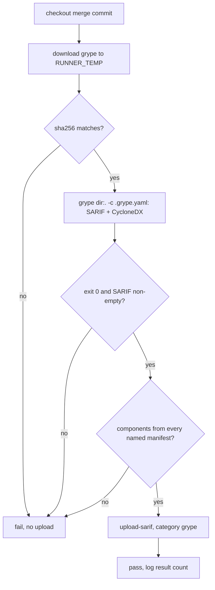

## Goal Capsule

- **Objective:** every pull request and every push to `main` scan the whole repository's dependencies with a pinned Grype and publish vulnerable dependencies and malicious packages to code scanning under category `grype`, starting from a tree with no open finding.
- **Parent:** #379, part 1 of 3. Read it only for a question this part does not answer.
- **Open blockers:** none. The repository has been public since 2026-10-08, which makes code scanning, SARIF uploads and dependency review free.
- **Authority:** the Product Contract wins on behaviour, the KTDs on mechanism. A unit overrides neither.
- **Stop conditions:** stop and report if any of these happens:
  - code scanning rejects the `grype` upload from a `pull_request` run;
  - Grype does not match a known Go or npm malware advisory (U2's malware check), which would invalidate KTD1.

## Product Contract

### Summary

Adds the `grype` job to `.github/workflows/security.yml`: a pinned, checksummed Grype binary scans the whole checkout, fails only on a tool error or an empty scan, and uploads its SARIF to code scanning. The acceptance module's `golang.org/x/sys` moves to a fixed version, and `.grype.yaml` ignores today's npm findings by id and package.

### Context

Codacy's Trivy covers vulnerable dependencies and malicious packages today, on Codacy's server only. This part moves that row of R4 into CI.

It builds R4's "Vulnerable dependencies and malicious packages" row, and R5, R7, R8 and R17 for the `grype` job. Part 2 adds the `dependency-review` job, which completes R4's last row and these requirements. In the verbatim text below, "part 1", "part 6", "part 7" and "part 8" name #272's parts (#391, #383, #384, #385), not the parts of this split.

### Key Decisions

- **GitHub code scanning is the only dashboard, and Codacy leaves.** Governs R1, R5, R6. (session-settled: user-approved — chosen over keeping Codacy, which is now free, as the hosted gate, and over adding SonarQube Cloud as a trend dashboard: everything stays in the repository, configuration changes take effect in the pull request that makes them, and no check needs a token)
- **Only what is free.** Governs R17. (session-settled: user-directed — chosen over paid GitHub Secret Protection, Code Security and Copilot features, Codacy's Team plan and SonarQube's paid plans)
- **Each area Codacy owned gets exactly one owner.** The single exception is SAST, where CodeQL and Opengrep apply different rule sets. Governs R4.

### Scope Boundaries

- This part delivers the `grype` job and clears today's findings. Part 2 delivers the `dependency-review` job, and part 3 documents both jobs in `AGENTS.md` and the README; this part leaves both files as they are.
- Blocking the merge on a disallowed license or a new alert (R6, AE4) and the required checks (R9) are #384's (part 7 of #272). The daily scan of `main` is #383's (part 6 of #272).
- govulncheck keeps running in the `go` job (R11), whatever planning decides about publishing it.
- From the plan: no SonarQube Cloud or other hosted dashboard; no GitHub paid feature; no new check runs locally.

### Dependencies / Assumptions

- The repository is public before R4–R6 take effect. Code scanning, dependency review, secret scanning and push protection are free only for public repositories. This holds: the repository has been public since 2026-10-08.
- Code scanning accepts results from a fork's pull request without a repository secret (unverified).

### Success Criteria

- crew pays nothing for code quality or security tools.

### Outstanding Questions

The four questions deferred to planning are resolved here:

- Trivy or Grype: Grype (KTD1).
- Severity levels in code scanning: KTD5.
- govulncheck: it stays in the `go` job's log (KTD9).

### Sources / Research

Split from #379.

- `.github/workflows/ci.yml`, `.codacy/codacy.config.json` (Trivy).
- `charmbracelet/crush`'s `.github/workflows/security.yml`: a public Go CLI that runs Grype, govulncheck as SARIF and dependency review with a license allowlist, on pull requests and every day.

## Planning Contract

### Key Technical Decisions

- KTD1. **Grype, not Trivy.** Only Grype detects malicious packages. Its database imports the GitHub advisories classified as malware, and since July–August 2026 GitHub imports the OpenSSF malicious-packages reports into those advisories for Go and npm, among others. On 2026-10-09, Grype v0.120.1 matched a known-malicious Go module in a `go.mod` (GHSA-652v-q229-xvr4, `gogets.dev/btreex`) and a known-malicious npm package in a pnpm v9 lock file (GHSA-5xvp-j6m9-rwr6, `ddok-modal@1.0.0`). Trivy v0.75.0 found nothing on the same files: trivy-db reads only GitHub's reviewed advisories and the Go vulnerability database. Codacy's `Trivy_malicious_packages` pattern is Codacy's own code, which matches Trivy's package list against an index of `ossf/malicious-packages`. Plain Trivy does not have it. Grype also reads the Go vulnerability database (since v0.114.0) and includes pnpm development dependencies by default, which crew's npm dependencies all are. Trivy's March 2026 compromise (GHSA-69fq-xp46-6x23: force-pushed `trivy-action` and `setup-trivy` tags, a malicious v0.69.4 release) weighs against it too, though SHA pins were safe.
- KTD2. **The jobs live in `.github/workflows/security.yml`, with the shape #391 (KTD1, KTD3, KTD4 of its plan) gives that file.** The file runs on `pull_request` and on `push` to `main`, with no `paths` filter and no `workflow_dispatch`. It sets `permissions: {}`, and each job grants itself only what it needs. Every checkout uses the default merge commit and `persist-credentials: false`. If #391 is on `main` when this part starts, add the two jobs to its file. Otherwise create the file with that header, triggers and permissions, and whichever of the two pull requests merges second rebases onto the other. Concurrency is set per job. Each group carries the job's id written out, for example `${{ github.workflow }}-grype-${{ github.event_name == 'push' && github.sha || github.ref }}`, with `cancel-in-progress` only for pull requests. `github.job` cannot stand in for it: GitHub sets it only inside a job's steps, so in `concurrency` it is null. A group without the job's id would make the file's jobs cancel each other. #391's plan copies `ci.yml`'s group unchanged, and its CodeQL matrix also needs `matrix.language` in its group. Whichever plan lands second aligns the other's jobs on this form.
- KTD3. **Grype runs as a pinned release binary, not through `anchore/scan-action`.** The job downloads `grype_<version>_linux_amd64.tar.gz` into `$RUNNER_TEMP` with `curl -fsSL`, checks it against a sha256 written in the workflow with `sha256sum --check --strict`, and extracts it there. This is the codacy job's pattern in `ci.yml`. `scan-action` fails the same way on findings and on errors, and its SARIF output is set before it checks grype's exit code, so the job could not tell the two apart (KTD4). Dependabot does not bump a version in a `run:` step, so a comment beside it says the bump is manual, as for `REPORTER_VERSION`. Pins as of 2026-10-09, re-checked at implementation:

  | Item | Version | Commit SHA | Asset sha256 |
  | --- | --- | --- | --- |
  | grype | v0.120.1 | `6f8d854af29d3a3086b11a84afa51554a2a245fe` | `grype_0.120.1_linux_amd64.tar.gz`: `0a9ee97ef5ae2ee953b0a80098105052e846cdbe319a57d808b519c33cd1343d` |
  | `github/codeql-action` (`upload-sarif`) | v4.38.3 | `24c54180a607b1449ed407dd24f251e4e9147c8d` | |
  | `actions/dependency-review-action` | v5.0.0 | `a1d282b36b6f3519aa1f3fc636f609c47dddb294` | |

- KTD4. **The `grype` job fails on a tool error or an empty scan, and never on findings.** Grype runs `dir:.` over the checkout with `-c .grype.yaml`, without `--fail-on` and without `--only-fixed`, so it exits 0 on a clean scan and on a scan with findings, and non-zero only on an error. `--only-fixed` would hide every malware match, since malware has no fixed version. The job writes two outputs in that one run, the SARIF and a CycloneDX JSON, both to `$RUNNER_TEMP`, so the scan never catalogues them. It sets `GRYPE_DB_REQUIRE_UPDATE_CHECK=true`, so a failed database check is an error, and `GRYPE_CHECK_FOR_APP_UPDATE=false`. The job then classifies the run:
  - **error:** a non-zero exit, a missing or empty SARIF, or a database older than grype's maximum age. The job fails and uploads nothing, because a partial SARIF would mark every alert it leaves out as fixed.
  - **empty scan:** the CycloneDX output lists no component from one of the manifests the job names in one place, `go.mod`, `acceptance/go.mod` and `pnpm-lock.yaml`. The job fails and uploads nothing. This is the job's proof that it looked at something (`docs/solutions/logic-errors/diffcover-passes-silently-on-mnemonic-diff-prefixes.md`).
  - **complete:** the job uploads the SARIF with category `grype` and passes, findings or not. It writes the number of results to its log.

  Findings do not fail the job, because a vulnerability can be published at any time against a dependency nobody touched. A job failing on every result in the tree would then turn every pull request red, docs-only ones included, until someone fixed it. Code scanning compares a pull request's analysis with the base branch's, so it reports only the alerts the pull request adds, and part 7's rule blocks those (R6). A pull request that adds a vulnerable dependency still fails now, through dependency review (KTD7).
- KTD5. **Grype's SARIF goes to code scanning as Grype writes it.** Each rule carries `security-severity` (9.0 for critical) and each result a `level`, so every result is a security alert. Malware advisories show as critical. The job does not rewrite levels or scores. A result with unknown severity may carry a `security-severity` of 0.0. Part 7 needs its code scanning rule to block such a result, with both thresholds at "all". Grype's location URIs start with a slash (`/pnpm-lock.yaml`). The first upload shows whether code scanning anchors them to the file. If it does not, the job strips the slash before the upload. Results sit on line 1 of the manifest, so they appear in the check's summary, not as annotations on the diff.
- KTD6. **Today's findings are cleared in this pull request, the Go one by a fix and the npm ones by ignore rules that name the finding.** On 2026-10-09 grype reports 15 matches:
  - GO-2026-5024 for `golang.org/x/sys v0.41.0` in `acceptance/go.mod`, fixed in v0.44.0. The acceptance module moves to the version the root module uses (v0.48.0).
  - 14 in `pnpm-lock.yaml`, all in the Codacy CLIs' development tree. Three have no fix (braces, http-cache-semantics, sprintf-js). #385 (part 8) deletes that lock file.

  Each npm finding gets one rule in `.grype.yaml`, by vulnerability id and package name, with a `reason` naming the dependency path and #385. #385 deletes the rules with the lock file. An ignore rule has to name both the vulnerability id and the package. Rules by `fix-state`, a whole location, `exclude` and `only-fixed` are not used, because each would also drop malware matches, which have no fixed version. This keeps the repository's "zero findings" bar on the day the check arrives, and gives part 7 a `main` with no open `grype` alert.
- KTD8. **The names are contracts.** The jobs are `grype` and `dependency-review`, and their SARIF categories are `grype` and `dependency-review`. Part 7 requires the jobs by name, and part 6's daily scan uploads under category `grype` with the same scan settings. A renamed category leaves its old alerts open on `main`, and a renamed job leaves a required check pending forever. A comment in the workflow says so.
- KTD9. **govulncheck stays in the `go` job's log and is not published.** Grype reads the Go vulnerability database (KTD1), so the same advisories reach code scanning. With `-format sarif`, govulncheck always exits 0, so publishing it would take a second run. It would also open a second alert for each advisory grype already reports. The `go` job keeps its govulncheck step unchanged (R11). Part 6 can revisit this with the same reasoning.
- KTD10. **Codacy's Trivy stays as it is until part 8.** Its patterns stay in `.codacy/codacy.config.json`, and Codacy keeps running beside the new checks, as #391's plan also assumes. Removing them here would change Codacy's server analysis only after this pull request merges, and part 8 removes Codacy whole.
- KTD11. **The suppression forms:**
  - Grype: a rule in `.grype.yaml` by vulnerability id and package, with a `reason` (KTD6).
  - Dependency review: a package exempted through `allow-dependencies-licenses` (a purl), or an advisory through `allow-ghsas`, each with a comment giving the reason.

  A match on a malware advisory is never suppressed, neither in `.grype.yaml` nor through `allow-ghsas`. The package is removed instead. `.grype.yaml` holds only ignore rules. A `fail-on-severity` there would make grype exit non-zero on findings, which the job reads as an error (KTD4). That fails loudly and is not a silent pass.

### High-Level Technical Design

| Job | Runs on | Permissions | Fails on | Publishes |
| --- | --- | --- | --- | --- |
| `grype` | PR, push to `main` | `contents: read`, `security-events: write` | tool error, empty scan | SARIF, category `grype` |

### Assumptions

- Ignoring the 14 npm findings until #385 is acceptable: they sit in development-only tooling that crew's binary never contains. The alternative was overriding transitive versions through pnpm, which leaves three findings with no fix and changes tooling #385 deletes.
- Code scanning accepts uploads from fork and Dependabot pull requests, whose tokens are read-only, as GitHub's documentation and its 2023 change state. Nobody has tested it here. #391 carries the same assumption.

### Deferred to Implementation

- Whether Grype's CycloneDX output records each component's manifest path. If it does not, the job generates the SBOM once with syft at the version grype vendors and scans it with `grype sbom:`. KTD4's proof holds either way.
- The 14 npm finding ids and package names, read from the job's first run.
- Whether code scanning anchors `/pnpm-lock.yaml`-style URIs (KTD5).
- The `.grype.yaml` ignore rule's `reason` field. If grype v0.120.1 rejects it, the reason goes in a YAML comment above the rule.

### Sequencing

U1 first, so the job's first run on the pull request is clean, then U2. U1's ignore rules take their ids from U2's first run, so both land in one pull request.

### Handoffs

- **#383 (part 6):** the daily scan uploads under category `grype` with KTD4's scan settings. Until then, `main`'s analysis is refreshed only by pushes. A pull request scanned with a newer database can show an alert, from an advisory published after `main`'s last push, as new in that pull request.
- **#385 (part 8):** delete the npm ignore rules from `.grype.yaml` and `pnpm-lock.yaml` from the job's manifest list, together with the lock file.

## Implementation Units

### U1. Clear today's dependency findings

**Goal:** the tree has no Grype finding left open: the acceptance module's `golang.org/x/sys` is fixed and each npm finding carries an ignore rule that names it.

**Requirements:** R4 (vulnerable dependencies row). KTD6, KTD11.

**Dependencies:** none.

**Files:**
- `acceptance/go.mod`, `acceptance/go.sum`
- `.grype.yaml` (new)

**Approach:**
1. Move `golang.org/x/sys` in `acceptance/` to v0.48.0, the root module's version, and tidy the module.
2. Write `.grype.yaml` with a header comment: the file holds only ignore rules, each by vulnerability id and package name with a reason, never by fix state, location, `exclude` or `only-fixed`, and never for a malware advisory (KTD6, KTD11).
3. Add one rule per npm finding from U2's first run, each with the reason "development dependency of the Codacy CLIs; #385 removes pnpm-lock.yaml".

**Patterns to follow:** `.github/dependabot.yml`'s comment style for the reason a rule exists.

**Test scenarios:**
- Test expectation: no Go code changes. The proof is U2's run.
- After U1, grype on the pull request's merge commit reports zero results.
- `go -C acceptance vet ./...` and the acceptance module's build still pass with the new `golang.org/x/sys`.

**Verification:** U2's job on the pull request uploads an analysis with zero results, and `.grype.yaml` has one rule per npm finding and none for a Go module.

### U2. The `grype` job

**Goal:** every pull request and every push to `main` scan the whole repository's dependencies with a pinned Grype and publish the results to code scanning under category `grype`.

**Requirements:** R4 (vulnerable dependencies and malicious packages row), R5, R7, R8, R17. KTD1, KTD2, KTD3, KTD4, KTD5, KTD8.

**Dependencies:** none. U1 makes its first run clean.

**Files:**
- `.github/workflows/security.yml` (new, or modified if #391 is on `main`)

**Approach:**
1. If the file does not exist, write its header comment, triggers and `permissions: {}` as KTD2 describes, in `ci.yml`'s style: what runs on which event, that no job holds a secret, and why there is no path filter.
2. Add the job `grype` with `name: grype`, the per-job concurrency of KTD2, `timeout-minutes: 15` (the database is about 188 MB) and the permissions of the table above.
3. Download, check and extract grype in `$RUNNER_TEMP` (KTD3). Pin `upload-sarif` by SHA with its version comment.
4. Run the scan and classify its outcome (KTD4). The manifest list is a single job-level `env` value, so #385 edits one line.
5. Upload with category `grype` only on a complete scan, and log the result count.
6. Add the comment that names the job and category as contracts (KTD8) and the one that says grype's version is bumped by hand (KTD3).

**Patterns to follow:** `.github/workflows/ci.yml`'s codacy job for the checksummed download into `$RUNNER_TEMP`, SHA pins with `# vX.Y.Z`, `persist-credentials: false`, and `env:` instead of `${{ }}` inside `run:`.

**Test scenarios:**
- The pull request's own run: `grype` is green, and code scanning has a `grype` analysis on the merge ref with zero open alerts.
- Covers R8. On a throwaway branch, a commit that removes one of U1's ignore rules reopens that alert in the same run.
- Malware check. On a throwaway branch, `go.mod` requires `gogets.dev/btreex` and `pnpm-lock.yaml` lists `ddok-modal@1.0.0`. The run uploads a critical alert for each, GHSA-652v-q229-xvr4 and GHSA-5xvp-j6m9-rwr6 or their successors, and the job stays green (KTD4). Both entries are written into the files by hand. Nothing installs, downloads, imports or builds them: no `pnpm add` or `pnpm install`, no `go get`, no import. The branch is deleted after the run.
- On a throwaway branch, a wrong sha256 fails the job before the scan, and no analysis is uploaded.
- On a throwaway branch, an `exclude` of `./acceptance/**` in `.grype.yaml` fails the job as an empty scan, and no analysis is uploaded. The log shows grype exited 0 and the manifest check named `acceptance/go.mod`. syft rejects a pattern without a `./`, `*/` or `**/` prefix, which would test the error branch instead.
- After the first push to `main`, a later pull request's `grype` analysis compares against a base analysis and does not report a missing one.
- The uploaded alerts anchor to `go.mod`, `acceptance/go.mod` or `pnpm-lock.yaml`, not to an unlinked path (KTD5).

**Verification:** actionlint passes on the workflow. The `grype` job is green on the pull request with zero open `grype` alerts, and each throwaway scenario above produced its stated outcome without reaching `main`.

## Verification Contract

| Gate | Command or place | Applies to |
| --- | --- | --- |
| Workflow syntax | the shared `actionlint / actionlint` job on the pull request | U2 |
| Acceptance module | `go -C acceptance vet ./...` and `go -C acceptance build ./...` | U1 |
| Root module unchanged | the `go` job, including govulncheck, still passes unchanged | all |
| Each job's own run | `security.yml` on the implementing pull request: `grype` green, a `grype` analysis on the merge ref, zero open alerts | U1, U2 |
| Gate proofs | each throwaway scenario in U2, on branches that never merge | U2 |

## Definition of Done

- The job names and the category match KTD8.
- `.grype.yaml` holds only rules by vulnerability id and package, each with its reason.
- `ci.yml`, the Codacy jobs and `.codacy/codacy.config.json` are unchanged. The `checks` ruleset is unchanged.
- No abandoned attempt remains in the diff: no unused config file, no planted finding, no throwaway workflow change.

## Scope Boundaries (planning)

### Deferred to Follow-Up Work

- Requiring the checks and setting the code scanning rule: #384 (part 7), with the names of KTD8 and the thresholds of KTD5.
- The daily scan of `main`: #383 (part 6), reusing category `grype`.
- Removing pnpm, its ignore rules and Codacy: #385 (part 8).

### Considered and not built

- A workflow step that rejects anything in `.grype.yaml` beyond ignore rules by vulnerability id and package: rules by fix state or location, `only-fixed`, `exclude`, or another database through `db.update-url`. Each is visible in the pull request's diff, and AGENTS.md states the allowed form. The same holds for a pull request that edits `security.yml` itself, which no step inside the workflow could stop. Build it if such a change ever merges unnoticed.
- Required approval from security code owners for changes to `security.yml` and `.grype.yaml`. Branch rules are part 7's and the boss's.
- A retry of grype's database download. A failed download fails the job visibly, and a re-run fixes it. Build it if transient failures become frequent.
- A cache of grype's database between runs. It would save one download of about 188 MB per run. That cost does not yet justify a cache key and a staleness rule.
- Failing `grype` on findings in the whole tree. KTD4 gives the reason.

<!-- cw-split-ce-plan: part of #379 -->

<!-- publish-split: part 1 of #379 -->

