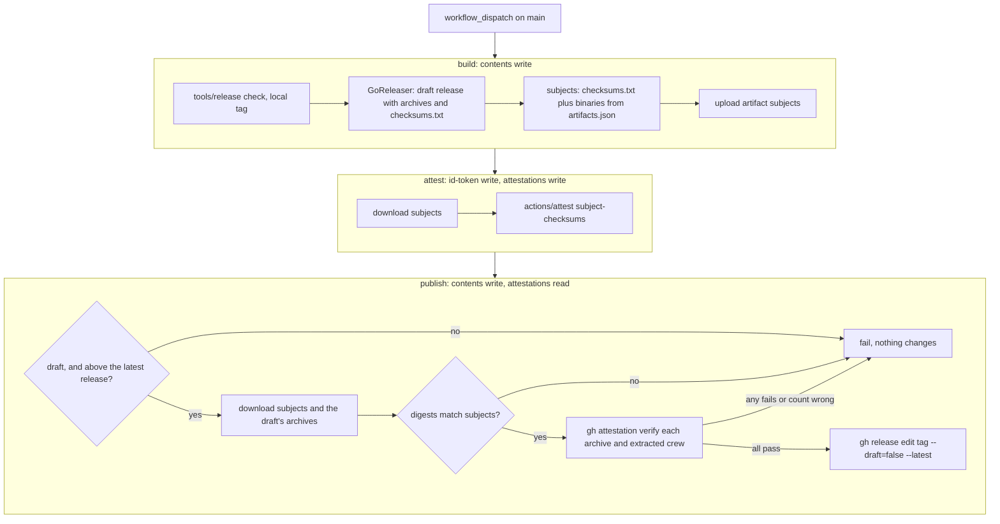

# Attest the build provenance of every release binary - Plan

## Goal Capsule

- **Objective:** Every binary in a crew release carries a signed build-provenance attestation.
- **Means:** the Release workflow builds the release as a draft, attests the archives and the binaries inside them with `actions/attest`, checks each one with `gh attestation verify`, and only then publishes the draft (KTD1, KTD3).
- **Parent:** #272, part 5 of 8. Read it only for a question this part does not answer.
- **Open blockers:** none. The issue's blocker was that the repository had to be public. It has been public since 2026-10-08 (`gh repo view --json visibility` answers `PUBLIC`), so artifact attestations are available and free.
- **Authority:** the Product Contract wins on behaviour, the KTDs on mechanism. A unit overrides neither.
- **Stop conditions:** stop and report if any of these happens:
  - `actions/attest` at the pinned version refuses a `subject-checksums` file whose names contain a `/` (KTD2), and no flat naming is accepted either;
  - `gh` cannot find or publish a draft release by its tag (KTD3);
  - a release run's `gh attestation verify` fails with the README's flags against an attestation the `attest` job made (KTD5), which would make the README's command wrong.
- **Who finishes:** the implementer ships U1 and U2 in one pull request. The boss proves it with the next release they start: a pull request cannot run the Release workflow, because `tools/release check` refuses every ref except `main`.

---

## Product Contract

Product Contract preservation: restructured, no scope change. `### Context` became `### Problem Frame`, and one line notes that R14 and R15, which a Key Decision governs, belong to #272's other parts.

### Summary

The release workflow attests each binary it publishes with GitHub's artifact attestations.

### Problem Frame

Attestations let a user check that a crew binary was built by crew's own release workflow, and they are free on a public repository.

### Key Decisions

- **Only what is free.** Governs R17. (session-settled: user-directed — chosen over paid GitHub Secret Protection, Code Security and Copilot features, Codacy's Team plan and SonarQube's paid plans)
- **Every GitHub security feature that is free for a public repository is turned on.** Governs R14, R15, R16. (session-settled: user-directed — the boss asked for GitHub's whole free toolset)

### Requirements

**GitHub's free security features**

- R16. Every binary in a release carries a signed build-provenance attestation, made with GitHub's artifact attestations.
- R17. Nothing added requires a paid plan.

R14 and R15 belong to #272's other parts.

### Success Criteria

- crew pays nothing for code quality or security tools.

### Scope Boundaries

- `SECURITY.md` and the security settings are part 4's.
- From the plan: #318's protected environment for releases is out of scope.

### Dependencies / Assumptions

- The repository is public before R16 takes effect. Artifact attestations are available only to public repositories. Met on 2026-10-08.

### Sources / Research

Split from #272.

<!-- cw-split-brainstorm: part of #272 -->

<!-- publish-split: part 5 of #272 -->

---

## Planning Contract

### Key Technical Decisions

- KTD1. **Attest the four archives and the four `crew` binaries inside them, in one attestation.** `dist/checksums.txt` lists only the archives, because GoReleaser checksums only the artifacts it uploads, and a binary packed into a tar.gz is not one. A user who runs `gh attestation verify` on the `crew` they installed would then find nothing. The binary GoReleaser leaves in `dist/<build>/crew` is byte for byte the one in the archive, so its digest is the installed binary's. The `build` job writes a subjects file: the lines of `dist/checksums.txt`, then one `sha256sum` line per artifact of type `Binary` in `dist/artifacts.json`, named by its path relative to `dist/`. The step fails unless it lists at least one archive and exactly as many binaries as archives. It reads the paths from `artifacts.json`, which never depends on GoReleaser's folder suffixes (`_v1`, `_v8.0`).
- KTD2. **`actions/attest`, pinned by SHA, with `subject-checksums`.** As of 2026-10-09 the latest version is v4.2.2 (`1e69f48acb82d1966a394da916b4c1698aa569d6`); re-check the latest at implementation. `actions/attest-build-provenance` is now only a wrapper around the same commit, and its README sends new workflows to `actions/attest`. With no predicate or SBOM input, `actions/attest` makes SLSA build provenance (`https://slsa.dev/provenance/v1`), signed through Sigstore's public-good instance on a public repository. One call makes one attestation for every subject in the file (the limit is 1024). The job needs `id-token: write` and `attestations: write`. It does not need `artifact-metadata: write`, which only the registry path uses. Dependabot's `github-actions` entry bumps the pin.
- KTD3. **The release goes public only after it is attested.** `.goreleaser.yaml` gains `release.draft: true`, so GoReleaser leaves the release as a draft with its assets uploaded. The tag stays local, as today, and GitHub creates it when the draft is published. The last job publishes the draft with `gh release edit <tag> --draft=false --latest`. The workflow's existing promise then still holds: nothing is published unless every asset built and was attested. A failed run leaves a draft. Running the release again, or re-running the failed jobs, finishes it, because `tools/release check` already passes over a draft (`TestCheckPassesOverADraft`) and GoReleaser's `use_existing_draft` and `replace_existing_artifacts` already reuse it. `--latest` is safe because `publish` checks again, before it publishes, that the version is above the latest published release (KTD5).
  - Rejected: attesting after GoReleaser publishes, which is GoReleaser's documented pattern and its own. A failed attest would leave a public release with no provenance. A new run would then be refused, since the release is published, so nothing in the workflow could repair it.
  - Rejected: building with publishing skipped and publishing in a second GoReleaser run. GoReleaser OSS cannot publish a build it did not make in the same run, and a second build's digests would differ from the attested ones.
- KTD4. **Three jobs. Only `attest` can mint an OIDC token, and it runs no repository code.** Workflow-level `permissions` becomes `{}`, as in `security.yml`, and each job gets its own scopes, each with a comment saying why:

  | Job | Needs | Permissions | Does |
  | --- | --- | --- | --- |
  | `build` (today's `publish`, renamed) | none | `contents: write` | today's steps, GoReleaser leaving a draft, the subjects file (KTD1), uploaded as the `subjects` workflow artifact |
  | `attest` | `build` | `id-token: write`, `attestations: write` | downloads `subjects`, runs `actions/attest` (KTD2); no checkout |
  | `publish` | `build`, `attest` | `contents: write`, `attestations: read` | the verify gate (KTD5), then publishes the draft (KTD3); no checkout |

  In one job, GoReleaser, `go build` and every module the build downloads could mint Sigstore certificates under `release.yml`'s identity. `build` passes its tag to `publish` as a job output. The `subjects` upload sets `overwrite: true`, so a re-run of `build` replaces it. Every job keeps a `timeout-minutes`. `publish` keeps its name because it is still the job that makes the release public, which is the job #318's environment gate will protect.
- KTD5. **`publish` verifies this run's bytes before publishing, with the README's command.** The step sets `GH_TOKEN` and `GH_REPO`, since it has no checkout, and fails before any change unless every check below passes:
  1. The release for the tag exists and is still a draft, and its version is above the latest published release's, if there is one. CI's `version` check only gates `build`, and "re-run failed jobs" on an old run skips `build`. Without this check, a stale re-run of an old run's `publish` would mark an old version Latest: after its own release was published, or after a newer release shipped while its draft was left behind.
  2. It downloads the `subjects` artifact and the draft's archives, and each archive's sha256 matches its line in `subjects`. That ties the bytes to this run's attestation.
  3. For each archive, `gh attestation verify` passes on the archive and on the `crew` extracted from it. It counts these checks and fails unless the count is twice the number of archives in `subjects` and above zero. A glob that matches nothing can therefore never pass.

  The flags are `--repo "$GITHUB_REPOSITORY" --signer-workflow "$GITHUB_REPOSITORY/.github/workflows/release.yml" --source-ref refs/heads/main`. The attestation records the ref the run was dispatched on, `refs/heads/main`, never the `vX.Y.Z` tag, so `--source-ref refs/tags/...` would fail. These checks are the only automated proof of R16, because no pull request can run the Release workflow.
- KTD6. **The inline scripts are tested the way `tools/securityworkflow` tests `security.yml`.** A new test package, `tools/releaseworkflow`, reads `release.yml` with `go.yaml.in/yaml/v3` and runs the subjects step and the publish step as the workflow holds them. It runs them with `bash` against a fake `dist/` and a stub `gh` on `PATH`, so a test exercises the script that actually ships.
- KTD7. **The README tells users how to check provenance, as an optional step.** The Quick start's install command does not change: it already checks `checksums.txt` and must keep working without `gh attestation`. A short paragraph after it gives the `gh attestation verify` command for a downloaded archive and for the installed `crew`, with the flags from KTD5 and the literal repository. It says that releases up to v0.1.1, and crew built by `go install` or in a checkout, have no attestation, and that `gh` reports none for them. `crew upgrade` does not change (see Scope Boundaries (planning)).

### High-Level Technical Design

A failure at any box leaves the release a draft, or leaves no release at all. A user only ever sees the previous release, through the README's install command and `crew upgrade`, until P5 runs.

### Assumptions

These are bets made without a user to confirm them:

- "Every binary in a release" covers the `crew` executables inside the archives as well as the archives (KTD1). The archives alone would satisfy a narrower reading, but they would leave an installed `crew` unverifiable.
- The README documents verification. AGENTS.md's "Keep it true" rule asks for it, and #381's `SECURITY.md` names no attestation (#381's plan defers that to this part).
- The first release this change affects is the one after v0.1.1, the latest on 2026-10-09. If another release ships before this merges, the README names that release instead.
- `gh release view`, `download` and `edit` find a draft by its tag. If one of them does not, the step uses the release's id, from the GitHub API's release list (Deferred to Implementation).

### Deferred to Implementation

- The exact `actions/attest`, `upload-artifact` and `download-artifact` pins: the attest pin from KTD2, re-checked, and the artifact actions at the pins `ci.yml` and `security.yml` already use.
- Whether `actions/attest` accepts subject names with a `/`. If it does not, name each binary `<build folder>-crew`; `gh` matches by digest, never by name. Settle this, and the draft-by-tag lookup in Assumptions, before merge: read the checksum parser of `actions/attest` at the pinned SHA, and `gh`'s release lookup or a trial on a scratch repository. Neither should be left for the first release to discover.
- Whether the publish job's token needs `attestations: read` for `gh attestation verify` on a public repository. Keep the scope either way: it costs nothing and the job reads attestations.
- The exact wording of the workflow's header comment, `.goreleaser.yaml`'s release comment and `tools/release`'s package comment: a draft is now the normal state between `build` and `publish`, not only what a failed upload leaves.

### Sequencing

U1, then U2, in one pull request, so the docs never describe a workflow `main` does not run.

---

## Implementation Units

### U1. The Release workflow attests a draft and publishes it once verified

- **Goal:** a release run leaves a draft, attests its archives and binaries, verifies them, and only then publishes the draft.
- **Requirements:** R16, R17; KTD1, KTD2, KTD3, KTD4, KTD5, KTD6.
- **Dependencies:** none.
- **Files:**
  - `.github/workflows/release.yml`
  - `.goreleaser.yaml`
  - `tools/release/main.go` (package comment only)
  - `tools/releaseworkflow/releaseworkflow_test.go` (new)
- **Approach:**
  1. `.goreleaser.yaml`: add `draft: true` under `release:`, with a comment that the Release workflow publishes the draft after attesting it.
  2. `release.yml`: set workflow-level `permissions: {}`. Rename the job to `build`, give it the `tag` output, and add the subjects step (KTD1) and the `subjects` upload after GoReleaser.
  3. Add the `attest` job (KTD2, KTD4) and the `publish` job (KTD5, KTD3), with values passed through `env:`, never `${{ }}` inside `run:`.
  4. Rewrite the header comment: the draft, the attestation, the publish gate, and how a failed run is finished (re-run the failed jobs, or start the release again).
  5. Update `tools/release`'s package comment: a draft is the normal state between the jobs, and also what a failed run leaves.
- **Patterns to follow:** `security.yml` for `permissions: {}`, per-job scopes with a reason and SHA pins with a version comment. `tools/securityworkflow/dependencyreview_test.go` for running a workflow's inline script from the parsed YAML. `release.yml` for `persist-credentials: false` and values passed through `env:`.
- **Test scenarios:** in `tools/releaseworkflow/releaseworkflow_test.go`, each running the step's script as `release.yml` holds it:
  - The subjects step, with a `dist/` holding four archives, their `checksums.txt` and an `artifacts.json` listing four `Binary` paths, writes eight lines: the four checksum lines unchanged, then one line per binary whose digest matches the file and whose name is its path relative to `dist/`.
  - The subjects step fails when `artifacts.json` lists no `Binary`.
  - The subjects step fails when it lists three binaries for four archives.
  - The subjects step fails when `dist/checksums.txt` is missing.
  - The publish step, with a stub `gh` that reports a draft, serves archives matching `subjects` and verifies everything, calls `gh attestation verify` eight times with KTD5's flags, once per archive and once per extracted `crew`, and calls `gh release edit <tag> --draft=false --latest` last.
  - The publish step fails without calling `verify` or `edit` when the release is not a draft.
  - The publish step fails without calling `verify` or `edit` when a newer release than its tag is already published, such as a draft of `v0.1.2` after `v0.1.3` shipped.
  - The publish step fails without calling `edit` when a downloaded archive's digest differs from its line in `subjects`.
  - The publish step fails without calling `edit` when `gh attestation verify` fails for one extracted `crew`.
  - The publish step fails without calling `edit` when the download yields no archive.
  - The workflow grants `id-token: write` to `attest` alone, sets workflow-level permissions to `{}`, and orders the jobs `build`, then `attest`, then `publish` through `needs`.
- **Verification:** the tests pass. actionlint passes on the workflow. Run the subjects step's script by hand against the `dist/` of a local `goreleaser release --snapshot --clean` at v2.18.2: it lists the four archives and four binaries, and each binary's digest matches the `crew` inside its archive.

### U2. The docs describe provenance and how to check it

- **Goal:** users can check a release's provenance, and the docs describe the Release workflow as it now runs.
- **Requirements:** R16; KTD5, KTD7.
- **Dependencies:** U1.
- **Files:**
  - `README.md`
  - `AGENTS.md`
- **Approach:**
  1. `README.md`, after the Quick start's install block: a paragraph with the `gh attestation verify` command for an archive and for the installed `crew` (KTD7). It names the first release the change affects (see Assumptions), says older releases and `go install` or local builds have none, and that `gh` must be logged in.
  2. `README.md`, the `.github/workflows/release.yml` row of the file table: the release is built as a draft, attested, verified and then published. Also the `.goreleaser.yaml` row if it names publishing.
  3. `AGENTS.md`, the **Releases** bullet: GoReleaser builds a draft, the workflow attests the archives and their binaries and publishes the draft only once every one verifies. Name the three jobs.
- **Patterns to follow:** the README's existing Quick start and `crew upgrade` prose: plain sentences, the command in a `sh` block, and no repository-admin setup (users and contributors are its audience).
- **Test scenarios:** Test expectation: none -- documentation only. `TestTheRepositoryChangelogHasTheFirstVersion` does not read these files.
- **Verification:** the README's command, with `crew_linux_amd64.tar.gz`, is exactly the command KTD5 runs, with the literal repository in place of `$GITHUB_REPOSITORY`. Every sentence about the Release workflow in `README.md` and `AGENTS.md` matches `release.yml`.

---

## Verification Contract

| Gate | Command or place | Applies to |
| --- | --- | --- |
| Workflow script tests | `go test -race ./tools/releaseworkflow` | U1 |
| All tests | `go test -race ./...` | U1 |
| Format, vet, lint | `gofmt -l cmd internal tools acceptance`, `go vet ./...`, golangci-lint v2.14.0 through `go run` | U1 |
| Workflow lint | the `actionlint / actionlint` check on the pull request | U1 |
| Snapshot dry run | `go run github.com/goreleaser/goreleaser/v2@v2.18.2 release --snapshot --clean`, then the subjects script on its `dist/` | U1 |
| Coverage floors | `.testcoverage.yml` total and `tools/diffcover` on changed lines; the new package is test-only | U1 |
| Docs | read-through against `release.yml` | U2 |
| Release proof | the boss's next release: `attest` and `publish` pass, the release is published, and `gh attestation verify` from the README passes on a downloaded archive and an installed `crew` | U1, U2, after merge |

---

## Definition of Done

- A release run publishes nothing until `publish` has verified every archive and every extracted binary of this run.
- Every failure path in U1's test scenarios leaves the release a draft, or creates no release, and the tests prove it.
- Only `attest` holds `id-token: write`, and no step that runs repository code holds it.
- The README and AGENTS.md describe the workflow as it runs, and the README's verify command is the one the workflow runs.
- No abandoned attempt remains in the diff.

---

## Scope Boundaries (planning)

### Deferred to Follow-Up Work

- `crew upgrade` verifying a release's attestation before it replaces crew. It checks `checksums.txt` today (`internal/upgrade/install.go`). Verifying provenance there needs Sigstore verification, through `sigstore-go`, which `internal/upgrade`'s standard-library-only rule forbids, or a call to `gh attestation verify`, and a fake for the acceptance suite. That is a new feature with its own trust policy.
- The Quick start's install command verifying provenance. It would make `gh attestation` a requirement of every install.
- #318's protected environment on the `publish` job, and #381's `SECURITY.md` and settings, which may turn on immutable releases. Draft-first publishing (KTD3) is the order immutable releases expect.
- A `CHANGELOG.md` line. The version bump pull request writes the next section.

### Considered and not built

- Turning off `actions/setup-go`'s cache in `build`. zizmor's `cache-poisoning` audit flags caches in release workflows, and #392 brings zizmor. Moving the OIDC token to `attest` (KTD4) stops code in `build` from minting Sigstore certificates of its own. It does not stop a poisoned cache from changing the bytes and the subject list `attest` then signs, since the subjects check runs inside `build`. Keeping the cache is an accepted risk, the same one today's release already carries, for #392 to judge.
- Taking `contents: write` away from the job that runs GoReleaser, so a compromised build step could not publish the draft itself. GoReleaser OSS creates the draft and uploads its assets in the same run that builds them, so this would mean replacing GoReleaser's publishing. A compromised build can already shape what gets attested (see the line above), and today's release carries the same exposure. Revisit if the build moves to a reusable workflow for SLSA Build Level 3.
- Guarding against two drafts with the same tag. The `release` concurrency group runs one release at a time, and `use_existing_draft` reuses the draft. A second draft needs someone to create it by hand.
- Cleaning up drafts a run abandoned, and the attestations of rebuilt drafts' digests. Both are harmless: a draft is invisible to users, KTD5's check 1 stops a left-behind draft from being published over a newer release, and an attestation of bytes nobody downloads matches nothing.
- `--source-digest` in the README's command. `--signer-workflow` and `--source-ref` already tie the attestation to `release.yml` on `main`. The commit differs for each release, so a fixed command could not include it.

