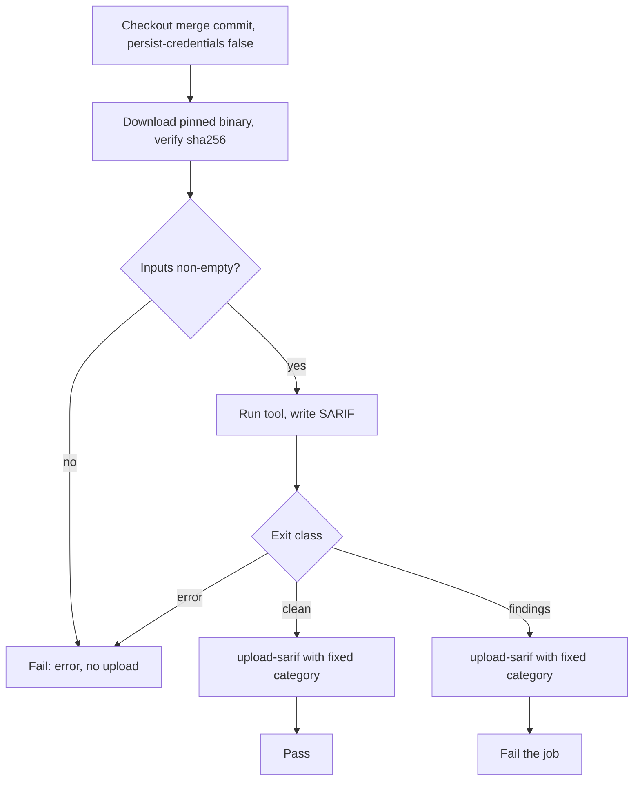

## Goal Capsule

- **Objective:** the `zizmor` job audits every workflow on every pull request and each push to `main`, publishes its findings under `zizmor`, and the repository's workflows reach zero findings.
- **Parent:** #378, part 3 of 6. Read it only for a question this part does not answer.
- **Open blockers:** none. The repository has been public since 2026-10-08, which makes code scanning and SARIF uploads free.
- **Stop conditions:** stop and report if zizmor needs a secret or a paid feature to run on a fork's pull request.

## Builds on

Already on main when this part starts; read the code, not these parts' files.

- Part 2 (U2): `.github/workflows/security.yml` with its triggers, `permissions: {}`, per-job concurrency and the `codeql (go)` and `codeql (actions)` jobs, the code-scanning bullet in `AGENTS.md` and the README's `security.yml` row, which this part extends with its job's line and its tool's suppression form.

## Product Contract

### Summary

Adds the `zizmor` job to `security.yml`, which audits workflow security, and fixes or suppresses its findings in the repository's workflows.

### Context

Workflow security is checked only by Codacy's Checkov today. This part builds R4's workflow security row and some of R5, R7 and R8, which this split's part 6 completes. #378 is itself part 1 of #272: where the text copied from the plan says "part 2" to "part 8", it means #272's parts; this split's parts are named "this split's part k", or "Part k" under Builds on.

### Key Decisions

- **GitHub code scanning is the only dashboard, and Codacy leaves.** Governs R1, R5, R6. (session-settled: user-approved — chosen over keeping Codacy, which is now free, as the hosted gate, and over adding SonarQube Cloud as a trend dashboard: everything stays in the repository, configuration changes take effect in the pull request that makes them, and no check needs a token)
- **gitleaks runs in addition to GitHub's secret scanning.** It catches generic secrets and private keys, which GitHub's free secret scanning likely does not. Governs R4. (session-settled: user-approved — chosen over relying on secret scanning and push protection alone)
- **Each area Codacy owned gets exactly one owner.** The single exception is SAST, where CodeQL and Opengrep apply different rule sets. Governs R4.

### Acceptance Examples

- AE3. **Covers R8.** **Given** a pull request that turns off a zizmor rule with a stated reason, **when** its checks run, **then** that rule is already off in this pull request's own run.

### Scope Boundaries

- The `AGENTS.md` bullet and the README row this split's part 2 wrote stay true for what this part adds: its job, its line, its suppression form, and whether it fails on findings.
- A pull request that cannot merge on a failing check or a new alert (R6) and the required checks (R9) are part 7's. The daily scan of `main` is part 6's. Codacy keeps running beside these checks until part 8 removes it.
- The checks that exist today keep running unchanged (R11).
- From the plan: no SonarQube Cloud or other hosted dashboard; no GitHub paid feature; no new check, CodeQL included, runs locally; making the repository public is the boss's.
- Fixes that belong in the shared `thatsnotmynameio/.github` repository are not made here; their findings are suppressed inline with the reason (KTD11).

### Sources / Research

Split from #378.

- `.github/workflows/ci.yml`, `.codacy/codacy.config.json` (Checkov).
- zizmor configuration and usage docs: SARIF mode exits 0, ignore comments, `rules.<id>.disable`.
- Pins as of 2026-10-09:

  | Tool | Version | Tag SHA | Asset sha256 |
  | --- | --- | --- | --- |
  | `zizmorcore/zizmor-action` | v0.6.4 | `cc914d7f3750a2d13d75c7f184a1060aa0e9d482` | |

  Implementation re-checks these values, which move with new releases.
- Learnings: `docs/solutions/tooling-decisions/codacy-lizard-and-golangci-lint-limits.md`.

## Planning Contract

### Key Technical Decisions

- KTD1. **One new workflow, `.github/workflows/security.yml`, and `ci.yml` stays as it is.** It runs on `pull_request` and on `push` to `main`, with no `paths` filter and no `workflow_dispatch`. The `push` run gives code scanning the base analysis that a pull request's alerts are compared against. Without it, every pull request shows "missing analysis for base commit". Part 7 will require these checks, and a path filter would leave a required check pending forever on a docs-only pull request. A separate file keeps `ci.yml`'s jobs, its Codacy concurrency rule and its comments untouched (R11). Concurrency is set per job, not for the workflow. Every job except `gitleaks` copies `ci.yml`'s group: a newer pull-request run cancels the older one, and pushes to `main` are never cancelled. `gitleaks` is never cancelled (KTD10). `crush`'s `security.yml` has the same shape.
- KTD2. **Job and category names are fixed now, because part 7 requires them by name and a renamed category leaves its old alerts open on `main`.** The jobs are `codeql (go)` and `codeql (actions)` (a matrix), `opengrep`, `zizmor`, `gitleaks` and `shellcheck`. Their SARIF categories are `/language:go` and `/language:actions` (set by CodeQL's analyze step), `opengrep`, `zizmor` (set by zizmor's action), `gitleaks` and `shellcheck`. No job is named `go`, `version`, `actionlint` or a bare `CodeQL`. The first three are the names the `checks` ruleset requires. The last is the name code scanning gives its own check run.
- KTD3. **No secret, and the least permissions.** The workflow sets `permissions: {}`. Each job grants itself `contents: read` and `security-events: write`. Every checkout sets `persist-credentials: false`. GitHub's documentation says code scanning always accepts an upload from a run that the `pull_request` event started. That covers a fork's pull request too, whose token is otherwise read-only (R7). zizmor's online audits work with that read-only `GITHUB_TOKEN`. `gitleaks/gitleaks-action` is not used, because it needs a `GITLEAKS_LICENSE` secret for repositories an organization owns.
- KTD4. **Analysis jobs check out the default merge commit.** `upload-sarif` files its results under `GITHUB_SHA`, the merge commit. Copying the `go` job's `ref: head.sha` would put the reported line numbers on the wrong commit. Configuration files are therefore read from the pull request's merged tree, and the workflow file itself comes from that tree too. That is how R8 and AE3 hold.
- KTD5. **Every job reports only a complete scan, and it fails on its own errors.** Each job classifies its tool's exit:
  - **clean:** the tool ran and found nothing.
  - **findings:** the tool ran and found something.
  - **error:** anything else, such as a crash, a rule that fails to load, files left unprocessed, or no input.

  A target file that the tool parses only in part is not an error when the tool reports its run as complete. The job lists those files in its log. Opengrep v1.30.2 parses `internal/adapter/jsonl/encode.go` and `line.go` only in part today, because its Go parser does not know Go 1.26's `new(expr)`. It reports this as a `PartialParsing` warning notification while the run stays `executionSuccessful: true`. Valid Go is never rewritten to suit a parser. shellcheck reports a script's syntax error as an `SC1xxx` comment in a complete run, so the error reaches code scanning as an error-level result and fails the job.

  The SARIF is uploaded only after a clean or findings exit. After an error the job fails and uploads nothing, because a partial SARIF marks every alert it leaves out as fixed. Opengrep, gitleaks and shellcheck also fail their job on findings, after the upload. CodeQL's analyze step and zizmor's action in SARIF mode never fail on findings. Their alerts block only once part 7's code scanning rule exists. Each job also proves it looked at something:
  - shellcheck: a non-empty list of scripts.
  - Opengrep: more than zero rules in the SARIF, and both `acceptance/` files and `_test.go` files among the paths its JSON output lists as scanned. The SARIF does not list scanned files.
  - gitleaks: more than zero commits in the range.
  - CodeQL: `acceptance/` files present in the Go database.

  `docs/solutions/logic-errors/diffcover-passes-silently-on-mnemonic-diff-prefixes.md` shows a gate that passed while checking nothing.
- KTD7. **The three CLI tools run as pinned release binaries checked against a sha256. A pinned action runs zizmor.**
  - Opengrep, gitleaks and shellcheck each come from their GitHub release at a pinned version. The workflow verifies each download's sha256 before running it, as the `codacy` job does with its reporter.
  - zizmor runs through `zizmorcore/zizmor-action`, pinned by SHA. The action pins zizmor's container image by digest, so Dependabot bumps both together.
  - shellcheck is the pinned v0.11.0 binary, not the runner's copy. The runner's copy changes from 0.9.0 to 0.11.0 when `ubuntu-latest` moves to 26.04.
  - Dependabot does not see the three binary pins or the Opengrep rules commit. The workflow keeps them together under one comment that says they are bumped by hand.
- KTD11. **Suppression happens at the finding, naming the rule and the reason, for every tool.** This follows the repository's Codacy rule and `docs/solutions/tooling-decisions/codacy-lizard-and-golangci-lint-limits.md`.
  - Opengrep: `nosemgrep: <rule-id>` with a reason.
  - zizmor: `# zizmor: ignore[<id>] <reason>`.
  - shellcheck: `# shellcheck disable=SC<n> # <reason>`, already used in `backtest.sh`.
  - gitleaks: `gitleaks:allow` with a reason, already used in `internal/engine/paths_test.go`.
  - CodeQL: a dismissal in code scanning with its reason. CodeQL has no inline form.
  - A rule turned off for the whole repository goes in that tool's configuration file with a comment giving the reason. AE3's case uses `.github/zizmor.yml`.
  - `.gitleaksignore` is not used. Its fingerprints carry the commit SHA, which a squash merge changes.

### High-Level Technical Design

zizmor uses its action's built-in upload and skips the last failure step of this flow (KTD5).

| Job | Runs on | Install | Scope | Category | Fails on findings |
| --- | --- | --- | --- | --- | --- |
| `zizmor` | PR, push | `zizmorcore/zizmor-action` | `.github/` workflows | `zizmor` | no |

### Assumptions

- Code scanning accepts a fork pull request's uploads under `pull_request`, as GitHub's documentation states. Nobody has tested it here (AE2).

### Deferred to Implementation

- The first findings. U2 to U6 each bring their tool to zero on the whole tree: they fix what is real and suppress a false positive at the finding (KTD11). Likely candidates:
  - `codacy-import.yml` interpolates `${{ github.repository_owner }}` and `${{ github.event.repository.name }}` into `run:`.
  - `claude.yml` uses `secrets: inherit`.
  - `codacy-import.yml`'s `setup-node` uses `cache: pnpm`.

### Sequencing

U3 alone, adding one job to `security.yml` and its line to the docs.

## Implementation Units

### U3. zizmor

**Goal:** the `zizmor` job audits every workflow and publishes its findings under `zizmor`, and the repository's workflows reach zero findings.

**Requirements:** R4 (workflow security), R5, R7, R8. KTD2, KTD3, KTD7, KTD11. Covers AE3.

**Dependencies:** U2.

**Files:**
- `.github/workflows/security.yml`
- `.github/workflows/codacy-import.yml`, `.github/workflows/claude.yml` (only as findings require)
- `.github/zizmor.yml` (new, only if a rule must be off repository-wide)
- `AGENTS.md`, `README.md` (the job's line)

**Approach:**
- Use `zizmorcore/zizmor-action` v0.6.4, pinned by SHA, in its advanced-security mode with online audits on, the default token, and the `regular` persona.
- Fix findings where a fix exists: pass `codacy-import.yml`'s `${{ }}` values through `env:`, as the rest of the repository does.
- Where a finding is a false positive, or the fix belongs in the shared `thatsnotmynameio/.github` repository, suppress it inline with the reason (KTD11). One example is `secrets: inherit` toward the shared Claude workflow, if passing the secrets one by one is not possible there.

**Patterns to follow:** the `env:` handoff in `ci.yml`'s `changed lines coverage` step.

**Test scenarios:**
- Covers AE3. On a throwaway branch, a commit that turns off one zizmor rule in `.github/zizmor.yml`, with a comment giving the reason, removes that rule's findings from the same run's `zizmor` analysis.
- The run uploads an analysis in category `zizmor` and the job is green.
- A planted `${{ github.event.pull_request.title }}` inside a `run:` on a throwaway branch produces a `template-injection` alert in that run. The job stays green, since zizmor reports without failing (KTD5).
- A malformed `.github/zizmor.yml` planted on a throwaway branch fails the job and uploads no analysis.

**Verification:** zero open `zizmor` alerts on the pull request's merge ref. The throwaway branches are deleted, and their commits never reach the merged pull request.

## Verification Contract

| Gate | Command or place | Applies to |
| --- | --- | --- |
| Workflow syntax | the shared `actionlint / actionlint` job on the pull request | U3 |
| Each job's own run | `security.yml` on the implementing pull request: every job green, one analysis per category on the merge ref, zero open alerts | U3 |
| Gate proofs | planted findings and tool errors on throwaway branches or pull requests (each unit's scenarios), never in the merged history | U3 |
| Existing checks | `version`, `actionlint / actionlint`, `go` and the Codacy jobs still run and pass unchanged | all |

## Definition of Done

- On the implementing pull request's final head, every new job is green and code scanning shows zero open alerts in each new category on its merge ref.
- Each job was proven once to fail on a tool error and to report a planted finding, without the planted commit reaching `main`. Opengrep, gitleaks and shellcheck also failed on their planted finding. CodeQL and zizmor only uploaded theirs as alerts: their blocking is part 7's.
- The check names match KTD2 exactly.
- AE3 was shown with a zizmor rule turned off in the same run. AE2 was shown by a pull request from a fork, or the pull request description states that it is unverified and why.
- `AGENTS.md` states R10's sentence and the suppression forms. The README's file table lists `security.yml` and its jobs.
- `ci.yml`, `codacy-import.yml`'s triggers and the Codacy jobs keep running as before. The `checks` ruleset is not changed, because part 7 owns it.
- No abandoned attempt remains in the diff: no unused config files and no leftover planted findings or throwaway workflow changes.

## Scope Boundaries (planning)

### Deferred to Follow-Up Work

- Requiring these checks and adding a code scanning rule to the ruleset: part 7, which uses KTD2's names and KTD8's levels.

### Considered and not built

- A failing zizmor or CodeQL job on findings, through a second non-SARIF run or an alert query. Part 7's code scanning rule blocks them uniformly. Building it here would duplicate that gate.

<!-- cw-split-ce-plan: part of #378 -->

<!-- publish-split: part 3 of #378 -->

