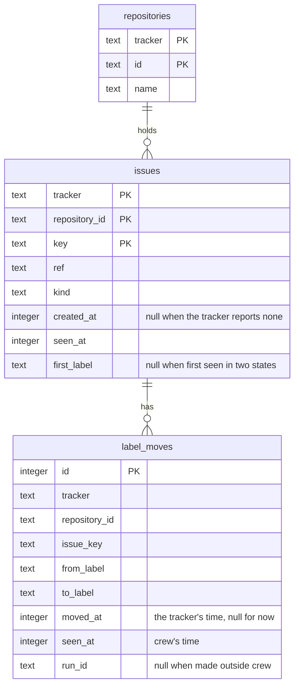

## Goal Capsule

- **Objective:** the domain has the repository, issue sighting and label move records, and the SQLite store keeps each entity once, bridges a restart and records each move once, ready for part 2's core to emit them.
- **Parent:** #341, part 1 of 2. Read it only for a question this part does not answer.
- **Open blockers:** none.

---

## Product Contract

### Summary

Three new `crew.Statistic` variants (a repository, an issue sighting, a label move), the warning that names each when it is lost, and migration `0002` with the store's rules for writing them.

### Context

Part 2 of #315 is already on `main`: the statistics port, the SQLite store in crew's global data folder chosen or turned off by the config, the warning on a failed write, the record of each crew process, and the README section on what crew records. In the units below, "part 2's crew" means that part of #315, not part 2 of this split.

This part builds the records and their storage for these requirements, which part 2 of this split completes once the core emits the records:

- R6. A repository is recorded once, with the identity and display name its tracker gives it, so a tracker other than GitHub fits the same shape.
- R7. The first time crew sees an issue carrying a label one of its rules knows, it records the issue once, under its repository, with the tracker's creation date when the tracker reports one and the time crew saw it.
- R8. Each move of a recorded issue from one crew label to another is an event of the issue, with the label it left, the label it reached, the tracker's time of the move when the tracker reports one, the time crew made or saw it, and the rule run that made it or none when it was made outside crew.

### Key Decisions

- **Entities, events and spans are different things.** An entity exists and has attributes (a process, a repository, an issue). An event is an instant (an issue moved from one label to another). A span is work with a start, an end, a cost and children (a rule run, an action). Cost and time live on spans; waiting time comes from the gaps between events. Governs R5, R6, R7, R8, R9.
- **The issue is the root: the demand is the unit of business value.** Every work span hangs under the issue it was for, so a demand's cost is the sum of its spans, and its stages are its rule runs. Governs R7, R9. (session-settled: user-directed — chosen over the issue as an attribute of each rule run, which hides the demand, and over the issue as a span, which mixes an entity with work)
- **A label move is an event beside the spans, not a span.** A rule run sits between two moves (its take and its route's move), but people and other tools also move issues, and a move has no duration or cost. Governs R8. (session-settled: user-approved — chosen over treating each move as a rule run span: moves made outside crew have no rule run)
- **Start small: only what crew manages.** An issue enters the store when crew first sees it with a label one of its rules knows, with the tracker's creation date when the tracker reports one and crew's own time; parent issues and an issue's end are later slices. Governs R7, R8. (session-settled: user-directed — chosen over recording every issue of the repository and over a parent-issue tree now)
- **The repository comes from the tracker.** An issue belongs to a repository stored with the tracker's own identity, never organization and repository fields that another tracker may not have. Governs R6, R7. (session-settled: user-directed — chosen over organization and repository columns on the process)
- **The core decides what to record, the engine writes it.** The core already knows the issue, its labels, the run's rule, action, bot, verdict and route, so it builds the records and emits commands; the engine executes them through the port, the way it executes journal records today. Crew's own time reaches the core with the fact the engine hands it, so the core keeps no clock. Harness-specific detail stays in the harness's adapter. Governs R7, R8, R9, R10, R11, R12, R16. (session-settled: user-approved — chosen over the engine assembling records on its own: the core keeps the decision pure and table-testable)

### Acceptance Examples

- AE1. **Covers R6, R7.** Given crew first lists #315 on GitHub carrying `crew:brainstorm:ready`, the store records the repository once and the issue under it, with GitHub's creation date and the time crew listed it; listing #315 again records nothing new about the issue.
- AE2. **Covers R8.** Given a person moves #315 from `crew:brainstorm:in progress` to `crew:brainstorm:done`, the next poll records a move of #315 between those labels, made outside crew, with the time crew saw it and GitHub's time of the move when GitHub reports it.

This part tests the store's half of AE1 and AE2 (U2); part 2 tests the core's half and completes them.

### Scope Boundaries

- Part 2 makes the core decide the records from listings, takes and route moves, wires the engine and the app, and updates the README, CONCEPTS.md and AGENTS.md. Until it merges, nothing emits the new records, so crew's behaviour and docs stay as they are.
- Parent issues and an issue's end are later slices of #315, not this part.

### Sources / Research

Split from #341.

---

## Planning Contract

### Key Technical Decisions

- KTD2. **A repository's identity is the tracker's name with the tracker's id.** The record carries the tracker adapter's name from the config's `tracker.name` (`github`), the `crew.Repository` id and its display name, and the store keys it by tracker and id. The id `port.RepositoryFinder` gives is GitHub's node id, unique only within GitHub, and a tracker without a finder falls back to the root folder's base name. Adding the tracker later would mean rewriting stored rows, so it goes in now. Issues and moves carry the same pair, then the issue's key. Governs R6, R7.
- KTD6. **This part leaves the tracker's move time absent and does not widen the listing.** Each move carries an optional tracker time, which the GitHub adapter does not fill yet. Reading it would take a new optional tracker interface and a timeline query per moved issue. `timelineItems` read through the `repository.issues` connection comes back hours stale, so it would have to go through `issue(number:)` lookups (`docs/solutions/` learning on timeline reads). crew's time of an outside move is the first listing that sees it, at most one poll interval late (300 s by default), later while polls are skipped because every slot is busy. The listing keeps asking only for ready and running labels, plus waiting labels with a board filled from listings, so taking work never competes with statistics for the listing's window. Governs R8.
- KTD7. **The store keeps each entity once and bridges a restart.** Migration `0002` adds three tables (High-Level Technical Design). A repository is upserted, so a rename updates its name on the same row. An issue sighting is inserted only when the issue is absent, so the first sighting across all processes and restarts keeps its seen time, creation date and first label. The core's memory starts empty in each process, so the store applies one rule in the same immediate transaction: a sighting with one state, of an issue already stored, whose last label differs, also inserts a move made outside crew at the sighting's time. The last label is the `to` of the issue's latest move, else its first label. A label move made by a run is inserted as given. One made outside crew is inserted only when the issue's last label differs from its `To`, so two processes that see the same move record it once. No foreign key is enforced, so a lost issue record never loses its moves. Governs R6, R7, R8.
  - **Conflict call-out** with the settled decision "The core decides what to record, the engine writes it": the restart rule and the outside-move check are decided in the store. The core keeps no memory across processes, and reading the store at startup would add a startup step and a read port. Each is a single conditional insert, tested in `internal/adapter/sqlite`.
- KTD8. **The records are three new `crew.Statistic` variants with optional fields.** These are a repository record, an issue sighting and a label move (names deferred). The sighting carries the item's kind, ref, creation date and its one state, each optional where a tracker may not report it. The move carries `From`, `To`, crew's time, an optional tracker time and an optional rule run id. They use `crew.Optional` rather than zero values, as #315's decision on absent values asks. `crew.Statistic` is a sealed sum type, so `internal/ui/lines/lines.go`'s `statistic` names each one in the `StatisticNotRecorded` warning. Governs R6, R7, R8.

### High-Level Technical Design

The store's tables after migration `0002` (KTD2, KTD7); times are Unix milliseconds in UTC, as in `processes`:

### Assumptions

These are unconfirmed bets made while planning, with nobody to ask. Review them in the pull request.

- The tracker's move time stays absent for GitHub in this part (KTD6), although AE2 mentions it. AE2 holds with crew's time alone, and a follow-up can add the timeline read.

### Deferred to Implementation

- The names of the three record types and their fields, and the core's per-issue bookkeeping type.
- The `statistic` wording in `internal/ui/lines/lines.go` for each new record, such as "the repository", "issue #42" and "a label move of #42".
- The SQL text of the gap rule (KTD7) and whether it reads the latest move by `id` or by `seen_at`.

### Sequencing

U1, then U2: the store switches on the record types U1 adds.

---

## Implementation Units

### U1. The repository, issue sighting and label move records

**Goal:** the domain has the three new statistics records, and every place that names a statistic names them.

**Requirements:** R6, R7, R8 (KTD2, KTD8).

**Dependencies:** none.

**Files:**
- Modify `internal/crew/statistic.go` (the three variants and their `statistic()` markers; update the `Statistic` doc, which lists only `Process`).
- Modify `internal/ui/lines/lines.go` (`statistic` names each new record in the warning) and `internal/ui/lines/lines_test.go`.
- Test `internal/crew/statistic_test.go` (create it if a behaviour such as a constructor's copy needs a test; skip it when the types are plain data).

**Approach:**
- The issue sighting and the move carry the tracker's name and a `crew.IssueID`, which already holds the repository id and the key.
- `Kind` reuses `crew.Kind`.
- Times use `time.Time`; absent ones use `crew.Optional[time.Time]`. The run uses `crew.Optional[crew.RuleRunID]`.

**Patterns to follow:** `crew.Process` in `internal/crew/statistic.go`; `crew.Optional` in `internal/crew/optional.go`.

**Test scenarios:**
- A `StatisticNotRecorded` for each new record prints a `warning: could not record … in the statistics store` line that names it, with the scrubbed reason.
- The process's existing line is unchanged.

**Verification:** `gochecksumtype` and lint pass, and `--plain` names every record kind.

### U2. The SQLite store keeps repositories, issues and moves

**Goal:** the store writes the three records with the once and restart rules of KTD7, and several processes can write them at once.

**Requirements:** R6, R7, R8, AE1, AE2 (KTD2, KTD7).

**Dependencies:** U1.

**Files:**
- Create `internal/adapter/sqlite/migrations/0002_issues.sql`.
- Modify `internal/adapter/sqlite/migrate.go` (embed and append it) and `internal/adapter/sqlite/store.go` (`Record` switches on the record's type).
- Test `internal/adapter/sqlite/store_test.go` (bump the `migrations` constant to 2) and `internal/adapter/sqlite/concurrent_test.go`.

**Approach:**
- Each record is one immediate transaction through the existing `inTx`.
- Repository: upsert on tracker and id, updating the name.
- Sighting: insert the issue when absent. Otherwise, when the sighting has a state and the issue's last label is set and differs, insert a move with no run and no tracker time at the sighting's time.
- Move: insert one with a run as given. Insert one with no run only when the issue's last label differs from its `To`.
- The process insert keeps its contract that a duplicate fails (`TestRecordingTheSameProcessTwiceFails`).
- The migration only adds tables, as `migrate.go`'s policy says.

**Patterns to follow:** `insertProcess` and `inTx` in `internal/adapter/sqlite/store.go`; `0001_processes.sql` with its `tsqllint-disable` header; the raw `read` helpers in `store_test.go`.

**Test scenarios:**
- Covers AE1. Recording the same repository twice leaves one row; a second record with a new name updates the name.
- Covers AE1. Recording a sighting of issue 42 twice, with different seen times, keeps one row with the first seen time, creation date and first label.
- A sighting with no creation date stores a null `created_at`.
- A sighting of a stored issue whose latest move reached `done`, now at `ready`, inserts one move `done` → `ready` with no run, no tracker time and the sighting's time.
- A sighting of a stored issue with no move, first seen at `ready`, now at `ready`, inserts nothing.
- A sighting with no state, or of an issue whose first label is null and has no move, inserts no move.
- Covers AE2. A move recorded with no run stores a null `run_id` and a null `moved_at`; one with a run stores its id.
- A move for an issue the store lacks is still written.
- Two stores on the same file record the same move made outside crew: the store keeps one row.
- Two stores on the same file record the same sighting and the same repository at once: one issue row, one repository row, no error (`concurrent_test.go`).
- A file migrated to version 1 by part 2's crew migrates to 2 and keeps its processes.

**Verification:** the store's tests pass under `-race`, and `PRAGMA user_version` reads 2 on a new file.

---

## Verification Contract

| Gate | Command | Applies to |
|---|---|---|
| Format | `gofmt -l cmd internal tools` prints nothing | every unit |
| Vet | `go vet ./...` | every unit |
| Lint and layering | `go run github.com/golangci/golangci-lint/v2/cmd/golangci-lint@v2.14.0 run` | every unit |
| Tests | `go test -race ./...` | every unit |
| Coverage floor | `go test -race -covermode=atomic -coverpkg=./... -coverprofile=coverage.out ./...`, then `go run github.com/vladopajic/go-test-coverage/v2@v2.19.0 --config=.testcoverage.yml` (total at least 90%) | before the pull request |
| Module tidy | `go mod tidy` changes nothing | before the pull request |
| Vulnerabilities | `go tool govulncheck ./...` | before the pull request |

---

## Definition of Done

- Every unit's Verification holds, and every gate above passes.
- Code from abandoned approaches is removed from the diff.

---

## Scope Boundaries (planning)

### Deferred to Follow-Up Work

- The tracker's time of a move: a new optional tracker interface that reads GitHub's `LabeledEvent`s through `issue(number:)` lookups, filling the move's tracker time and the moves between two polls (KTD6).

### Considered and not built

- **Reading the store at startup so the core alone bridges a restart.** It would add a read port and a startup step for one comparison the store makes in its transaction (KTD7). Revisit if a later slice needs other store reads at startup.
- **The process id on sightings and moves.** R8 does not ask for it, and a later migration can add the column.

<!-- cw-split-ce-plan: part of #341 -->

<!-- publish-split: part 1 of #341 -->

