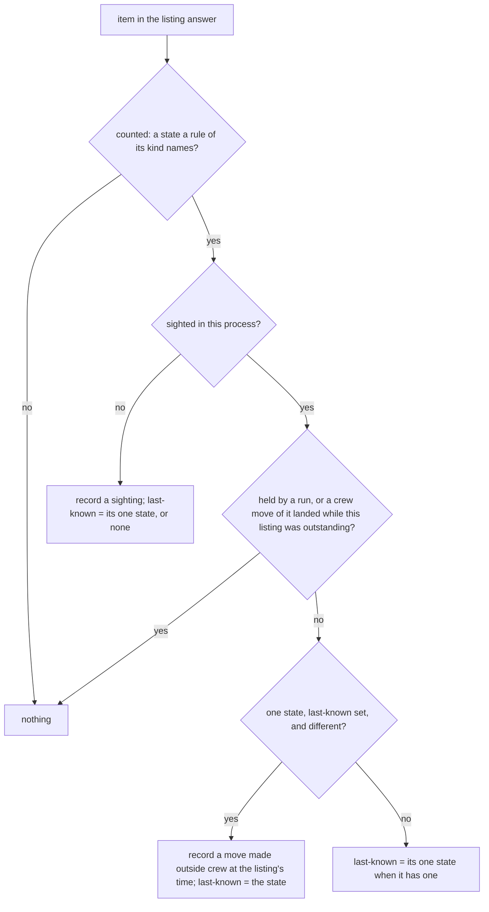

## Goal Capsule

- **Objective:** a running crew records the repository, each issue it manages and each move of those issues between its rules' labels, with the rule run that made it or none, and the docs say so.
- **Parent:** #341, part 2 of 2. Read it only for a question this part does not answer.
- **Open blockers:** none.

---

## Builds on

Already on main when this part starts; read the code, not these parts' files.

- Part 1 (U1, U2): the repository, issue sighting and label move records (`crew.Statistic` variants with optional fields, named in the `StatisticNotRecorded` warning), and migration `0002` with the SQLite store's rules: each repository and issue kept once, a sighting of a stored issue at a new label recorded as a move made outside crew (the restart bridge), and an outside move recorded once across processes.

---

## Product Contract

### Summary

The core decides the repository record at start, an issue sighting at each item's first counted listing, and a label move for each take, route move or return that lands and for each change a listing sees outside crew; the engine and the app hand it the repository and the tracker's name, and the README, CONCEPTS.md and AGENTS.md describe the records.

### Context

The first measure #315 wants beyond processes: how long each demand waited at each stage, from the gaps between its label moves. In the units below, "part 2", "part 4", "part 5" and AE8 refer to #315's parts and examples, not to the parts of this split.

### Key Decisions

- **Entities, events and spans are different things.** An entity exists and has attributes (a process, a repository, an issue). An event is an instant (an issue moved from one label to another). A span is work with a start, an end, a cost and children (a rule run, an action). Cost and time live on spans; waiting time comes from the gaps between events. Governs R5, R6, R7, R8, R9.
- **The issue is the root: the demand is the unit of business value.** Every work span hangs under the issue it was for, so a demand's cost is the sum of its spans, and its stages are its rule runs. Governs R7, R9. (session-settled: user-directed — chosen over the issue as an attribute of each rule run, which hides the demand, and over the issue as a span, which mixes an entity with work)
- **A label move is an event beside the spans, not a span.** A rule run sits between two moves (its take and its route's move), but people and other tools also move issues, and a move has no duration or cost. Governs R8. (session-settled: user-approved — chosen over treating each move as a rule run span: moves made outside crew have no rule run)
- **Start small: only what crew manages.** An issue enters the store when crew first sees it with a label one of its rules knows, with the tracker's creation date when the tracker reports one and crew's own time; parent issues and an issue's end are later slices. Governs R7, R8. (session-settled: user-directed — chosen over recording every issue of the repository and over a parent-issue tree now)
- **The repository comes from the tracker.** An issue belongs to a repository stored with the tracker's own identity, never organization and repository fields that another tracker may not have. Governs R6, R7. (session-settled: user-directed — chosen over organization and repository columns on the process)
- **The core decides what to record, the engine writes it.** The core already knows the issue, its labels, the run's rule, action, bot, verdict and route, so it builds the records and emits commands; the engine executes them through the port, the way it executes journal records today. Crew's own time reaches the core with the fact the engine hands it, so the core keeps no clock. Harness-specific detail stays in the harness's adapter. Governs R7, R8, R9, R10, R11, R12, R16. (session-settled: user-approved — chosen over the engine assembling records on its own: the core keeps the decision pure and table-testable)

### Requirements

**Entities and events**

- R6. A repository is recorded once, with the identity and display name its tracker gives it, so a tracker other than GitHub fits the same shape.
- R7. The first time crew sees an issue carrying a label one of its rules knows, it records the issue once, under its repository, with the tracker's creation date when the tracker reports one and the time crew saw it.
- R8. Each move of a recorded issue from one crew label to another is an event of the issue, with the label it left, the label it reached, the tracker's time of the move when the tracker reports one, the time crew made or saw it, and the rule run that made it or none when it was made outside crew.

### Key Flows

- F1. An issue's life as crew records it
  - **Trigger:** crew lists the repository's issues and sees one with a label one of its rules knows.
  - **Steps:** crew records the issue with its two dates; when a person or another tool moves it to another crew label, crew records the move at the poll that sees it, made outside crew; when a rule takes it, the take is a move made by that rule run and the rule run's span opens under the issue; when the run's route moves the issue on, that move is made by the same rule run.
  - **Covered by:** R7, R8, R9

### Acceptance Examples

- AE1. **Covers R6, R7.** Given crew first lists #315 on GitHub carrying `crew:brainstorm:ready`, the store records the repository once and the issue under it, with GitHub's creation date and the time crew listed it; listing #315 again records nothing new about the issue.
- AE2. **Covers R8.** Given a person moves #315 from `crew:brainstorm:in progress` to `crew:brainstorm:done`, the next poll records a move of #315 between those labels, made outside crew, with the time crew saw it and GitHub's time of the move when GitHub reports it.

### Scope Boundaries

- The rule run's span that a take opens (F1) is #315's part 4, and so is AE3; this part records the moves a rule run makes with the run that made them.
- AE9 (R4, R6) is tested in #315's part 5, the first part that writes spans.
- Parent issues and an issue's end are later slices of #315, not this part.
- Issues crew never saw with a known label are not recorded.
- #315's part 2 documents what crew records in the README; this part keeps it true for repositories, issues and their moves.

### Dependencies / Assumptions

- A rule run's take already carries the labels it moved between (`RunTaken`), and the engine already executes recorded run events from its loop in order.

### Sources / Research

Split from #341.

- `internal/crew/event.go` (`RunTaken`), `internal/port/port.go` (`RepositoryFinder`), `internal/engine/exec.go`.

---

## Planning Contract

### Key Technical Decisions

- KTD1. **Crew labels are the rules' states, `crew.RuleStates`.** They are the labels crew already treats as its own: the GitHub adapter is built with them, `Issue.States` holds only them, and an issue in two of them is skipped. crew has no label prefix; `crew:` is this repository's convention, and a prefix rule would count labels no rule knows. An item counts only in a state that a rule of its own kind names, the same split `otherKind` in `internal/core/kind.go` reports, so a pull request carrying an issue rule's label is not recorded. Governs R7, R8.
- KTD2. **A repository's identity is the tracker's name with the tracker's id.** The record carries the tracker adapter's name from the config's `tracker.name` (`github`), the `crew.Repository` id and its display name, and the store keys it by tracker and id. The id `port.RepositoryFinder` gives is GitHub's node id, unique only within GitHub, and a tracker without a finder falls back to the root folder's base name. Adding the tracker later would mean rewriting stored rows, so it goes in now. Issues and moves carry the same pair, then the issue's key. Governs R6, R7.
- KTD3. **The engine's `Started` carries the repository, and the core records it with the process.** `Started` is stepped after `prepare`, which already filled `e.repository` (`findRepository`, `internal/engine/engine.go`). `RecordingStatistics` gains the tracker's name, which `internal/app` passes into a new engine `Config` field. The core emits the repository record right after the process record, so it precedes every issue record in the writer's queue. Governs R6.
- KTD4. **The core records issues and moves from what it already sees.**
  - A listing answer (`listed` in `internal/core/scheduler.go`, beside `m.gone`, before the stopping return) gives each counted item's first sighting in this process and each change of its one crew state since the last listing. A change is a move made outside crew, at the listing's time.
  - A landed take (`takeMoved` in `internal/core/runs.go`) is a move from its `From` to its `To`, made by its run. A landed route move or return (`stepEnded` in `internal/core/steps.go`, `StepMove`) is a move from the rule's running label to the step's `To`, made by its run. Both happen at the time of the input that landed them.
  - Each recorded move sets the issue's last-known state to `To`. A close records nothing and leaves the state as it was.
  - The core never records a move whose `From` or `To` is empty or whose `From` equals `To`.

  This keeps the decisions in the core with no new port: `Issue.Created` already carries GitHub's `createdAt`, and the listing's and the call result's arrival times are crew's time. Governs R7, R8, F1.
- KTD5. **A listing never contradicts crew's own moves.** `ListIssues` and `Move` run on separate engine goroutines, and GitHub changes the labels before `Move` returns. A listing can therefore show crew's move before the core has settled it, and an owed move keeps that window open for whole polls. A session can also move its own issue to the route's `To` before the route's move lands, which GitHub's `Move` then reports as landed. The core skips the comparison for an item crew holds (`m.held`), whose moves its run records. It also skips an item whose crew move landed while that listing was outstanding, whose answer may predate it, using the generation guard the board uses (`board.reads` and `boardMove` in `internal/core/board.go`, against `m.listings`). A skipped item keeps its last-known state, so the next listing compares again. Governs R8.
- KTD6. **This part leaves the tracker's move time absent and does not widen the listing.** Each move carries an optional tracker time, which the GitHub adapter does not fill yet. Reading it would take a new optional tracker interface and a timeline query per moved issue. `timelineItems` read through the `repository.issues` connection comes back hours stale, so it would have to go through `issue(number:)` lookups (`docs/solutions/` learning on timeline reads). crew's time of an outside move is the first listing that sees it, at most one poll interval late (300 s by default), later while polls are skipped because every slot is busy. The listing keeps asking only for ready and running labels, plus waiting labels with a board filled from listings, so taking work never competes with statistics for the listing's window. Governs R8.

### High-Level Technical Design

What the core does with each counted item of a listing answer (KTD4, KTD5):

### Assumptions

These are unconfirmed bets made while planning, with nobody to ask. Review them in the pull request.

- A move's `From` is the last crew label crew knew the issue at. When an issue goes through a label crew does not list, or is closed and reopened, the time it spent there counts at that `From` label until #315's "issue's end" slice records more. The alternative, forgetting the label when an issue disappears, would leave the move into the new label unrecorded.
- A landed move counts as made by its run even when the tracker reports the issue was already at `To`, because a session of the run or a person moved it first. crew's `Move` returns success in that case (`internal/adapter/github/tracker.go`), and the run did ask for that move.
- The tracker's move time stays absent for GitHub in this part (KTD6), although AE2 mentions it. AE2 holds with crew's time alone, and a follow-up can add the timeline read.
- In this repository's `.crew/config.yaml`, no rule names `crew:brainstorm:ready` or `crew:brainstorm:in progress`, so those labels stay invisible here. AE1 and AE2 are tested with an invented rule set that names them.

### Deferred to Implementation

- The names of the three record types and their fields, and the core's per-issue bookkeeping type.

### Sequencing

U3, then U4, then U5.

---

## Implementation Units

### U3. The core records the repository, issue sightings and label moves

**Goal:** the core decides every record of KTD3 to KTD5 from its inputs, with no clock and no I/O.

**Requirements:** R6, R7, R8, F1, AE1, AE2 (KTD1, KTD3, KTD4, KTD5).

**Dependencies:** U1.

**Files:**
- Modify `internal/core/statistics.go` (the tracker name, the per-issue bookkeeping, the sighting, comparison and move helpers) and `internal/core/model.go` (`RecordingStatistics` takes the tracker's name).
- Modify `internal/core/input.go` (`Started` carries the repository), `internal/core/scheduler.go` (`listed` calls the sighting step), `internal/core/runs.go` (`takeMoved`) and `internal/core/steps.go` (`stepEnded`). Also modify the outbox or board hook that marks a landed crew move against the outstanding listing's generation.
- Test `internal/core/statistics_test.go`.

**Approach:**
- At `Started`, after the process record, emit the repository record (KTD3). Without `RecordingStatistics`, nothing changes.
- In `listed`, apply KTD1's count and KTD4's flow for each item, guarded by KTD5.
- In `takeMoved` and on a landed `StepMove` in `stepEnded`, record the move with the run's id (`EventHead`) and the event's time, and set last-known.
- Items absent from a listing keep their bookkeeping.

**Execution note:** write the KTD5 race rows first: a listing answer that shows `running` while the take's `CallResult` has not arrived, and one answered after an owed take.

**Patterns to follow:** `started` in `internal/core/statistics.go`; `m.otherKinds` for per-issue maps; `boardMoved` and `board.reads` for the generation guard; `recordingDriver`, `d.send`, `wantCommands` in `internal/core/statistics_test.go`.

**Test scenarios:**
- With `RecordingStatistics`, `Started` carrying repository `R_1`/`owner/name` emits the process record, then the repository record with tracker `github`.
- Covers AE1. A first listing with issue 315 at `brainstorm:ready`, created at C and answered at T, emits one sighting with C, T and `brainstorm:ready`; a second listing of the same issue emits nothing.
- Covers AE2. Issue 315 sighted at `brainstorm:in progress`, then listed at `brainstorm:done` at T2, emits one move `in progress` → `done` with no run, crew time T2 and no tracker time.
- A take of issue 1 that lands at T emits a move `ready` → `running` with the run's id and time T. The next listing showing `running` emits nothing.
- A route move that lands emits a move `running` → the step's `To` with the run's id. A return step emits the same with the check's label.
- A close step that lands emits no move.
- A listing answered while the take's `Move` is in flight shows `running`: no outside move. The `CallResult` then emits the take move once.
- A held issue listed at its route's `To` during its session, because the session moved it, emits no outside move. The route move that lands emits the one move with the run's id.
- A take move owed after a transient failure: listings during the owed polls show `running` and emit nothing. The retry that lands emits the take move once.
- A listing asked before a route move lands and answered after it, still showing `running`, emits nothing. The next listing showing the route's `To` emits nothing.
- An issue first listed in two crew states emits a sighting with no state and no move. Listed later in one state, it emits no move.
- An item of kind pull request in a label only issue rules name emits nothing.
- An issue missing from one listing and back at another label emits a move from its last-known label.
- Without `RecordingStatistics`, listings, takes and route moves emit no `RecordStatistic`.

**Verification:** the core's table tests pass with no clock or I/O, and every existing core test passes unchanged.

### U4. The engine and the app hand the core the repository and the tracker's name

**Goal:** a running crew records the repository, its issues and their moves through the configured store.

**Requirements:** R6, R7, R8 (KTD2, KTD3).

**Dependencies:** U3.

**Files:**
- Modify `internal/engine/engine.go` (`Config` gains the tracker's name; `Started` carries `e.repository`) and `internal/engine/statistics.go` (`RecordingStatistics` gets the tracker's name).
- Modify `internal/app/app.go` (pass `cfg.Tracker` into the engine's `Config`).
- Test `internal/engine/statistics_test.go`.

**Approach:** the writer, the `RecordStatistic` command and the `StatisticFailed` path stay as they are; only what the core is given changes.

**Patterns to follow:** the existing `synctest` statistics tests with `fake.NewStatistics`, `fake.NewTracker` and `config(t, tr, develop)`.

**Test scenarios:**
- A crew with a fake tracker listing issue 1 at `ready`, which develops it, records in order: the process, the repository with the configured tracker name, the sighting of issue 1, then the take move with its run.
- A person's move of issue 1 between two ready labels, made on the fake tracker between two ticks, is recorded at the second tick's listing, with no run.
- A store whose records fail warns for each lost record, and the run ends as it would without statistics (AE8's rule, kept true for the new records).

**Verification:** engine tests pass under `synctest` with no leaked goroutine.

### U5. The README, CONCEPTS.md and AGENTS.md say what crew records

**Goal:** the docs describe the repositories, issues and label moves crew now records, and how a move's labels and times are read.

**Requirements:** R6, R7, R8 (Scope Boundaries: part 2's README section stays true).

**Dependencies:** U2, U4.

**Files:**
- Modify `README.md` (the `## Statistics` section: replace "For now it records one row each time crew starts" with the process, the repository, each issue crew manages with its first label and dates, and each move between the rules' labels, with who made it).
- Modify `CONCEPTS.md` (the `### Statistics store` entry, which says it holds one row per process).
- Modify `AGENTS.md` (the `internal/crew` bullet's `Statistic` variants and the `sqlite` adapter's tables).

**Approach:**
- State the limits users will see: a move made outside crew is recorded at the poll that sees it, and moves through labels crew does not list are recorded from the last label crew saw (KTD6, Assumptions).
- The tracker's own time of a move is not recorded yet.

**Test expectation:** none -- documentation only.

**Verification:** each doc's statement matches the behaviour U2 to U4 test.

---

## Verification Contract

| Gate | Command | Applies to |
|---|---|---|
| Format | `gofmt -l cmd internal tools` prints nothing | every unit |
| Vet | `go vet ./...` | every unit |
| Lint and layering | `go run github.com/golangci/golangci-lint/v2/cmd/golangci-lint@v2.14.0 run` | every unit |
| Tests | `go test -race ./...` | every unit |
| Coverage floor | `go test -race -covermode=atomic -coverpkg=./... -coverprofile=coverage.out ./...`, then `go run github.com/vladopajic/go-test-coverage/v2@v2.19.0 --config=.testcoverage.yml` (total at least 90%) | before the pull request |
| Module tidy | `go mod tidy` changes nothing | before the pull request |
| Vulnerabilities | `go tool govulncheck ./...` | before the pull request |

---

## Definition of Done

- Every unit's Verification holds, and every gate above passes.
- A crew run against a fake tracker records the process, the repository, each managed issue once and each move once, with the run that made it or none.
- `README.md`, `CONCEPTS.md` and `AGENTS.md` describe the new records in the same pull request.
- Code from abandoned approaches is removed from the diff.

---

## Scope Boundaries (planning)

### Deferred to Follow-Up Work

- The tracker's time of a move: a new optional tracker interface that reads GitHub's `LabeledEvent`s through `issue(number:)` lookups, filling the move's tracker time and the moves between two polls (KTD6).

### Considered and not built

- **Listing every crew label to see moves into terminal labels.** It would grow the listing that takes work, which already covers only an oldest-first window. Revisit if measured waiting times show issues vanishing into unlisted labels.
- **Reading the store at startup so the core alone bridges a restart.** It would add a read port and a startup step for one comparison the store makes in its transaction (KTD7). Revisit if a later slice needs other store reads at startup.
- **Attributing a pull request's mirrored label to the run that reported it.** No rule set here takes pull requests in an issue rule's label. Revisit when a configuration records such moves as outside crew.

<!-- cw-split-ce-plan: part of #341 -->

<!-- publish-split: part 2 of #341 -->

