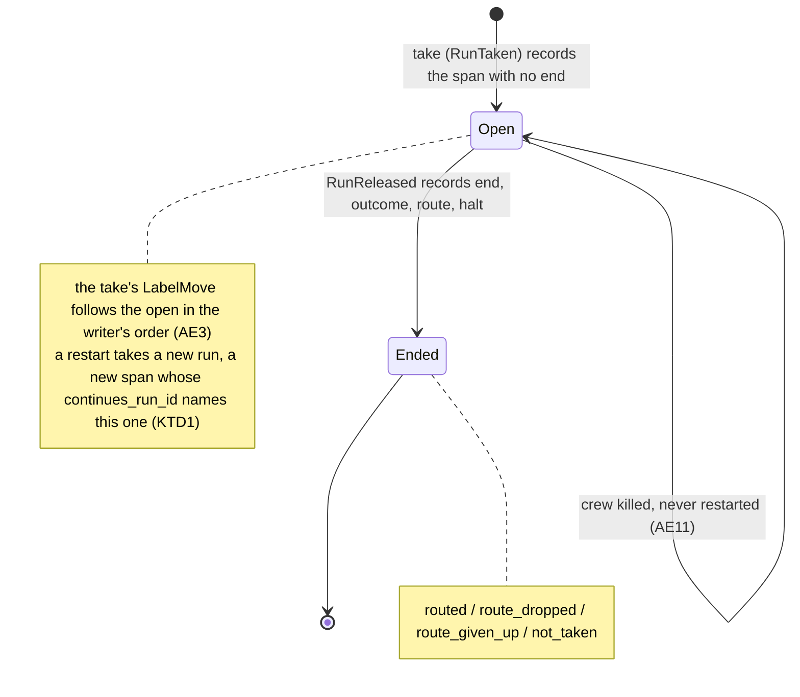
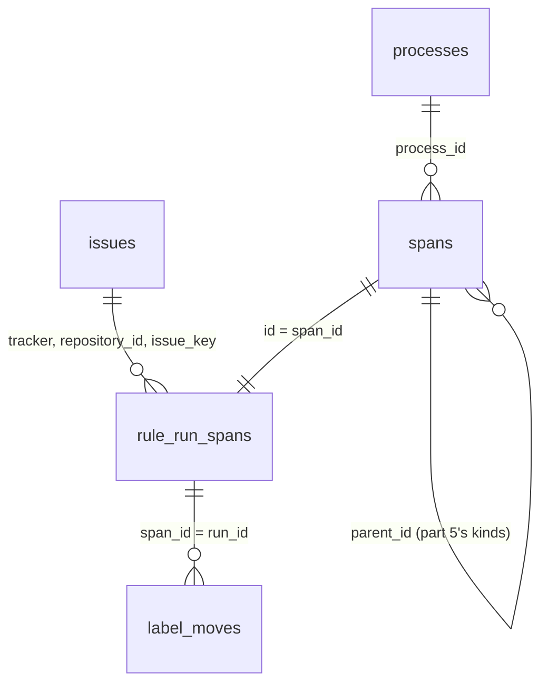

## Goal Capsule

- **Objective:** crew's statistics store tells how long each stage of a demand took: every rule run is a span under its issue, opened when the run starts and completed when it ends, with its rule, queue and outcome, and a run cut short by a killed crew stays open.
- **Means:** the core records one rule run span record at the take and again at the release, and the SQLite store keeps a common span table plus a rule run table (KTD2, KTD4, KTD5).
- **Parent:** #315, part 4 of 5. Read it only for a question this part does not answer.
- **Open blockers:** none.
- **Authority:** the Product Contract's R9 and its Key Decisions win on behaviour; the KTDs win on mechanism; units override neither.
- **Stop conditions:** stop and report if a run turns out to cross a restart under one id (KTD1), or if a migration cannot only add.

---

## Builds on

Already on main when this part starts; read the code, not these parts' files.

- Part 3: the records of each repository, each issue crew manages and each move of an issue between crew labels, with the rule run that made it.

---

## Product Contract

Product Contract preservation: unchanged in meaning; F3 is read through KTD1, recorded under Assumptions.

### Summary

The first span of the tree: one span per rule run under its issue, with its rule, queue, outcome, start and end, written when the run starts and completed when it ends, even when the run crosses a restart.

### Problem Frame

A demand's stages are its rule runs; this part tells how long each stage took, and it is the parent every action span of part 5 hangs from.

### Key Decisions

- **Entities, events and spans are different things.** An entity exists and has attributes (a process, a repository, an issue). An event is an instant (an issue moved from one label to another). A span is work with a start, an end, a cost and children (a rule run, an action). Cost and time live on spans; waiting time comes from the gaps between events. Governs R5, R6, R7, R8, R9.
- **The issue is the root: the demand is the unit of business value.** Every work span hangs under the issue it was for, so a demand's cost is the sum of its spans, and its stages are its rule runs. Governs R7, R9. (session-settled: user-directed — chosen over the issue as an attribute of each rule run, which hides the demand, and over the issue as a span, which mixes an entity with work)
- **Spans in a tree, not flat records.** An issue holds rule runs, a rule run holds actions, an action holds the route its verdict chose, and a route holds its steps; later slices add subagents, model calls, tool calls and waits as children. Each span inherits its issue, rule and repository from its ancestors instead of repeating them. Governs R9, R10, R11. (session-settled: user-approved — chosen over one flat record per action that repeats the issue, rule and queue: the tree normalizes the dimensions and each later slice adds a span kind without redesigning the base)
- **The core decides what to record, the engine writes it.** The core already knows the issue, its labels, the run's rule, action, bot, verdict and route, so it builds the records and emits commands; the engine executes them through the port, the way it executes journal records today. Crew's own time reaches the core with the fact the engine hands it, so the core keeps no clock. Harness-specific detail stays in the harness's adapter. Governs R7, R8, R9, R10, R11, R12, R16. (session-settled: user-approved — chosen over the engine assembling records on its own: the core keeps the decision pure and table-testable)

### Requirements

**The spans**

- R9. Each rule run is a span under its issue, recorded when the run starts and completed when it ends, with its rule, its queue, its outcome, its start and its end.

### Key Flows

- F1. An issue's life as crew records it
  - **Trigger:** crew lists the repository's issues and sees one with a label one of its rules knows.
  - **Steps:** crew records the issue with its two dates; when a person or another tool moves it to another crew label, crew records the move at the poll that sees it, made outside crew; when a rule takes it, the take is a move made by that rule run and the rule run's span opens under the issue; when the run's route moves the issue on, that move is made by the same rule run.
  - **Covered by:** R7, R8, R9
- F3. A rule run's life across a restart
  - **Trigger:** a rule takes an issue, and crew restarts before the run ends.
  - **Steps:** the rule run's span is written when the run starts, while the first process runs; the restarted crew records a new process; the actions and route steps that end after the restart point to the new process; the rule run's span is completed when the run ends.
  - **Covered by:** R5, R9, R10, R11

### Acceptance Examples

- AE3. **Covers R8, R9.** Given the promote rule takes #315 from `crew:brainstorm:done`, the store records the take as a move made by that rule run and opens the rule run's span under #315.
- AE11. **Covers R9.** Given crew is killed in the middle of a rule run and never restarted, the rule run's span stays without an end, and the spans of the actions that ended before still belong to its issue through it.

### Scope Boundaries

- Action, route and step spans, and the actions of F3 and AE11 that point to a process, are part 5's; AE10 is tested there. This part checks AE11's open rule run span.
- The run's attempt and the time it waits for a slot or for answers are later slices of #315.
- Part 2 documents what crew records in the README; this part keeps it true for rule run spans.

### Dependencies / Assumptions

- A rule run's take already carries the labels it moved between (`RunTaken`), and the engine already executes recorded run events from its loop in order.

### Sources / Research

Split from #315.

- `internal/crew/event.go` (`RunTaken`, `RunReleased`), `internal/crew/run.go` (`ReleasedPhase`, `RoutingPhase.Final`), `internal/core/scheduler.go` (`take`), `internal/core/runs.go` (`on`), `internal/core/claims.go` (`continued`), `internal/core/statistics.go`, `internal/adapter/sqlite/store.go` and `migrate.go`, `internal/engine/exec.go`.
- `docs/solutions/design-patterns/statistics-store-decides-restart-and-duplicate-label-moves.md`: memory across processes lives in the store's immediate transaction, never in a startup read.
- OpenTelemetry's trace model: a span has an id, a parent, a start, an end and a status. KTD4 borrows that shape without adopting OpenTelemetry.

---

## Planning Contract

### Key Technical Decisions

- KTD1. **A rule run span is one `crew.RuleRun`, keyed by its `RuleRunID`.** A run never continues in another process. After a restart, crew takes a new run with a new id whose `RunTaken.Continues` names the old one (`continued` in `internal/core/claims.go`, and the run journal entry in `CONCEPTS.md`). So the process that opens a span is the one that ends it, and its start is its own take's time. Answers the deferred question on a resumed run's start: the core never needs it. The span keeps the run it continues, so the chain across a restart can be read back. `RuleRunID` is unique across processes and already fills `label_moves.run_id`, so part 5's action spans can point to it. Governs R9, F3, AE11.
- KTD2. **The span opens at the take and completes at the release.** The core records it in `step.take` (`internal/core/scheduler.go`), right after the `RunTaken` it records, at the take's time. That is before the take move is delivered, so in the writer's order the span comes before the take's `LabelMove`, which names its run (AE3). The core records it again on `RunReleased`, the one event every run ends with, at the release's time, in `on` (`internal/core/runs.go`) before `release` lets the run go. A journal replayed at startup folds `History` only and records nothing. Governs R9, AE3.
- KTD3. **The outcome says how the run ended; the route and a halt are kept beside it.** The outcome comes from `ReleasedPhase.Route` and `RoutingPhase.Final` (`internal/crew/run.go`), with the domain's meaning of each final step (`internal/crew/routing.go`, `passedFinished` in `internal/crew/history.go`). It has four values:
  - `routed`: the route's final move or close landed. A route with no steps also counts.
  - `route_dropped`: the final move or close was dropped because the item was moved or closed meanwhile. The route is finished: the item is where someone else put it.
  - `route_given_up`: the tracker refused the final move or close, or its final try failed. The route is unfinished, so the next run of the rule runs it again (`StartPassedRoute`).
  - `not_taken`: the take did not land, so no route was chosen.

  The route's name (`passed`, `failed`, `waiting` or one the config names) goes in its own field, absent for `not_taken`. Route names are the config's, so mixing them into the outcome could collide. A run that crew's stop or run time limit ended goes through `failed` like any other (README "Stopping crew"). The span's `halted` field says so, only when the halt chose the route. The core decides it when the run chooses its route (`RouteChosen`), as `finish` and `halted` in `internal/crew/decide.go` do:
  - `stop`: the run was already stopping when it chose its route, so the stop forced it.
  - `run_time_limit`: the action at the run's cursor ended with `CauseTimeUp`, because the limit kept it from starting.
  - absent otherwise, including a stop that reaches a run already going through its route, a session that ends on its own during the wind-down, and a take that does not land.

  Reading `RuleRun.Stopping` or `RuleRun.TimeUp` at the release would also mark runs the halt only overlapped. Without the field a failure rate would count every Ctrl+C, and old rows could not get it later. Governs R9.
- KTD4. **A common `spans` table, plus one table per kind.** Migration `0003_spans.sql` adds two tables:
  - `spans`, with the fields every span has: `id`, `kind`, `parent_id`, `process_id`, `started_at`, `ended_at` and `outcome`. A rule run's id is its `RuleRunID`, its kind is `rule_run`, and its `parent_id` is null, because its parent is its issue.
  - `rule_run_spans`, keyed by `span_id`, with the issue (`tracker`, `repository_id`, `issue_key`), `rule`, `queue`, `route`, `halted` and `continues_run_id`, and an index by issue.

  Part 5's kinds add their own table and point `parent_id` at their parent span. That way, one recursive query over `spans` walks a demand's tree and sums its time, and the issue lives only on the rule run, per the tree decision. As in `0002`, the migration has no foreign key and only adds. Migrations keep the existing `PRAGMA user_version` count (`internal/adapter/sqlite/migrate.go`), and writes stay `const` statements in `store.go`. Read queries are not part of this work. Governs R9.
- KTD5. **One record type, written as an upsert that never moves an end.** `crew.RuleRunSpan` carries every field: the issue, run, process, rule, queue, continued run and start, plus an optional end, outcome, route and halt. The core emits it twice. In one immediate transaction the store inserts both rows when the span is new. When the span exists, it sets the end, outcome, route and halt only if the stored end is null and the record has one. So:
  - a second open changes nothing;
  - an end whose open record failed (a `StatisticNotRecorded` warning) still writes a whole span;
  - a repeated end keeps the first.

  The end carries every field because a lost open would otherwise leave a bare update with nothing to update. Fixing that later would mean repairing stored rows. This follows the store-side idempotency of `docs/solutions/design-patterns/statistics-store-decides-restart-and-duplicate-label-moves.md`. Governs R9.
- KTD6. **The span's process is the one that took the run, and its queue is the rule's.** The core takes the process from `statistics.process`, which `Started` sets before any listing can take. It takes the queue from `m.queues[m.queueOf[si]].Name`. A config always names a queue, `default` when the rule names none (`internal/config/queue.go`). Only a core built without config has an unnamed queue, which the store writes as null. Governs R9.

### High-Level Technical Design

A rule run span's life, with the record each step writes (KTD2, KTD3, KTD5):

The tables after this part (KTD4):

### Assumptions

These are unconfirmed bets made while planning, with nobody to ask. Review them in the pull request.

- F3 describes one rule run crossing a restart. In crew, a restarted crew never resumes a run under the same id: it takes a new run that continues it (KTD1). So across a restart, the old run's span stays open as in AE11, and the new run's span opens at its own take and records the run it continues. The actions after the restart belong to the new run and the new process, which keeps F3's point that they point to the new process.
- A span stays open when crew is killed, even after a restart, because nobody knows when the killed run ended. The run that continues it marks it as resumed through `continues_run_id`. A later slice can close such spans if a measure needs it.
- An open span reads the same whether its run is still running or its crew was killed: `processes` records no end. Only a later run of the same rule on the issue links back to it, and only when crew keeps its run journal, which `cmd/crew` always does. A killed run whose issue someone moves to another rule stays unlinked. This is accepted for this part, as AE11 asks only for the open span.
- The outcome's four values and the halt (KTD3) answer the outcome values the brainstorm deferred.
- The built-in `question` and `answered` rules are rule runs like any other, recorded under their names and `questions.queue`.
- A pull request a rule takes gets a span under its item, as its moves already do.

### Deferred to Implementation

- The exact names of `crew.RuleRunSpan`'s fields and of the outcome type and its constants.
- Whether the end record is built from `h.run` once `RunReleased` is applied, or from the event and the run before it.
- Whether the halt is read from `RouteChosen`'s run before or after it is applied, so long as it reflects the stop and time-up state that chose the route.

### Sequencing

U1, then U2, then U3, then U4.

---

## Implementation Units

### U1. The rule run span record and its tables

**Goal:** the domain has the rule run span record, and the SQLite store keeps each span once, with its first end.

**Requirements:** R9, AE11 (KTD1, KTD3, KTD4, KTD5).

**Dependencies:** none.

**Files:**
- Modify `internal/crew/statistic.go` (the `RuleRunSpan` variant and the outcome type with its four values of KTD3).
- Create `internal/adapter/sqlite/migrations/0003_spans.sql`; modify `internal/adapter/sqlite/migrate.go` (embed it and list it third) and `internal/adapter/sqlite/store.go` (the `Record` case, the upsert across both tables in one transaction).
- Modify `internal/ui/lines/lines.go` (`statistic` names the record, telling the open from the end, such as "the start of the rule run <rule> on #<key>" and "the end of ...").
- Test `internal/adapter/sqlite/spans_test.go` (new), `internal/adapter/sqlite/store_test.go` (`migrations` becomes 3), `internal/adapter/sqlite/concurrent_test.go`, `internal/ui/lines/lines_test.go`.

**Approach:**
- The migration follows `0002_issues.sql`: the `tsqllint-disable` header, a comment on each table saying what a row is and that times are Unix milliseconds in UTC, no foreign key, and an index on `rule_run_spans` by issue.
- `Record` inserts both rows, doing nothing on conflict. When the record has an end, it then sets the end, outcome, route and halt across both tables only if the stored `spans.ended_at` is still null (KTD5). It reads that condition once, before either update, so updating `spans` first cannot skip the `rule_run_spans` update. Absent values go through `unixMilli` and `text`.

**Patterns to follow:** `insertIssue` and `upsertRepository` in `store.go`; `open`, `record`, `rows` and the typed row readers in the sqlite tests; `TestTwoStores...` in `concurrent_test.go`; the version-one migration test in `issues_test.go`.

**Test scenarios:**
- An open record for run `r.1` of rule `develop`, queue `default`, issue 315, process `p`, started at T, writes one `spans` row with kind `rule_run`, no parent, no end and no outcome, and one `rule_run_spans` row with the issue, rule, queue, no route and no continued run.
- Covers AE11. With only the open record written, the span reads back with a null end and outcome.
- The open, then an end at T2 with outcome `routed` and route `passed`, leaves one row with end T2, `routed` and `passed`.
- An end record whose open was never written writes the whole span with its start, end, outcome and route.
- A second open after the end changes nothing. A second end with another time keeps the first end.
- An end with outcome `not_taken` stores a null route.
- An end with halt `stop` stores `stop`; an end without one stores null.
- An open with no queue stores a null queue.
- A span that continues run `q.3` stores `continues_run_id` `q.3`.
- Two stores writing the same open and end at once leave one span with one end.
- A store migrated by an older crew to version 2, holding processes and moves, migrates to 3 and keeps its rows.
- `lines` names a failed open and a failed end of a rule run span differently in the `StatisticNotRecorded` warning.

**Verification:** the sqlite and lines tests pass, and `migrations` counts 3.

### U2. The core opens a span at each take and ends it at the release

**Goal:** the core records each rule run's span from what it already sees, with no clock and no I/O.

**Requirements:** R9, F1, F3, AE3, AE11 (KTD1, KTD2, KTD3, KTD6).

**Dependencies:** U1.

**Files:**
- Modify `internal/core/statistics.go` (helpers that build the open and end records from a held run).
- Modify `internal/core/scheduler.go` (`take` records the open after `s.record(taken)`) and `internal/core/runs.go` (`on`, `case crew.RunReleased`, records the end before `release`; `heldRun` keeps the halt).
- Modify `internal/core/steps.go` (`onRoute`, on `RouteChosen`, keeps the halt on the held run).
- Test `internal/core/statistics_test.go`.

**Approach:**
- Without `RecordingStatistics`, nothing changes: every helper returns at once, as `moved` does.
- The open carries the rule's name, the queue (KTD6), `st.process`, `taken.Continues` and the take's time.
- On `RouteChosen`, the held run keeps the halt KTD3 decides, from the run as it was when it chose the route and from the action at its cursor.
- The end reads the released run's phase for the outcome and the route, and the kept halt (KTD3). Its time is `RunReleased`'s time.

**Execution note:** start with the ordering row of AE3, the span's open before the take's move, since the writer's order is what makes the move's run resolvable.

**Patterns to follow:** `takeMoved` and `moved` in `internal/core`; `recordingDriver`, `d.poll`, `d.send(core.CallResult{...})`, `implemented`, `statisticsOf` and `wantStatistics` in `internal/core/statistics_test.go`.

**Test scenarios:**
- Covers AE3. A take of issue 315 by rule `promote` from `brainstorm:done` emits the span's open with no end, then, once the take lands, the take's move with the same run id, in that order.
- A run whose route `passed` moves the issue and lands emits the end at the release's time with outcome `routed` and route `passed`.
- A run whose route's final move is dropped, as the issue was moved meanwhile, emits the end with outcome `route_dropped` and that route.
- A run whose route's final move is given up after its final try emits the end with outcome `route_given_up` and that route.
- A take that does not land emits the end with outcome `not_taken`, no route and no halt.
- A run that crew's stop ends through `failed` emits the end with outcome `routed`, route `failed` and halt `stop`. A stop that arrives while the take is in flight and the take lands ends the same way.
- A run whose next action the run time limit kept from starting emits route `failed` and halt `run_time_limit`.
- A run whose session fails on its own during the wind-down emits route `failed` and no halt.
- A stop that reaches a run already going through `passed` emits route `passed` and no halt. One already going through a `failed` it chose itself emits no halt either.
- A run whose session judged its work failed, with no stop, emits route `failed` and no halt.
- A run of a rule in queue `fast` records queue `fast`. A run that continues an earlier run in the journal records that run's id.
- A run that only runs its continued run's passed route (`StartPassedRoute`) emits an open and an end like any run.
- Covers AE11. A run whose session is still running emits its open and no end.
- A journal replayed with `Journaling` emits no span record.
- Without `RecordingStatistics`, takes and releases emit no `RecordStatistic`.

**Verification:** the core's tests pass with no clock or I/O, and every existing core test passes unchanged.

### U3. A running crew records its rule runs' spans

**Goal:** the engine writes each span through the configured store, in order with the other records.

**Requirements:** R9, AE3 (KTD2).

**Dependencies:** U2.

**Files:**
- Test `internal/engine/statistics_test.go`.

**Approach:** the writer, the `RecordStatistic` command and the `StatisticFailed` path are generic over `crew.Statistic`, so no engine code should change. If one has to, keep it to the writer's existing path.

**Patterns to follow:** `TestRunRecordsTheProcessTheRepositoryTheIssueAndItsMovesInOrder` and the AE8 failing-store test, under `synctest`, with `recordingConfig` and `fake.NewStatistics`.

**Test scenarios:**
- A crew that develops issue 1 records in order: the process, the repository, the sighting, the span's open, the take move, the route move, then the span's end with outcome `routed`.
- A store whose records fail warns once for each lost span record, and the run ends as it would without statistics.

**Verification:** engine tests pass under `synctest` with no leaked goroutine.

### U4. The README, CONCEPTS.md and AGENTS.md say what crew records

**Goal:** the docs describe rule run spans: what they hold, when they open and end, and what a killed or restarted crew leaves.

**Requirements:** R9 (Scope Boundaries: part 2's README section stays true).

**Dependencies:** U1, U3.

**Files:**
- Modify `README.md` (`## Statistics`: each rule run, with its rule, queue, start, end and outcome, open until it ends, a killed crew's run left without an end, and a restart's new run naming the run it continues).
- Modify `CONCEPTS.md` (`### Statistics store`: the rule run span, and spans as work with a start and an end beside entities and events).
- Modify `AGENTS.md` (the `internal/crew` bullet's `Statistic` variants, and the `sqlite` adapter's tables).

**Approach:** name the four outcomes and the halt in users' words (KTD3), and say that an open span is a run still running or one a killed crew left (Assumptions).

**Test expectation:** none -- documentation only.

**Verification:** each doc's statement matches the behaviour U1 to U3 test.

---

## Verification Contract

| Gate | Command | Applies to |
|---|---|---|
| Format | `gofmt -l cmd internal tools` prints nothing | every unit |
| Vet | `go vet ./...` | every unit |
| Lint and layering | `go run github.com/golangci/golangci-lint/v2/cmd/golangci-lint@v2.14.0 run` | every unit |
| Tests | `go test -race ./...` | every unit |
| Coverage floor | `go test -race -covermode=atomic -coverpkg=./... -coverprofile=coverage.out ./...`, then `go run github.com/vladopajic/go-test-coverage/v2@v2.19.0 --config=.testcoverage.yml` (total at least 90%) | before the pull request |
| Module tidy | `go mod tidy` changes nothing | before the pull request |
| Vulnerabilities | `go tool govulncheck ./...` | before the pull request |

---

## Definition of Done

- Every unit's Verification holds, and every gate above passes.
- A crew run against a fake tracker records each rule run's span open before its take move, and its end with outcome and route once the run is released.
- A store written only up to a span's open reads that span back with no end.
- `README.md`, `CONCEPTS.md` and `AGENTS.md` describe rule run spans in the same pull request.
- Code from abandoned approaches is removed from the diff.

---

## Scope Boundaries (planning)

### Deferred to Follow-Up Work

- Action, route and step spans, with `parent_id` pointing at the rule run span (part 5).
- The run's attempt and its waits for a slot or for answers (later slices of #315).

### Considered and not built

- **Closing a killed run's span when a restarted crew continues it.** Its end time is unknown, and any time written would be a guess that spoils the stage's duration. `continues_run_id` already tells a resumed run from an abandoned one. Revisit if a measure needs closed spans.
- **One span across a restart, keyed by the first run of a chain.** crew has no such run: each run has its own id, actions and route, and a run that failed and was moved back to ready is continued the same way, which is the attempts slice's to model. Revisit with that slice.
- **Opening the span when the take lands instead of when it is decided.** A take that does not land would then leave no trace of the slot it held, and the span's open would no longer precede the take move it explains.
- **Recording each process's end, so an open span can be told from a live run.** It is a process record, not a span, and AE11 asks only for the open span. Revisit when a measure needs to tell abandoned runs apart.

